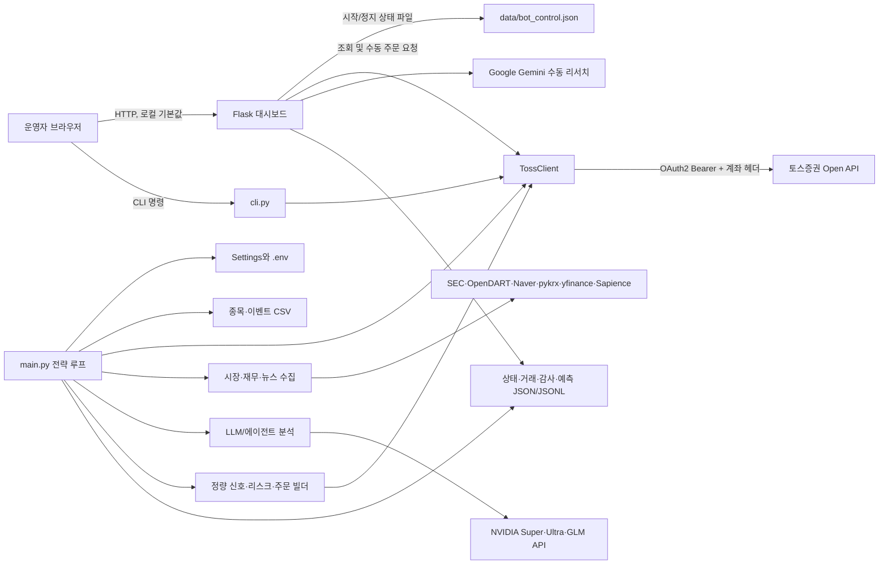
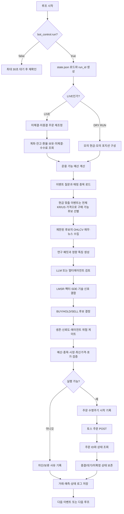

# 01. 전체 시스템 아키텍처

## 문서 목적

이 문서는 이 프로젝트가 어떤 문제를 해결하고, 각 구성요소가 어떤 책임을 가지며, 데이터가 어디에서 들어와 어떤 판단 단계를 거쳐 주문 또는 보류로 끝나는지를 한눈에 설명한다. 세부 설계는 같은 폴더의 02~10 문서에서 이어진다.

이 프로젝트는 토스증권 Open API를 실행 경계로 사용하는 개인용 자동매매·리서치 시스템이다. 종목과 질문을 파일로 관리하고, 실시간 계좌·시장 데이터와 외부 재무·뉴스 자료를 모아 정량 신호와 LLM 의견을 결합한다. 다만 LLM은 주문 권한을 갖지 않는다. 실제 주문 생성 여부와 주문 수량은 Python의 결정적 규칙, 자금 한도, 생존 게이트, 시장 상태, 호가 검증을 모두 통과해야 한다.

## 핵심 설계 원칙

1. 기본 실행 모드는 `DRY_RUN=true`이며, 실거래는 명시적으로 켜야 한다.
2. LIVE에서는 현재가·OHLCV·잔고·보유종목 같은 핵심 데이터가 파싱되지 않으면 주문을 막는다.
3. LLM은 후보를 평가하고 신규 매수의 승인·축소·보류 의견을 내지만, 브로커 API를 직접 호출하지 않는다.
4. 보유 포지션 청산은 이벤트 단위 LLM 의견보다 종목별 손절·익절·기술적 청산 규칙을 우선한다.
5. 주문 전송 이후 결과가 애매하면 “실패”로 가정하지 않고 미해결 주문으로 기록하여 중복 주문을 막는다.
6. 중요한 결정·호출·주문 상태는 원본을 덮어쓰지 않는 JSONL 감사 기록으로 남긴다.
7. 현재 영속 계층은 관계형 DB가 아니라 CSV·JSON·JSONL·XLSX 파일이다.

## 시스템 컨텍스트

## 주요 구성요소와 책임

| 계층 | 주요 파일/폴더 | 책임 | 주문 권한 |
|---|---|---|---|
| 실행 오케스트레이션 | `main.py` | 루프 시작, 데이터 수집, 판단 순서 조정, 주문 전후 상태 보존 | 있음. 단 모든 게이트 통과 후에만 호출 |
| 환경 설정 | `config.py`, `.env` | 모드, 한도, API 주소, 키, 캐시·로그 경로 정의 | 없음 |
| 토스 인증·통신 | `auth.py`, `toss_client.py` | 토큰 발급/갱신, 계좌 선택, 요청 헤더, 재시도, 주문 API 래핑 | API 호출 경로 제공 |
| 종목·이벤트 | `data/*.csv`, `strategy/events.py`, `strategy/symbol_registry.py` | 실행 가능 종목과 연구 질문을 결정 | 없음 |
| 시장·재무 데이터 | `strategy/market_data.py`, `strategy/market_history.py`, `strategy/free_financial_sources.py` 등 | 현재가, 장기 캔들 이력, 재무, 뉴스, 환율 자료 수집·정규화 | 없음 |
| AI 분석 | `agent/`, `strategy/agentic/orchestrator.py`, `strategy/llm_providers.py` | Super 분석, Ultra 토론·위험 판단, GLM 최종 JSON, 메모리·감사 | 직접 주문 금지 |
| 정량 판단 | `strategy/factors.py`, `sde.py`, `trend.py`, `technical_entries.py`, `risk.py` | 팩터·확률·추세·진입/청산 신호 산출 | 없음 |
| 주문 안전장치 | `portfolio_budget.py`, `order_builder.py`, `live_data_guard.py`, `order_lifecycle.py` | 예산, 주문 형태, 시장/종목/호가 검증, 주문 수명주기 기록 | 주문 허용/차단 결정 |
| 운영 UI | `dashboard_server.py`, `dashboard/` | 상태·잔고·로그 조회, 봇 시작/정지, 수동 주문 UI | 수동 주문 API가 있어 로컬 신뢰 경계 필요 |
| 영속 저장 | `state.json`, `trades.jsonl`, `data/market_history.sqlite3`, `data/`, `data_cache/`, `log/` | 상태, 주문·예측 원장, 장기 시세, 감사, 캐시, API 접근 로그 | 없음 |
| 연구 원문 | `ai_prompt/` | 논문·연구 메모 보관 | 런타임에서 직접 읽지 않음 |
| 런타임 프롬프트 | `agent/` | 역할 프롬프트, 공통 정책, 에이전트 레지스트리 | LLM 지시만 제공 |

## 한 번의 전략 주기 흐름

### 단계별 의미

- 시작 시 `state.json`을 읽어 전일/누적 손실, API 오류 횟수, LMSR 상태, 모의 포지션, 미종결 주문을 복원한다.
- LIVE에서 미해결 POST가 있으면 새 주문을 전역 차단한다. 주문 ID를 확보한 미종결 주문은 먼저 상태 조회로 종결 여부를 확인한다.
- 이벤트는 `event_questions.csv`의 질문과 `symbols.csv`의 실행 가능 종목을 연결한 단위다. 질문 템플릿 회전이 켜져 있어도 같은 한국 날짜에는 이벤트별 문구가 고정되고, 다음 날짜에는 같은 테마의 다른 템플릿이 선택될 수 있다.
- 첫 `cash_affordable_candidates` 이벤트는 KRW·USD 주문가능액, 환율, reserve, 전체/종목당 상한과 최신 가격으로 실제 주문을 만들 수 있는 기존 KR/US 심볼만 고른다. 국내는 최소 1주, 미국은 금액주문 최소값을 만족해야 하며 정밀분석은 시장별·전체 상한으로 제한한다.
- 가격과 캔들이 준비된 종목만 연구 후보가 된다. 데이터가 없으면 `DATA_SKIPPED`로 남고 억지 값으로 진행하지 않는다.
- 연구 패킷에는 관측 시각, 데이터 출처, 가격·OHLCV, 기술 지표, 재무 정보, 입력 해시가 포함된다.
- LLM 결과는 확률, 신뢰도, 선택 종목, 매수 허용 여부, 크기 배수와 위험 사유로 제한된다.
- 정량 계층은 이벤트 엣지, LMSR, Kelly, 팩터 점수, SDE 상승 확률, 추세 점수를 합쳐 기본 행동을 만든다.
- 신규 매수는 LLM 게이트가 차단할 수 있다. 기존 포지션의 손절·익절은 낮은 LLM 신뢰도 때문에 막히지 않도록 분리되어 있다.
- 주문 직전 토스 현재가를 다시 읽어 분석 시점 대비 급변 여부를 확인하고, 시장가 주문은 호가 스프레드·예상 충격·호가 시각을 검증한다.

## 데이터 흐름의 세 가지 축

### 제어 흐름

운영자가 대시보드에서 시작/정지를 누르면 `data/bot_control.json`이 바뀐다. 전략 프로세스는 각 루프 전에 이 파일을 읽는다. 정지는 프로세스를 죽이거나 진행 중인 주문을 취소하는 기능이 아니라, 다음 전략 실행 진입을 일시 정지하는 소프트 제어다.

### 분석 흐름

종목 정의 → 잔액·가격 기반 구매 가능성 필터 → 이벤트 질문 → 시장/재무/뉴스 스냅샷 → 정량 특징 → LLM 검토 → 통합 점수 → 위험 게이트 순으로 흐른다. 현금 맞춤 이벤트가 아닌 테마 이벤트는 구매 가능성 필터 없이 기존 매핑에서 시작하되 주문 단계에서 같은 예산 검증을 받는다. 각 단계는 앞 단계의 관측 자료와 출처를 보존하며, LLM이 입력 후보군 밖의 티커를 새로 만들어 주문 대상으로 확장할 수 없다.

### 주문 흐름

행동 결정 → 예산 배정 → 주문 명세 생성 → 시장/종목 거래 가능 여부 → 최신 가격 → 호가 안전성 → 수명주기 원장 기록 → POST → 상태 조회 → 대기/종결 저장 순이다. POST 이후 네트워크가 끊겼다면 새 주문을 재시도하지 않고 수동 조정이 필요한 미해결 상태로 둔다.

## 실행 모드

| 모드 | 데이터 | 포지션 | 주문 | 주 용도 |
|---|---|---|---|---|
| DRY RUN | 실제 조회를 시도할 수 있으나 모의 대체 경로 허용 | `state.json`의 `sim_positions` | 토스로 보내지 않고 모의 체결 | 개발·검증·임계값 조정 |
| LIVE | 핵심 값은 실제 토스 응답 필수 | 토스 보유종목을 매 루프 재조정 | 검증 완료 후 실제 POST | 제한된 실운영 |
| `--once` | 한 주기만 실행 | 모드에 따름 | 모드에 따름 | 점검·배치 테스트 |
| `--preflight` | 토스 읽기 전용 점검 | 조회만 수행 | 절대 생성하지 않음 | LIVE 전 준비 확인 |

## 신뢰 경계와 보안 관점

- 브라우저와 Flask 사이에는 현재 로그인, 세션, 쿠키, CSRF 보호가 없다. 기본 바인딩이 `127.0.0.1`인 이유가 이 경계를 로컬 호스트로 제한하기 위해서다.
- 토스 자격 증명과 LLM API 키는 `.env`에 있고 Git에서 제외된다. 토스 액세스 토큰은 `.toss_token_cache.json`에도 저장되며 이 파일 역시 Git에서 제외된다.
- 토스 통신은 서버 측 `Authorization: Bearer ...`와 계좌 식별 헤더를 사용한다. 브라우저에 토스 토큰을 전달하는 구조가 아니다.
- 대시보드에는 주문·정정·취소 API가 존재하므로 외부 네트워크에 그대로 공개하면 안 된다.
- `trades.jsonl`, LLM 감사 로그, Excel API 로그에는 투자 판단·응답·요청 내용이 포함될 수 있으므로 운영 데이터로 보호해야 한다.

## 폴더 구조의 의미

| 경로 | 성격 |
|---|---|
| `agent/` | 실제 런타임 에이전트 프롬프트와 정책 |
| `ai_prompt/` | 논문과 연구 아이디어 원문 |
| `strategy/` | 데이터 정규화, 지표, AI 오케스트레이션, 위험·주문 도메인 로직 |
| `dashboard/` | 브라우저 정적 UI |
| `data/` | 기준 CSV, append-only 원장, 누적 시세 SQLite. `market_history.sqlite3`는 운영 데이터라 Git에서는 제외 |
| `data_cache/` | 다시 만들 수 있는 외부 데이터·분석 캐시. 기존 `toss_candles` JSON은 SQLite 최초 이전용 |
| `log/` | 대시보드 API Excel 로그 |
| `system/` | 현재의 시스템 설계 문서 11종 |
| `tests/` | 주요 안전 계약과 계산 검증 |

## 문서 지도

| 번호 | 문서 | 답하는 질문 |
|---|---|---|
| 02 | 백엔드 실행·운영 | 프로세스는 어떻게 시작·정지·반복되는가 |
| 03 | API·인증 | 어떤 외부/내부 API와 토큰·쿠키가 어떻게 흐르는가 |
| 04 | 데이터 저장 | 어떤 논리 테이블과 로그가 어디에 저장되는가 |
| 05 | 시장 데이터·유니버스 | 종목과 시장 자료는 어떻게 선정·검증되는가 |
| 06 | AI 에이전트 | 역할별 분석이 어떻게 연결되고 제한되는가 |
| 07 | 신호·리스크 | 매수·보유·매도 및 금액은 어떻게 결정되는가 |
| 08 | 주문 수명주기 | 주문 전송부터 체결·미확정 복구까지 어떻게 흐르는가 |
| 09 | 대시보드 | 운영자가 무엇을 조회·제어하고 브라우저 데이터는 어떻게 흐르는가 |
| 10 | 로그·감사·복구 | 장애를 어떻게 발견하고 기록으로 어떻게 재구성하는가 |
| 11 | 출력값·성능 | 콘솔의 p·C·edge·Kelly·alpha·gate는 무엇이며 3초 응답은 어떻게 설계하는가 |

## 현재 범위와 명시적 비범위

- 현재 자동주문 시장은 KR·US다. 다른 국가 현지 티커는 관심종목으로 보관할 수 있지만 주문 경로에는 들어가지 않는다.
- 데이터베이스 서버, 메시지 큐, 작업 스케줄러, 중앙 비밀 저장소는 없다.
- 대시보드는 단일 사용자 로컬 운영을 전제로 하며 다중 사용자 권한 모델이 없다.
- 트레일링 스톱 설정은 존재하지만 현재 구현은 저장된 최고가를 계속 갱신하는 완전한 상태형 트레일링이 아니라, 수익 구간에서 기술 매도 신호를 결합하는 방식이다.
- LLM 분석과 예측 기록은 리서치 근거이며 수익을 보장하거나 브로커 체결을 대신 확인하지 않는다.
