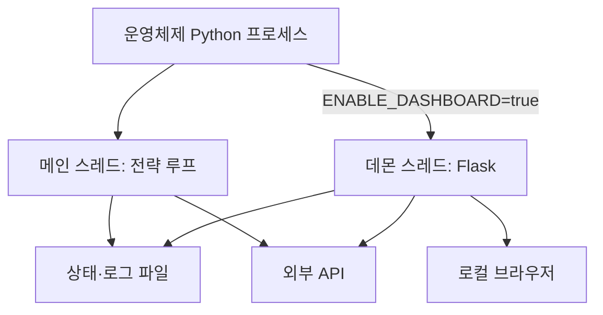
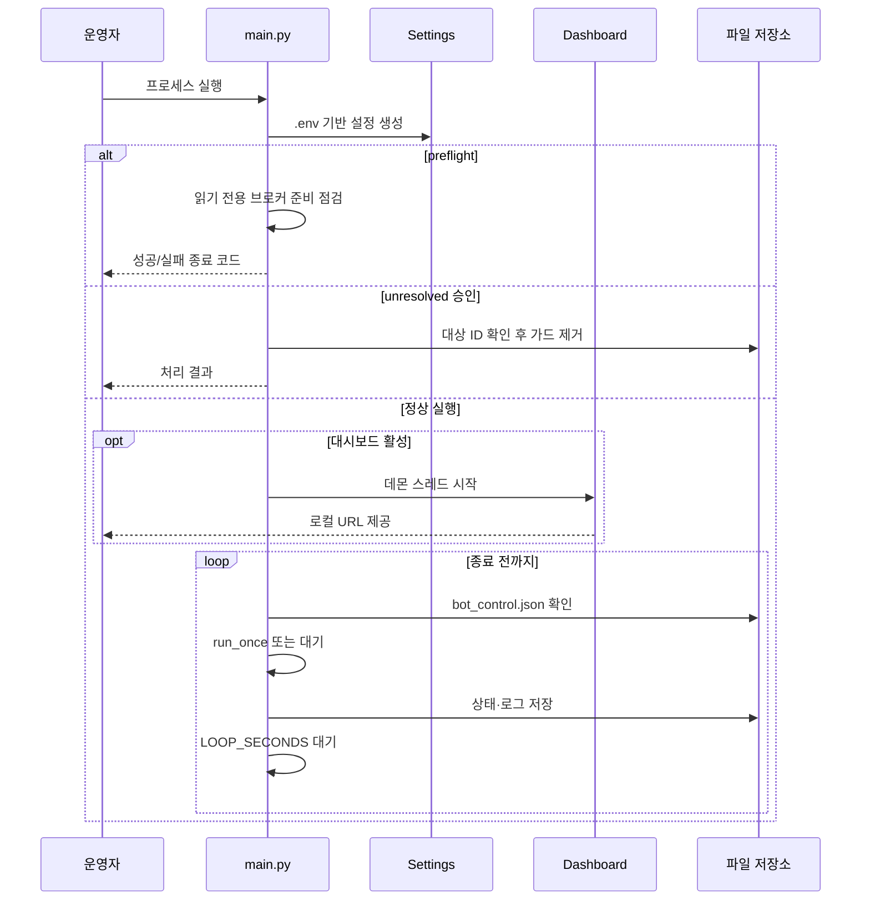
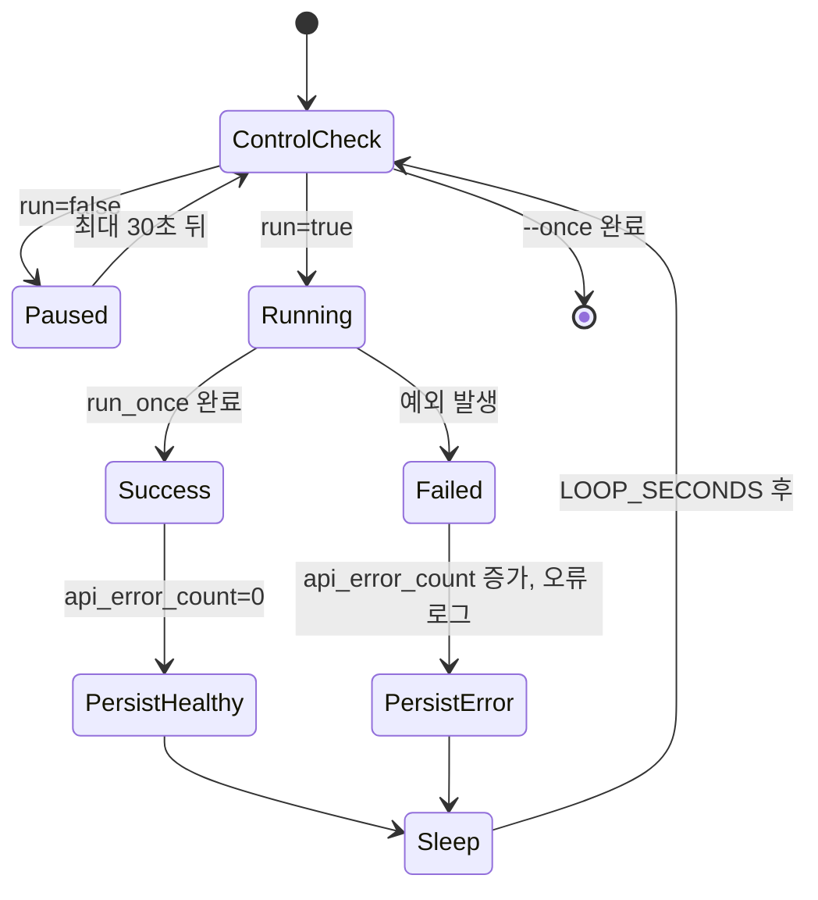

# 02. 백엔드 실행 및 운영 설계

## 목적과 운영 단위

백엔드는 별도의 애플리케이션 서버 여러 개로 나뉜 구조가 아니라, `main.py` 중심의 단일 Python 프로세스가 전략 루프를 실행하고 필요하면 Flask 대시보드를 데몬 스레드로 함께 띄우는 구조다. 운영자는 `.env`로 모드와 한도를 정하고, `main.py` 또는 `cli.py`로 작업을 시작한다.

## 프로세스 토폴로지

메인 전략과 대시보드는 같은 프로세스 안에서 실행될 수 있지만 서로 직접 함수를 호출해 상태를 전달하지 않는다. 공통 상태는 파일과 외부 토스 계좌 조회를 통해 느슨하게 공유한다. 따라서 대시보드 표시가 잠시 오래된 값이어도 전략 루프의 실제 주문 판단과는 별개다.

## 시작 방식

| 명령 | 동작 | 쓰기 가능성 |
|---|---|---|
| `python main.py` | 대시보드 시작 후 무한 전략 루프 | DRY RUN 상태/로그 또는 LIVE 주문 |
| `python main.py --once` | 한 주기만 실행하고 종료 | 모드에 따름 |
| `python main.py --preflight` | 계정·잔고·시장 데이터 등 읽기 점검 | 주문 없음, 토큰 캐시는 갱신될 수 있음 |
| `python main.py --acknowledge-unresolved ID` | 운영자가 토스에서 직접 확인한 미해결 POST 가드 해제 | 상태·거래 로그 변경 |
| `python cli.py ...` | 토큰, 계좌, 가격, 캔들, 주문 등 개별 작업 | 하위 명령에 따라 다름 |

`main.py`를 통한 실행이 전체 기능의 기준 경로다. 현재 `dashboard_server.py`에는 직접 실행용 `app.run()`이 일부 봇 전용 라우트 선언보다 앞에 있으므로, `python dashboard_server.py` 단독 실행은 전체 대시보드 API 등록 방식으로 신뢰하면 안 된다. 운영 기준은 `main.py`에서 모듈을 import하여 모든 라우트가 등록된 뒤 Flask를 시작하는 경로다.

## 부팅 순서

## 설정 로딩

설정은 `Settings` 데이터 클래스의 기본값 위에 환경변수가 적용되는 구조다. `.env`는 실행 진입점에서 로딩되며, 경로·한도·기능 플래그가 모두 문자열 환경변수에서 bool/int/float로 변환된다.

설정은 다음 여섯 그룹으로 운영하는 것이 좋다.

| 그룹 | 대표 항목 | 변경 영향 |
|---|---|---|
| 실행 | `DRY_RUN`, `LOOP_SECONDS`, `ENABLE_DASHBOARD` | 실제 주문 여부, 주기, UI 시작 |
| 자금 | 운용금 상한, 종목당/총 노출, 현금 보유율, 신규 매수 수 | 주문 금액과 집중도 |
| 리스크 | 일손실, 낙폭, 신뢰도, 팩터·SDE·추세 임계값 | 매수 차단과 청산 판단 |
| 토스 | 클라이언트 키, 계좌, 엔드포인트, 재시도, 캐시 | 브로커 연결과 데이터 신뢰성 |
| LLM/외부 데이터 | 공급자 키, 호출 한도, 모델, 기능 플래그 | 리서치 품질, 비용, 지연 |
| 저장소 | 상태·거래·감사·캐시 경로 | 복구와 감사 자료 위치 |

운영 중 `.env`를 바꾸더라도 이미 만들어진 `Settings` 인스턴스에는 자동 반영되지 않는다. 안전한 적용 단위는 프로세스 재시작이다.

### 이벤트 질문 주기 설정

| 설정 | 현재 `.env` | 의미 |
|---|---:|---|
| `EVENT_LLM_ONCE_PER_DAY` | `true` | 이벤트별 실제 모델 분석을 연구 날짜당 한 번만 시도 |
| `EVENT_LLM_DAILY_TIMEZONE` | `Asia/Seoul` | 연구 날짜가 바뀌는 기준 시간대 |
| `EVENT_LLM_REFRESH_ON_PROCESS_START` | `true` | 프로세스 시작 후 이벤트별 첫 시도는 기존 당일 캐시를 무시하고 새 결과로 교체 |
| `LOOP_SECONDS` | `600` | 전체 이벤트 주기가 끝난 뒤 다음 주기 전 대기 |

프로세스가 시작될 때 메모리상의 “이번 프로세스에서 갱신 완료한 이벤트” 집합은 비어 있다. 따라서 `EVENT_LLM_REFRESH_ON_PROCESS_START=true`이면 `state.json`에 오늘 결과가 있어도 이벤트별 첫 도달에서는 읽지 않고 새 분석을 수행한 뒤 같은 cache key를 덮어쓴다. 갱신이 끝난 이벤트는 메모리 집합에 표시되어 같은 프로세스의 다음 10분 루프부터 새 캐시를 사용한다. 테스트가 끝나고 재시작 간에도 하루 한 번 정책을 엄격히 유지하려면 이 설정을 `false`로 바꾼다.

이벤트 사이의 별도 대기 설정은 없다. 한 이벤트의 모델 분석과 종목 출력이 끝나면 다음 이벤트로 즉시 넘어간다. `LOOP_SECONDS=600`만 전체 이벤트 주기 종료 후에 적용된다.

### 대시보드 접근 로그

`DASHBOARD_ACCESS_LOG_PATH=log/dashboard_access.log`는 Werkzeug의 서버 시작 메시지와 `127.0.0.1 ... GET ...` 접근 기록을 회전 파일로 보낸다. 그래서 장시간 모델 분석 중 대시보드가 30초마다 summary를 조회해도 거래 콘솔에는 그 줄이 끼어들지 않는다. 파일은 기본 5 MB에 도달하면 최대 3개 백업으로 회전하며, Flask 애플리케이션 오류와 전략 오류는 콘솔에서 계속 확인할 수 있다.

## 메인 루프 상태 기계

### 시작/정지 제어의 정확한 의미

`data/bot_control.json`은 `run`과 `updated_at`을 가진다. `run=false`이면 다음 `run_once` 진입을 막고 짧게 대기한다. 이미 실행 중인 이벤트 분석이나 주문 POST를 중간에 취소하지 않으며, 브로커의 미체결 주문을 자동 취소하지도 않는다. 긴 이벤트 처리 중 즉시 정지가 필요한 운영 요구가 있다면 별도의 취소 토큰과 주문 취소 정책이 필요하다.

## 한 주기의 백엔드 단계

1. 상태 파일과 고유 `runtime_run_id`를 만든다.
2. LIVE의 미해결 주문 가드를 검사한다.
3. 주문 ID가 있는 미종결 주문을 조회해 종결 여부를 조정한다.
4. LLM 파이프라인, 재무 수집기, 예측시장·뉴스 클라이언트를 초기화한다.
5. DRY RUN이면 모의 자금, LIVE이면 실제 원화/달러 주문가능액·환율·보유·미체결·수수료를 읽는다.
6. 총 노출과 현금 보유분을 반영하여 이번 주기 매수 가능 예산을 계산한다.
7. 첫 현금 맞춤 이벤트는 활성 KR/US 전체의 가격을 최대 200개씩 묶어 읽고 현재 시장별 주문 예산으로 주문 명세를 만들 수 있는 심볼만 선별한다. 테마 우선·날짜 순환을 적용해 KR/US 최대 20개씩 총 40개만 정밀분석한다. 다른 이벤트는 기존 매핑과 일반 심볼 상한을 사용한다.
8. 선별 후보의 OHLCV·재무·기술·뉴스 자료를 수집한다. 한국 날짜의 첫 시도이거나 새 프로세스의 강제 갱신 대상이고 Python 기술 후보가 있으면 모델 파이프라인을 실행한다. 후보가 없으면 호출 생략 결과를 만들며, 어느 경우든 성공·실패·생략 결과를 즉시 `daily_event_llm_cache`의 같은 key에 저장한다. 같은 프로세스에서 이미 갱신한 당일 이벤트는 모델과 모델용 뉴스·lead-lag 재수집을 건너뛰고 저장 결과를 읽는다.
9. 현재 가격·OHLCV·재무·기술지표·포지션을 기준으로 정량 계산과 종목별 주문 가능성을 평가한다. 이 Python 계산은 당일 모델 캐시를 사용해도 매 정상 전략 루프마다 수행한다.
10. 실행/차단 결과, 예측 레코드, LMSR 상태를 저장하고 대기 없이 다음 이벤트로 넘어간다.
11. 모든 이벤트가 끝나면 상태를 원자적으로 교체 저장한 뒤 `LOOP_SECONDS`만큼 기다린다.

## 파일 쓰기와 동시성

- `state.json`은 임시 파일에 쓴 뒤 교체하여 중간 상태가 노출될 가능성을 줄인다.
- 감사·메모리·예측 원장은 `.lock` 파일을 이용한 배타 잠금과 `fsync`를 사용한다.
- 일반 `trades.jsonl`과 `llm_calls.jsonl`은 단순 append이므로 여러 프로세스를 동시에 실행하는 운영은 전제하지 않는다.
- `log/dashboard_access.log`는 Werkzeug의 회전 파일 handler가 기록한다. 정상 HTTP 접근 기록은 이 파일에서 보고 거래 콘솔에는 표시하지 않는다.
- Flask API Excel 로그는 프로세스 내부 `threading.Lock`으로 같은 프로세스의 동시 요청을 직렬화한다. 여러 프로세스로 Flask를 띄우면 이 잠금은 공유되지 않는다.
- 대시보드 제어 JSON은 현재 임시 파일 교체가 아니라 직접 쓰기다. 단일 로컬 프로세스 전제에서는 단순하지만 다중 프로세스 운영에는 보강이 필요하다.

## 장애 처리 정책

| 장애 | 현재 반응 | 다음 주기 영향 |
|---|---|---|
| 일반 주기 예외 | 콘솔 출력, 거래 로그에 오류, `api_error_count` 증가 | 횟수가 한도에 도달하면 생존 게이트가 신규 매수 차단 |
| LIVE 핵심 데이터 파싱 실패 | `LiveDataError` 또는 해당 통화 매수 가능액 0 | 잘못된 대체 값으로 주문하지 않음 |
| LLM 실패/한도 초과 | 불가 또는 보류 결과를 그 연구 날짜의 시도로 저장 | 같은 날 재질문하지 않으며 신규 매수는 fail-closed, 결정적 청산은 계속 가능 |
| 주문 POST 전 실패 | 주문하지 않고 차단 사유 기록 | 다음 후보/주기로 진행 가능 |
| 주문 POST 후 응답 불명확 | `unresolved_order_submissions` 저장 | 운영자 확인 전 새 LIVE 주문 전역 차단 |
| 주문 접수 후 비종결 | `pending_live_orders` 저장 | 다음 주기 시작 시 상태 재조회, 남아 있으면 새 주문 차단 |
| 대시보드 실패 | 데몬 스레드 종료 가능 | 메인 전략 루프는 원칙적으로 계속 실행 |

## 배포와 실행 전 체크리스트

### DRY RUN

- Python 의존성을 설치하고 전체 테스트가 통과하는지 확인한다.
- `DRY_RUN=true`인지 확인한다.
- `state.json`, `trades.jsonl`, `data/market_history.sqlite3`, `data_cache/`의 쓰기 권한과 여유 공간을 확인한다.
- `python main.py --once`로 한 주기 소요 시간과 외부 API 사용량을 측정한다.
- 대시보드는 `127.0.0.1`에만 바인딩한다.

### LIVE 전환

- `python main.py --preflight`가 성공해야 한다.
- 토스 계좌가 의도한 계좌인지 `accounts`, `positions`, `buying-power`로 교차 확인한다.
- 총 자동매수 상한, 종목당 상한, 현금 보유율, 신규 매수 수를 소액 기준으로 고정한다.
- `REQUIRE_REAL_DATA_FOR_LIVE`, 가격/OHLCV fallback 차단, 주문 상태 확인을 유지한다.
- `state.json`에 미해결·미종결 주문이 없는지 확인한다.
- 수동 주문 API가 있는 대시보드가 외부에 노출되지 않았는지 확인한다.
- 시스템 시간과 시간대가 정확한지 확인한다. 감사 레코드의 기준 시각은 주로 UTC다.

## 종료와 재시작

정상적인 종료 신호를 세밀하게 처리하는 별도 서비스 매니저는 없다. 프로세스가 종료되어도 `state.json`과 append-only 원장을 통해 다음 시작 시 상태를 복원한다. 다만 POST 직후 상태 저장 전에 프로세스가 죽을 수 있는 구간은 주문 원장과 토스 주문 내역을 반드시 교차 확인해야 한다.

권장 재시작 절차는 다음과 같다.

1. 토스 앱/계좌에서 미체결과 최근 주문을 확인한다.
2. `pending_live_orders`, `unresolved_order_submissions`를 확인한다.
3. 미해결 건은 클라이언트 주문 ID와 브로커 주문 내역을 대조한다.
4. 필요한 경우에만 수동 조정 후 `--acknowledge-unresolved`를 사용한다.
5. 읽기 전용 preflight를 실행한다.
6. DRY RUN 한 주기를 거친 뒤 LIVE 프로세스를 시작한다.

## 운영 확장 시 분리 대상

장기 실행 또는 다중 사용자 운영으로 확장한다면 전략 워커, 읽기 전용 대시보드, 주문 게이트웨이, 스케줄러, 영속 DB를 별도 프로세스로 분리하는 것이 적절하다. 특히 수동 주문 API와 조회 API를 같은 Flask 앱에 둔 현재 구조는 인증과 권한을 도입할 때 가장 먼저 경계를 나눠야 한다.
