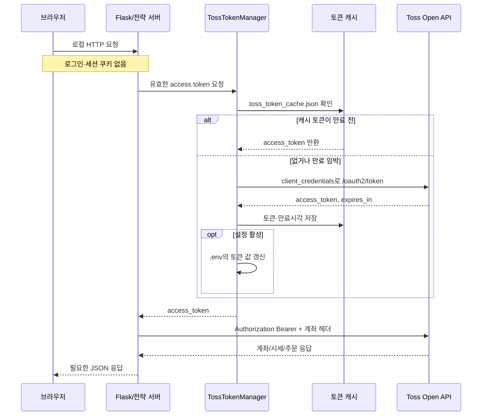
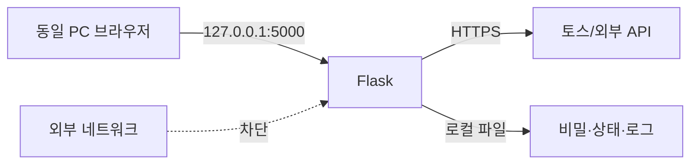

# 03. API 연동 및 인증 설계

## 문서 목적

이 문서는 브라우저, Flask, 토스증권, LLM 공급자, 뉴스·재무 공급자 사이의 호출과 자격 증명 흐름을 설명한다. 특히 현재 쿠키 사용 여부, 토스 OAuth 토큰 저장 위치, 계좌 식별 방식, API 호출 로그에 남는 내용을 명확히 한다.

## 인증 흐름 요약

## 쿠키와 세션

현재 프로젝트는 브라우저 쿠키를 생성하거나 읽지 않는다.

| 항목 | 현재 상태 | 의미 |
|---|---|---|
| 로그인 쿠키 | 없음 | 대시보드 사용자 인증이 없음 |
| Flask 세션 쿠키 | 없음 | `session` 저장소나 비밀키를 사용하지 않음 |
| 토스 토큰 쿠키 | 없음 | 토스 토큰은 서버 파일/환경변수에만 있고 브라우저로 전달하지 않음 |
| CSRF 토큰 | 없음 | POST API가 로컬 신뢰 경계를 전제로 함 |
| 브라우저 local/session storage | 핵심 상태 저장에 사용하지 않음 | 화면은 API를 다시 조회해 상태 구성 |

따라서 “어떤 쿠키가 어떻게 흐르는가”에 대한 현재 답은 “흐르는 쿠키가 없다”이다. 이 단순함은 로컬 전용에서는 장점이지만, 네트워크 공개 시에는 누구든 주문·정정·취소·봇 제어 API를 호출할 수 있다는 뜻이다. 외부 공개가 필요하면 역방향 프록시 인증만 덧붙이는 수준을 넘어 사용자 로그인, 읽기/주문 권한 분리, CSRF 방지, TLS, 감사 주체를 설계해야 한다.

## 토스 OAuth2 토큰 수명주기

### 입력 자격 증명

- `TOSS_CLIENT_ID`
- `TOSS_CLIENT_SECRET`
- 선택적 수동 `TOSS_ACCESS_TOKEN`
- 토큰 발급 주소 `TOSS_TOKEN_URL`

### 캐시 레코드

`.toss_token_cache.json`은 액세스 토큰, 만료 시각 등 발급 결과를 저장한다. 토큰은 만료 직전까지 재사용하며 기본적으로 실제 만료보다 5분 일찍 새로 받는 방식이다. 캐시와 `.env`는 Git 제외 대상이다.

### 요청 헤더

토스 API 요청에는 서버가 다음 의미의 헤더를 조립한다.

- `Authorization`: Bearer 액세스 토큰
- 계좌 필요 API: 선택된 `accountSeq`를 담는 토스 계좌 헤더
- JSON 요청: 콘텐츠 형식 및 수락 형식

계좌번호 문자열을 그대로 주문 헤더에 쓰지 않는다. 설정에 `TOSS_ACCOUNT_SEQ`가 없고 자동 선택이 켜져 있으면 계좌 목록을 조회하여 첫 BROKERAGE 계좌의 `accountSeq`를 선택한다. 실제 운영에서는 자동 선택 결과를 로그와 CLI로 확인하고 명시값으로 고정하는 편이 안전하다.

### 만료·401 처리

클라이언트는 기존 토큰이 거부되면 수동 토큰을 비우고 한 번 갱신한 뒤 요청을 다시 시도할 수 있다. 주문 POST는 중복 위험 때문에 일반 GET과 같은 방식으로 무조건 재시도하면 안 된다. POST 결과가 모호하면 미해결 주문 가드로 전환한다.

## 토스 API 매핑

경로는 환경변수로 바꿀 수 있으며 아래는 기본 논리 기능이다.

| 기능 | 메서드/기본 경로 | 계좌 필요 | 소비 데이터 |
|---|---|---|---|
| 토큰 발급 | POST `/oauth2/token` | 아니오 | client id/secret |
| 계좌 목록 | GET `/api/v1/accounts` | 아니오 | Bearer |
| 주문 가능 금액 | GET `/api/v1/buying-power` | 예 | 계좌, 통화 |
| 보유 종목 | GET `/api/v1/holdings` | 예 | 계좌 |
| 주문 목록/생성 | GET·POST `/api/v1/orders` | 예 | 상태 필터 또는 주문 명세 |
| 주문 상태 | GET `/api/v1/orders/{orderId}` | 예 | 브로커 주문 ID |
| 종목 정보 | GET `/api/v1/stocks` | 아니오 | 심볼 목록 |
| 현재가 | GET `/api/v1/prices` | 아니오 | 심볼 목록 |
| 호가 | GET `/api/v1/orderbook` | 아니오 | 심볼, 캐시하지 않음 |
| 캔들 | GET `/api/v1/candles` | 보통 아니오 | 심볼, 간격, 개수, cursor |
| 매도 가능 수량 | GET `/api/v1/sellable-quantity` | 예 | 심볼·계좌 |
| 수수료 | GET `/api/v1/commissions` | 예 | 계좌 |
| 환율 | GET `/api/v1/exchange-rate` | 상황별 | 기준/상대 통화 |
| 장 상태 | GET `/api/v1/market-calendar/{market}` | 아니오 | KR/US 시장 |

실제 토스 Open API의 버전이나 계약이 달라질 수 있어 모든 엔드포인트를 `.env`로 재정의할 수 있게 되어 있다. 운영 변경 시에는 공식 응답 필드와 `live_data_guard.py`의 파서가 함께 호환되는지 확인해야 한다.

## 요청 제한과 재시도

토스 클라이언트는 기능별 rate-limit 그룹을 구분하고 안전 계수를 적용한다. GET 계열은 제한된 횟수만 재시도하며 `Retry-After` 또는 백오프를 고려한다. 상한은 `TOSS_MAX_GET_RETRIES`, `TOSS_RETRY_BACKOFF_MAX_SECONDS`, `TOSS_RATE_LIMIT_SAFETY_FACTOR`로 관리한다.

중요한 구분은 다음과 같다.

- 조회 실패: 제한된 재시도 후 데이터 미확정으로 처리할 수 있다.
- 주문 전송 실패: POST가 브로커에 도달했는지 알 수 없으면 같은 주문을 재전송하지 않는다.
- HTTP 성공: 응답 안에 주문 ID나 필수 결과가 없으면 성공으로 간주하지 않는다.
- 체결 확인: 주문 접수 응답과 실제 체결은 다른 상태다. 주문 상태 조회가 별도로 필요하다.

## 내부 Flask API

### 조회·분석

| 경로 | 입력 | 반환/읽는 자료 |
|---|---|---|
| `GET /api/accounts` | 없음 | 토스 계좌 목록 |
| `GET /api/buying-power` | account, currency | 토스 주문 가능 금액 |
| `GET /api/positions` | account, profit | 보유종목, 선택적으로 추정 손익 |
| `GET /api/stocks` | symbols | 토스 종목 정보 |
| `GET /api/prices` | symbols | 토스 현재가 |
| `GET /api/candles` | symbol, interval, count | 토스 캔들 |
| `GET /api/stock/analyze` | symbol, refresh/generate | 캐시 또는 Gemini 종목 설명 |
| `GET /api/bot/status` | 없음 | 설정 모드, 상태, 마지막 거래 로그 |
| `GET /api/bot/trades` | n | 최근 거래 판단 JSONL |
| `GET /api/bot/events` | 없음 | 현재 활성 이벤트 |
| `GET /api/bot/symbols` | 없음 | 실행 가능 종목 레지스트리 |
| `GET /api/bot/watchlist-raw` | 없음 | 원본 관심종목 |
| `GET /api/bot/llm-calls` | n | 최근 LLM 호출 로그 |
| `GET /api/bot/api-usage` | 없음 | 공급자별 일일 사용량 |
| `GET /api/bot/summary` | 없음 | 최근 주문·판단·손익 요약 |

### 변경·주문

| 경로 | 영향 | 주의 |
|---|---|---|
| `GET /api/token` | 토큰 발급/갱신·캐시 쓰기 | 읽기처럼 보이지만 상태를 바꿈 |
| `POST /api/order` | 토스 주문 생성 | 인증/권한 없는 로컬 API |
| `POST /api/modify` | 토스 주문 정정 | 브로커 주문 ID 필요 |
| `POST /api/cancel` | 토스 주문 취소 | 브로커 주문 ID 필요 |
| `POST /api/bot/control` | `bot_control.json` 갱신 | 진행 중 주문 취소는 아님 |

내부 API는 현재 버전 관리 prefix, 사용자별 권한, 요청 idempotency 저장소가 없다. 자동 전략의 주문 경로는 별도 수명주기 원장을 쓰지만, 대시보드 수동 주문 API는 그 자동 전략 원장을 자동으로 거치지 않는다는 점을 구분해야 한다.

## 외부 리서치 API

| 공급자 | 용도 | 자격 증명 | 캐시/예산 |
|---|---|---|---|
| Google Gemini | Grounding 기반 리서치·레거시 LLM | Google/Gemini API key | 일일 호출 예산, 종목 분석 캐시 |
| NVIDIA NIM | 분석 판단 또는 Nemotron 에이전트 | NVIDIA API key | 일일 호출 예산, 최소 호출 간격 |
| Naver Search | 뉴스·블로그·주가 관련 근거 | client id/secret | 일일 한도와 TTL 캐시 |
| OpenDART | 국내 공식 공시·재무 | OpenDART key | 파일 캐시 |
| SEC EDGAR | 미국 공식 companyfacts | User-Agent 필수 | 파일 캐시 |
| Naver/WiseReport | 국내 재무 fallback | 보통 공개 조회 | 파일 캐시 |
| pykrx | 국내 시장·시총·거래 자료 | 없음 | 파일 캐시 |
| yfinance | 미국 재무·시장 fallback | 없음 | 라이브러리/원격 응답 |
| Sapience | 외부 예측시장 확률 참고 | 선택적 API key | 기능 기본 비활성, 실패 시 `None` |

외부 리서치 공급자는 주문을 호출하지 않는다. 실패 시 근거의 일부가 비거나 리서치 후보가 줄어들 수 있지만, 누락된 값을 임의의 실제 값처럼 표시해서는 안 된다.

## LLM API 요청 데이터

LLM에는 이벤트 질문, 제한된 후보 심볼, 종목 정보, 연구 패킷, 뉴스 근거, 이전 에이전트 보고서와 메모리가 들어갈 수 있다. 계좌 주문 권한과 토스 Bearer 토큰은 넣지 않는다. 감사 로그에는 프롬프트/입력/응답의 해시, 모델, 지연시간, 데이터 기준 시각이 남는다. 일부 감사 이벤트는 재현을 위해 입력 스냅샷과 결과 본문도 보존하므로 개인정보나 비밀을 프롬프트에 섞지 않는 정책이 필요하다.

## API 로그와 민감정보

Flask의 `/api/` 요청은 `log/api_logs.xlsx`에 날짜별 시트로 기록된다. 시간, 경로, 메서드, 쿼리, 요청 본문, 상태 코드, 응답 본문이 들어가며 긴 응답은 잘린다.

이 설계는 디버깅에는 편하지만 다음 위험이 있다.

- 주문 요청 본문과 계좌 응답이 로그에 남을 수 있다.
- `/api/token` 응답이 그대로 로깅되면 액세스 토큰이 Excel에 포함될 가능성이 있다.
- 파일 자체 암호화나 필드 마스킹이 없다.
- 로그 보존 기간과 삭제 정책이 없다.

따라서 LIVE 운영 전에는 토큰·계좌번호·개인정보 필드 마스킹을 추가하고, Excel 파일 접근 권한과 보존 기간을 정해야 한다.

## 오류 계약

토스 인증 오류와 API 오류는 Flask에서 각각 `toss_auth_error`, `toss_api_error` JSON과 502 상태로 변환된다. 일반 종목 분석 오류는 400 또는 500 JSON으로 반환한다. 브라우저의 공통 `getJson`은 응답 상태 코드에 따른 세밀한 분기보다는 JSON 표시를 우선하므로, 운영자는 HTTP 상태와 본문을 함께 확인해야 한다.

## 안전한 네트워크 배치

현재 권장 배치는 다음과 같다.

외부 접속이 꼭 필요하면 Flask 개발 서버를 직접 공개하지 말고 TLS 역방향 프록시, 강한 사용자 인증, IP 제한, 주문 권한 재인증, CSRF 보호, 요청별 감사 주체, 비밀 저장소를 포함한 별도 운영 설계가 필요하다.

