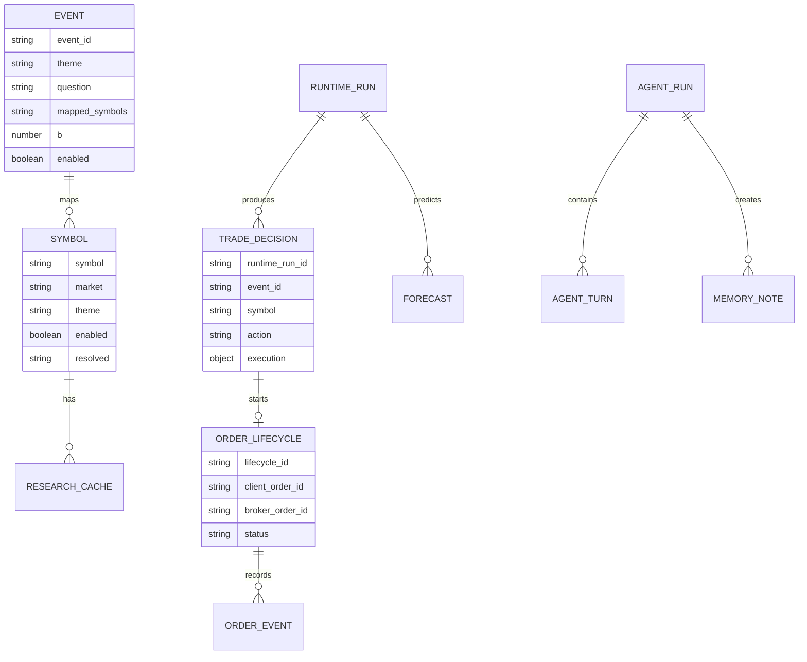

# 04. 데이터 저장 및 논리 테이블 설계

## 저장 구조 개요

현재 프로젝트에는 PostgreSQL, MySQL, SQLite 같은 관계형 데이터베이스가 없다. 대신 다음 형식이 DB 역할을 나눠 가진다.

- CSV: 운영자가 편집하는 기준정보와 종목·질문 마스터
- JSON: 현재 상태, 제어 상태, 일일 API 사용량처럼 최신값이 중요한 자료
- JSONL: 거래 판단, 주문 수명주기, AI 감사, 메모리, 예측처럼 시간 순서로 계속 추가되는 원장
- XLSX: 대시보드 HTTP 요청/응답을 사람이 열어볼 수 있게 저장하는 운영 로그
- 캐시 디렉터리: 외부 API 결과와 계산 결과 중 다시 만들 수 있는 자료

이 문서에서 “테이블”은 실제 SQL 테이블이 아니라 파일이 제공하는 논리적 레코드 집합을 뜻한다.

## 저장소 관계도

JSONL은 외래키를 강제하지 않으므로 `runtime_run_id`, `run_id`, `event_id`, `symbol`, `lifecycle_id`, `client_order_id`, `input_snapshot_hash`를 논리적 연결 키로 사용한다.

## 기준정보 테이블

### `data/symbols.csv` — 실행 종목 마스터

| 필드 | 의미 | 규칙 |
|---|---|---|
| `symbol` | 토스 조회·주문에 쓰는 코드 | 실행 대상이면 비어 있으면 안 됨 |
| `name` | 화면·로그 표시명 | 사람이 읽는 표준명 |
| `raw_name` | 원본 유입 이름 | 병합·추적에 사용 |
| `market` | 주문 시장 | 현재 자동 실행은 `KR`, `US`만 허용 |
| `sector` | 산업 분류 | 이벤트 그룹 또는 설명에 사용 |
| `theme` | 테마 | 이벤트의 `THEME:` 토큰과 연결 |
| `enabled` | 실행 후보 활성 여부 | true여도 비지원 시장이면 필터링 |
| `resolved` | 코드 확인 상태 | seeded, verified, unresolved 등 운영 메타 |
| `note` | 검증/국가 노출 메모 | `country_exposure=...`도 이곳에서 해석 가능 |

읽기 시 기본적으로 비활성, 심볼 없음, KR/US 외 시장을 제외한다. 원본 관심종목 확인 화면에서는 비활성과 미해결 행을 포함하도록 별도 읽기 옵션을 쓴다.

### `data/watchlist_raw.csv` — 원본 관심종목

사용자가 수집한 원래 관심종목과 아직 토스 심볼로 확정되지 않은 후보를 보존한다. 자동 실행 마스터와 분리함으로써 “관심 있음”이 곧 “주문 가능”이 되는 것을 막는다.

### `data/event_questions.csv` — 이벤트 마스터

| 필드 | 의미 |
|---|---|
| `event_id` | 이벤트 고유 식별자 |
| `theme` | 질문 테마와 질문 템플릿 그룹 |
| `question` | 기본 연구 질문 |
| `mapped_symbols` | 심볼 또는 `MARKET:`, `THEME:`, `SECTOR:`, `COUNTRY:` 토큰 |
| `b` | LMSR 유동성 파라미터 |
| `enabled` | 루프 포함 여부 |

`cash_affordable_candidates` 행은 `MARKET:KR,MARKET:US` 전체를 원본으로 선언한다. 이 CSV 목록이 그대로 모델 입력이 되는 것은 아니며, 실행 중 `strategy/affordable_universe.py`가 잔액·가격·주문 최소값을 적용해 제한된 동적 목록과 잔액이 포함된 질문으로 바꾼다.

### `data/question_templates.csv` — 회전 질문 템플릿

`theme`, `template` 구조다. 질문 회전이 켜져 있으면 이벤트의 테마에 맞는 템플릿 중 하나가 선택된다. 선택은 한국 연구 날짜·이벤트 ID·테마를 기준으로 결정되어 같은 날에는 문구가 고정된다. 다음 날에는 다른 템플릿이 선택될 수 있으며, 이벤트 ID와 매핑 종목은 계속 안정된 기준으로 남는다.

### 검증·요구사항 CSV

- `data/toss_execution_verification.csv`: 종목별 토스 종목정보/가격 조회 성공, 통화, 확인 시각, 실패 사유를 기록한 검증 산출물이다. 이 파일을 만들었다고 `symbols.csv`의 `enabled`가 자동 변경되지는 않는다.
- `data/actual_data_requirements.csv`: 데이터 항목, 목적, 주 공급자, fallback, LIVE 규칙을 사람이 점검할 수 있게 정리한다.
- `global_theme_universe_seed.csv`: 대규모 후보를 가져오는 seed다. 병합 시 새 후보는 기본 비활성으로 추가되어 즉시 주문 대상으로 승격되지 않는다.

## 현재 상태 테이블

### `state.json`

전략 루프가 덮어쓰는 현재 상태의 단일 스냅샷이다. 임시 파일에 완성된 JSON을 쓴 뒤 교체한다.

| 키 | 의미 | 갱신 시점 |
|---|---|---|
| `last_date` | 상태 기준 날짜 | 일자 전환/초기화 판단 |
| `daily_pnl_pct` | 당일 손익률 | LIVE 보유/계좌 재조정 또는 DRY 상태 |
| `total_drawdown_pct` | 최고 자산 대비 낙폭 | LIVE 계좌 재조정 |
| `api_error_count` | 연속/누적 운영 오류 가드용 수치 | 루프 성공 시 0, 실패 시 증가 |
| `lmsr` | 이벤트별 LMSR 수량·가격 상태 | 이벤트 분석 후 |
| `positions` | 일반 포지션 상태 공간 | 대시보드 요약에서 조회 가능 |
| `sim_positions` | DRY RUN 수량·평단·실현손익 | 모의 체결 후 |
| `daily_event_llm_cache` | 연구 날짜·pipeline·이벤트별 당일 LLM 시도 결과. 성공·실패·후보 없음 모두 포함 | 해당 날짜의 첫 이벤트 분석 시도 직후 |
| `live_agent_decision_cache` | 이벤트/후보별 LLM 판단 캐시 | 성공한 live 에이전트 판단 후 |
| `pending_live_orders` | 주문 ID는 있으나 비종결인 주문 | POST 수락 후 상태가 open/partial/미확인 |
| `unresolved_order_submissions` | POST 도달 여부 자체가 모호한 주문 | 네트워크/응답/감사 오류 시 |
| `portfolio_equity_krw` | 현금+평가금액 | LIVE preflight 후 |
| `portfolio_peak_equity_krw` | 관측 최고 자산 | LIVE preflight 후 |
| `last_broker_preflight_utc` | 실제 브로커 조회 성공 시각 | LIVE 주기 |
| `last_portfolio_reconciliation_utc` | 포트폴리오 조정 시각 | LIVE 주기 |

`daily_event_llm_cache`는 같은 이벤트를 10분 루프마다 다시 질문하지 않기 위한 운영 상태다. 오늘이 아닌 레코드는 다음 당일 결과를 저장할 때 제거된다. 현재 `.env`처럼 `EVENT_LLM_REFRESH_ON_PROCESS_START=true`이면 새 Python 프로세스의 이벤트별 첫 시도가 같은 날짜·pipeline·이벤트 key의 레코드를 새 `attempted_at_utc`, run ID, 후보와 결과로 교체한다. 이때 `write_reason=process_start_refresh`가 남고, 일반적인 날짜 첫 저장은 `daily_first_attempt`로 기록된다. 이전 전체 응답은 `data/agentic/audit.jsonl`에 append되어 남지만 `state.json`의 당일 현재값은 최신 시도 하나만 유지한다.

전체 역할별 응답과 과거 실행을 보존하는 감사 원장은 `data/agentic/audit.jsonl`이며, `state.json`은 그 원장을 대신하지 않는다. 과거값을 추적해야 하는 주문과 예측도 JSONL 원장에 별도로 기록한다.

### `data/bot_control.json`

`run`과 `updated_at` 두 필드를 중심으로 한다. 대시보드의 시작/정지 버튼이 갱신하고 메인 루프가 읽는다. 일시정지는 신규 루프 진입 제어이지 주문 취소 상태가 아니다.

### `api_usage_state.json`

| 키 | 의미 |
|---|---|
| `date` | 로컬 날짜 기준 사용량 일자 |
| `providers` | 공급자 이름별 사용 현황 객체 |
| `providers.*.count` | 당일 호출 횟수 |
| `providers.*.calls[]` | 호출 시각과 메타데이터 |

날짜가 바뀌면 로드시 새 일일 상태로 초기화된다. Google, NVIDIA, Gemini API2, Naver Search 등의 호출 예산 판단과 대시보드 표시가 이 파일을 사용한다.

## 이벤트 원장 테이블

### `trades.jsonl` — 전략 판단 로그

가장 큰 운영 로그이며 종목별 판단 한 건이 한 줄 JSON으로 누적된다. 정확한 필드는 상황별로 달라질 수 있으나 다음 묶음이 핵심이다.

현금 맞춤 이벤트를 시작할 때는 종목별 판단 전에 `action=CASH_AFFORDABLE_UNIVERSE` 레코드 하나를 추가한다. 이 레코드에는 KRW/USD 주문가능액, 환율, 시장별 최대 단일 주문 예산, 시장별 scan·구매 가능·선택 수, 거절 사유 집계와 정밀분석 심볼 목록이 들어간다. 이어지는 종목별 레코드의 `cash_affordability_candidate`는 해당 심볼의 scan 가격과 사전 주문 가능 명세를 연결한다.

| 묶음 | 대표 필드 | 설명 |
|---|---|---|
| 추적 | `ts`, `runtime_run_id`, `decision_time_utc`, `event_id`, `symbol` | 언제 어느 주기/이벤트/종목인지 |
| 종목·시장 | `symbol_info`, `price`, 가격 출처 메타 | 주문 시장과 관측 가격 |
| 모델 | LLM 확률·신뢰도·뉴스 점수, LMSR 전후, event edge | 이벤트 판단 근거 |
| 정량 | factor, SDE, Kelly, trend, final alpha | 결정적 점수 |
| 기술 | 기술 규칙 결과와 진입/청산 trigger | 종목별 차트 판단 |
| 행동 | `action`, `action_reason`, 주문 예정 금액 | BUY/HOLD/SELL/차단 사유 |
| 주문 | `order_spec`, `execution` | 제출 여부, 주문 ID, 상태, 거절/대기 |
| 데이터 품질 | 현재가/OHLCV/fundamental 출처와 오류 | fallback 여부와 누락 원인 |

대시보드는 전체 파일을 DB처럼 색인하지 않고 최근 N줄 또는 최근 2,000줄을 읽어 목록·요약을 만든다.

### `data/order_lifecycle.jsonl` — 주문 수명주기 원장

자동 LIVE 주문의 브로커 상태 변화를 append-only로 남긴다.

| 키 | 의미 |
|---|---|
| `event_type` | intent, submitted, status_observed, pending, reconciled, rejected 등 단계 |
| `lifecycle_id` | 한 주문 의도의 전 단계 연결 키 |
| `occurred_at_utc` | 해당 이벤트 시각 |
| `runtime_run_id`, `event_id`, `symbol` | 전략 판단과 연결 |
| `client_order_id` | 애플리케이션이 만든 중복 방지 식별자 |
| `broker_order_id` | 토스가 반환한 주문 ID |
| `order_spec` | side, type, quantity/amount, 시장, 명목금액 |
| 상태 요약 | terminal, filled, rejected, canceled, remaining 등 |

`trades.jsonl`이 판단 설명 중심이라면 이 원장은 주문이 시간에 따라 어떻게 변했는지에 초점을 둔다.

### `data/forecast_ledger.jsonl` — 예측과 사후평가 원장

예측을 나중에 덮어쓰지 않고 `forecast_prediction`과 `forecast_outcome`을 별도 행으로 추가한다.

예측 행에는 run ID, 결정 시각, 심볼, 결정 가격, 13개 수익률 bin 중 예측값, 신뢰도, 입력 스냅샷 해시, 평가 horizon이 들어간다. 결과 행에는 실제 가격, 실현 수익률, 실제 bin, 방향 적중 여부, bin 거리 점수가 같은 run ID와 해시로 연결된다.

## AI 감사와 메모리 테이블

### `data/agentic/audit.jsonl`

에이전트 한 턴 또는 전체 실행 이벤트를 기록한다. `run_id`, `agent_id`, status, provider, model, prompt hash, 입력 스냅샷 hash, 응답 hash, data cutoff, latency, 결과/오류가 주요 필드다. 재현 가능한 감사를 위해 입력 일부와 구조화 응답이 함께 저장될 수 있다.

### `data/agentic/memory.jsonl`

의사결정·성찰 메모를 쌓는다. 메모리 ID, 내용, 태그, 레코드 유형, run/event ID, 결정, 위험 게이트, 무효화 조건, 생성 시각 등이 포함된다. 검색은 현재 임베딩 DB가 아니라 태그와 텍스트 토큰을 이용한 결정적 로컬 검색이다.

### 메모리 링크와 실험 자료

설정에 따라 메모리 간 링크, 인과 hyperedge, teacher label이 `data_cache/agentic/`에 JSONL로 저장될 수 있다. 이 자료는 오프라인 실험·증류 후보이며 주문 권한을 갖는 운영 마스터가 아니다.

## LLM·HTTP 로그

### `llm_calls.jsonl`

일반 LLM 공급자 호출의 시각, provider, 질문/프롬프트 메타, 응답, 사용량·오류 등을 누적한다. 대시보드에서 최근 호출을 조회한다.

### `log/api_logs.xlsx`

날짜별 worksheet를 만들고 다음 열을 저장한다.

| 열 | 내용 |
|---|---|
| Time | 서버 로컬 시각 |
| Path | Flask `/api/` 경로 |
| Method | GET/POST |
| Query Params | JSON 문자열 |
| Request Body | 주문/제어 요청 등 JSON 문자열 |
| Status Code | HTTP 응답 코드 |
| Response Content | JSON 응답, 10,000자 이후 잘림 |

이 파일은 편리하지만 비밀 마스킹이 없으므로 `/api/token`과 계좌·주문 응답을 민감자료로 취급해야 한다.

### `log/dashboard_access.log`

Werkzeug가 출력하던 서버 시작·HTTP 접근 줄을 콘솔 대신 누적하는 회전 로그다. 대시보드의 `/api/bot/summary` polling, 정적 파일 요청, 상태 코드와 접속 시각을 확인할 수 있다. 기본 크기 상한은 파일당 5 MB이고 `.1`부터 최대 3개의 이전 파일을 보존한다. 이 파일로 이동하는 것은 출력 위치만 바꾸는 것이며 API 호출 자체를 중지하거나 늦추지 않는다.

## 장기 시세 SQLite

`data/market_history.sqlite3`는 대시보드 차트와 전략 OHLCV가 함께 쓰는 영속 시세 저장소다. 단기 TTL JSON 캐시와 달리, 이미 받은 과거 봉을 지우지 않고 같은 심볼·간격·시각의 행을 갱신하거나 추가한다. 저장 원본은 `1m`과 `1d` 두 종류로 제한하고 15분봉·주봉·월봉은 조회할 때 계산한다. 따라서 같은 가격을 여러 해상도의 파일로 중복 저장하지 않는다.

### `ohlcv_bars`

| 열 | 의미 |
|---|---|
| `symbol` | 정규화된 종목코드 |
| `interval` | 원본 해상도. 현재 `1m` 또는 `1d` |
| `timestamp` | UTC 기준 봉 시각 |
| `open`, `high`, `low`, `close` | 시가·고가·저가·종가 |
| `volume` | 거래량 |
| `currency` | KRW, USD 등 공급자 통화 |
| `source` | 자료 공급자 식별자 |
| `fetched_at_utc` | 해당 값을 공급자에서 마지막으로 받은 UTC 시각 |

기본키는 `(symbol, interval, timestamp)`다. 토스 페이지 경계에서 같은 봉이 다시 와도 행이 늘어나지 않으며 최신 값으로 보완된다.

### `market_history_sync`

| 열 | 의미 |
|---|---|
| `symbol`, `interval` | 동기화 대상 |
| `requested_bars` | 지금까지 요구된 가장 깊은 이력 수 |
| `history_exhausted` | 공급자가 더 이전 cursor를 주지 않아 시작점에 도달했는지 여부 |
| `last_attempt_at_utc`, `last_success_at_utc` | 최신 시세 갱신 시도·성공 UTC 시각 |
| `last_error` | 기존 저장 이력은 있으나 최신 갱신이 실패했을 때의 진단 정보 |

`history_exhausted=1`은 실패가 아니라 “실제로 더 오래된 자료가 없음”을 뜻할 수 있다. 예를 들어 상장 1년인 종목을 10년으로 조회하면 가능한 1년을 저장하고 이 상태를 남긴다. 이후 같은 10년 버튼을 누를 때마다 존재하지 않는 9년을 반복해서 페이지 조회하지 않고, 최신 구간만 주기적으로 갱신한다.

### `market_history_meta`

저장소 스키마 버전과 기존 JSON 이전 완료 여부 같은 전역 메타를 보관한다. 시작 시 `data_cache/toss_candles/`에 예전 캔들 JSON이 있으면 한 번 SQLite로 가져오며, 원본 JSON은 자동 삭제하지 않는다.

SQLite는 WAL 모드를 사용한다. 한 프로세스가 신규 봉을 쓰는 동안 다른 요청이 기존 차트를 읽을 수 있게 하며, 한 동기화 묶음은 트랜잭션으로 커밋한다. 운영 중 DB 파일을 단순 임시 캐시로 취급해서 삭제하면 누적한 장기 이력을 다시 받아야 한다.

## 캐시 테이블

| 경로 | 자료 | 만료/재생성 |
|---|---|---|
| `data_cache/toss_candles/` | 구버전 심볼·간격·요청개수별 캔들 JSON | `market_history.sqlite3`로 최초 1회 가져오기 위한 호환 자료. 신규 주 차트는 여기에 쓰지 않음 |
| `data_cache/sec/` | SEC companyfacts | 공급자별 정책 |
| `data_cache/opendart/` | 국내 공시·재무 | 공급자별 정책 |
| `data_cache/naver/` | 국내 재무 fallback | 공급자별 정책 |
| `data_cache/pykrx/` | KRX 시장 자료 | 공급자별 정책 |
| `data_cache/naver_search/` | 뉴스·검색 결과 | 설정 TTL |
| `data_cache/ai_analysis/` | 대시보드 종목 설명 | 명시 refresh 전 재사용 |
| `data_cache/agentic/` | hyperedge·teacher label 등 연구 산출물 | 오프라인 재생성 가능 |

캐시는 원본 근거의 출처와 관측 시각을 함께 가져야 한다. 캐시 파일이 깨지면 새로 조회하며, 캐시 쓰기 실패만으로 이미 성공한 실데이터 조회를 무효화하지는 않는다.

## 쓰기 보장 수준

| 저장소 | 방식 | 보장/한계 |
|---|---|---|
| `state.json` | 임시 파일 후 replace | 단일 파일 원자 교체에 가까움 |
| agent audit/memory | lock + append + flush + fsync | 프로세스 간 append 충돌 완화 |
| forecast/order lifecycle | lock 기반 append, durable 옵션 | 원장 보존 우선 |
| 장기 시세 SQLite | WAL + 트랜잭션 + 시각 기본키 upsert | 중복 봉 방지, 읽기/쓰기 병행. DB 파일과 WAL을 무리하게 개별 복사하면 시점 불일치 가능 |
| 일반 trade/LLM JSONL | 단순 append | 다중 프로세스 안전성 제한 |
| API usage JSON | 전체 덮어쓰기 | 동시 갱신 시 lost update 가능 |
| Excel API log | 프로세스 내부 lock | 다중 프로세스 lock 아님 |

## 보존·백업 정책 권고

현재 자동 rotation은 없다. 특히 `trades.jsonl`과 `llm_calls.jsonl`은 매우 커질 수 있다.

권장 분류는 다음과 같다.

- 매일 백업: `state.json`, `data/order_lifecycle.jsonl`, `data/forecast_ledger.jsonl`, `data/agentic/`, `data/market_history.sqlite3`
- 변경 시 백업: `data/*.csv`, `.env`의 암호화된 별도 사본
- 기간별 압축: `trades.jsonl`, `llm_calls.jsonl`, `log/api_logs.xlsx`, `log/dashboard_access.log*`
- 삭제 가능: 만료된 `data_cache/` 단, 구버전 캔들 JSON은 SQLite 이전 완료 여부와 백업을 확인하고 정리
- 절대 공개 금지: `.env`, `.toss_token_cache.json`, 마스킹 전 API 로그

백업 일관성이 중요할 때는 프로세스를 잠시 멈추고 상태와 append 원장을 함께 복사해야 한다. SQLite는 프로세스를 멈춘 뒤 복사하거나 SQLite backup 방식으로 떠야 하며, 실행 중인 `-wal` 파일을 제외한 본체만 복사하는 방식은 피한다.

## 관계형 DB로 이전할 때의 권장 테이블

확장 시 `symbols`, `events`, `event_symbols`, `runtime_runs`, `research_snapshots`, `agent_runs`, `agent_turns`, `trade_decisions`, `orders`, `order_events`, `positions_snapshots`, `forecasts`, `forecast_outcomes`, `api_calls`로 분리할 수 있다. JSONL의 원문 payload는 JSON 컬럼에 보존하되, 검색·조정에 쓰는 ID와 시각·상태는 정규 컬럼과 인덱스로 두는 것이 좋다.

이전 과정에서도 append-only 주문/감사 원칙과 원본 해시를 유지해야 하며, 현재 파일을 곧바로 삭제하지 말고 마이그레이션 검증 기간 동안 읽기 전용 원본으로 보관해야 한다.
