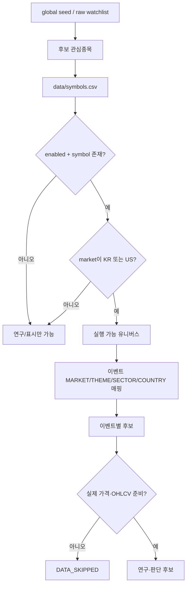
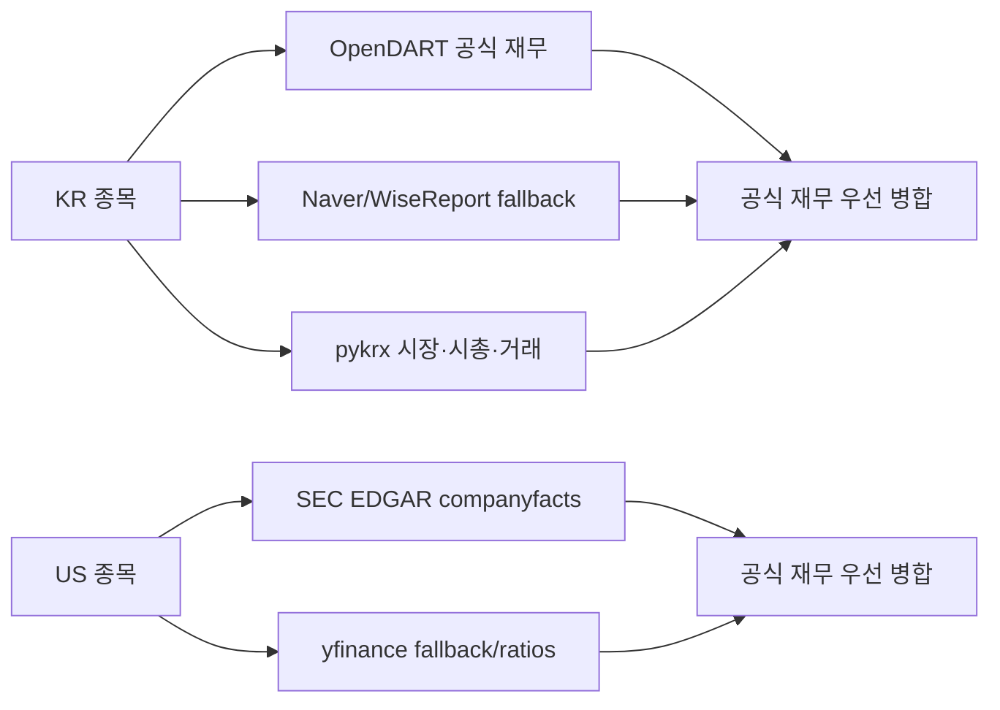

# 05. 시장 데이터 및 종목 유니버스 설계

## 목적

이 문서는 “어떤 종목을 볼 것인가”, “각 종목의 실제 가격·캔들·재무·뉴스는 어디서 가져오는가”, “데이터가 부족하면 어떻게 처리하는가”를 설명한다. 종목 후보를 넓히는 연구 경로와 실제 주문 가능 집합을 의도적으로 분리한 것이 핵심이다.

## 유니버스 계층

### 원본 관심종목과 실행 종목 분리

- `watchlist_raw.csv`는 아직 코드가 없거나 로컬 시장 티커인 항목도 보존한다.
- `global_theme_universe_seed.csv`의 병합은 신규 행을 비활성 후보로만 추가한다.
- `symbols.csv`에서 실행 후보가 되려면 심볼, 활성 여부, 시장 조건을 만족해야 한다.
- 일본·인도·중국 현지 종목처럼 토스 주문 경로를 구현하지 않은 시장은 실수로 `enabled=true`가 되어도 레지스트리에서 제외된다.

### 종목 검증

CLI의 `verify-execution-symbols`는 토스 종목 정보와 현재가를 묶음 조회해 `toss_execution_verification.csv`를 만든다. 확인 결과는 감사 자료이며 자동으로 종목을 활성화하지 않는다. 활성화는 사람이 검증 결과를 본 뒤 `symbols.csv`를 의도적으로 수정하는 별도 결정이다.

## 이벤트와 종목 매핑

이벤트는 하나의 연구 질문과 관련 종목 집합, LMSR 파라미터를 묶는다. `mapped_symbols`는 다음 유형을 가질 수 있다.

| 문법 | 의미 | 예시 결과 |
|---|---|---|
| 직접 심볼 | 특정 종목 | 삼성전자 코드 하나 |
| `MARKET:KR` / `MARKET:US` | 시장별 활성 종목 | 국내 또는 미국 실행 유니버스 |
| `THEME:...` | 같은 테마 | AI Semiconductor 등 |
| `SECTOR:...` | 같은 산업 | Financial, Healthcare 등 |
| `COUNTRY:...` | 특정 국가 노출 | 해당 국가 ETF/ADR/기업 |

국가 매핑은 거래소 시장과 다르다. 예를 들어 스위스 노출 미국 상장 종목은 주문 시장은 `US`로 유지하면서 `country_exposure=Switzerland` 메타로 국가 이벤트에 포함될 수 있다.

## 현금 맞춤 구매 가능 유니버스

`cash_affordable_candidates`는 `MARKET:KR,MARKET:US`로 활성 실행 종목 전체에서 시작하지만, 전체를 장기 분석하거나 모델에 보내지 않는다.

1. 현재 KRW·USD 주문가능액을 읽고 현금 reserve, 남은 전체 자동매수 한도, 종목당 상한, 이번 주기·시장별 이미 배치한 금액을 적용해 KR/US별 최대 단일 주문 예산을 계산한다.
2. 활성 심볼의 최신 가격을 최대 200개 단위로 묶어 조회한다. 가격이 없으면 구매 가능 후보가 아니다.
3. 국내는 최대 단일 주문 예산으로 최소 1주를 만들 수 있어야 한다. 미국은 현재 금액주문 경로의 원화·달러 최소 주문값을 모두 만족해야 한다.
4. 이미 보유한 심볼은 신규 기회 질문에서 제외한다. 기존 보유분의 추가매수나 청산은 다른 전략·exit 규칙의 책임이다.
5. 테마·국가 이벤트에도 등장하는 큐레이션 심볼을 우선한 뒤 한국 날짜 hash로 순환한다. KR/US 각각 `CASH_AFFORDABLE_MAX_SYMBOLS_PER_MARKET`, 전체 `CASH_AFFORDABLE_MAX_SYMBOLS`까지만 OHLCV·재무 정밀분석으로 넘긴다.
6. 정밀분석 안에서 Python factor+trend로 다시 정렬하고, 미보유·`tech_buy=True`인 상위 `LIVE_LLM_CANDIDATE_LIMIT`만 모델 후보가 된다.

이 방식은 활성 465개 전체를 매일 19역할로 분석하는 비용을 피하기 위한 bounded scan이다. “구매 가능”은 수익성이 좋다는 뜻이 아니며, 현재 잔액·가격·최소주문을 만족했다는 뜻뿐이다. 모델에는 구조화된 `portfolio_affordability`를 주지만 공개 Naver 검색에는 잔액을 보내지 않는다.

## 시장 데이터 수집 우선순위

### 토스 데이터

토스는 실제 주문 경계와 가장 가까운 자료를 제공한다.

- 현재가: 종목별 분석 가격과 주문 직전 재확인 가격
- 캔들: 기술 지표와 가격 경로
- 종목 정보: 거래 가능 여부·시장 메타 확인
- 호가: 시장가 주문 직전 스프레드·충격 검증
- 시장 달력: 장 개장 여부
- 계좌 자료: 주문 가능 금액, 보유, 미체결, 매도 가능 수량, 환율, 수수료

현재가 요청은 가능한 경우 여러 종목을 묶어 호출한다. 일부 종목 파싱이 실패하면 그 종목만 데이터 오류로 제외하며, 이벤트 전체를 무조건 중단하지 않는다.

### 캔들 페이징과 장기 저장

토스 캔들은 한 페이지 최대 200개를 기준으로 `nextBefore` cursor를 따라 추가 조회한다. 다음 페이지의 경계 캔들이 중복될 수 있으므로 timestamp를 기준으로 중복을 제거한다. 기술 지표와 차트는 시간 오름차순을 전제로 하므로 응답을 timestamp로 정렬한다.

수집한 원본 봉은 `data/market_history.sqlite3`에 누적한다. 첫 조회에서 요청 기간을 채울 때까지 과거 페이지를 가져오고, 그 뒤에는 설정된 최신성 주기 안에는 DB를 바로 사용한다. 주기가 지나면 최신 페이지를 받아 기존 시각은 갱신하고 새로운 시각만 추가한다. 15분봉·주봉·월봉 파일은 별도로 만들지 않고 저장된 1분봉 또는 일봉에서 집계한다.

| 화면 범위 | 저장 원본 | 화면 표시 봉 | 의도 |
|---|---|---|---|
| 1일 | 1분봉 | 1분봉 | 가장 최근 거래 세션. 거래일 사이 4시간 이상 공백을 기준으로 이전 세션을 잘라냄 |
| 1주 | 1분봉 | 15분봉 | 장중 흐름을 보되 화면 점 수를 제한 |
| 1개월·3개월·1년 | 일봉 | 일봉 | 일별 가격 경로 |
| 3년·5년 | 일봉 | 주봉 | 중장기 추세 |
| 10년 | 일봉 | 월봉 | 장기 구조와 저장 중복 최소화 |

종목 상장일이 요청 시작일보다 늦거나 공급자가 과거 cursor를 더 주지 않으면 실제 받은 시작일부터만 반환한다. 1년 된 종목의 10년 차트 앞부분을 0이나 복제 가격으로 채우지 않는다. 응답 메타에 `partial`, 실제 시작·종료일, 사유를 넣어 대시보드가 “상장일 또는 데이터 제공 시작일 이전은 없음”으로 표시한다. 공급자 시작점에 도달했다는 사실도 저장하므로 같은 종목을 다시 열 때 존재하지 않는 과거를 계속 재요청하지 않는다.

대시보드는 일부 이력이어도 차트를 보여준다. 자동매매 전략은 별도 안전 기준을 유지하여 LIVE에서 일봉이 최소 60개 미만이면 해당 종목 계산과 주문을 중단한다. 즉 차트의 부분 표시 허용이 부족한 데이터로 매매하는 허가가 되지는 않는다.

## 재무 데이터 경로

국내 종목은 OpenDART를 재무 우선 소스로 사용하고 Naver/WiseReport를 fallback으로 병합한다. 시총·거래량·거래대금 같은 시장 자료는 pykrx가 보완한다. 미국 종목은 미리 매핑된 CIK가 있으면 SEC companyfacts를 우선하고 yfinance가 비율과 누락 자료를 보완한다.

병합 시 주 공급자의 유효값이 fallback을 덮는다. 값의 단위가 비율과 퍼센트로 섞일 수 있어 ROE, 영업이익률, 순이익률, 부채비율은 과도하게 큰 값에 대해 정규화한다. 시총이 있으면 FCF yield, earnings yield, book-to-market, turnover 같은 파생 팩터도 계산한다.

## 뉴스·외부 근거

Naver Search는 이벤트 질문과 후보 종목을 기준으로 뉴스·검색 근거를 만든다. API 키, 일일 한도, TTL 캐시를 사용한다. 결과는 LLM의 근거 자료일 뿐 직접 주문 신호가 아니다. 검색 실패는 “긍정 뉴스가 없다”가 아니라 “근거를 가져오지 못했다”로 구분해야 한다.

Sapience는 설정이 켜진 경우 이벤트 확률을 참고값으로 읽는다. 0~1 범위의 확률을 다양한 응답 형태에서 방어적으로 파싱하며, 실패하면 `None`을 반환하고 내부 LMSR만 사용한다. Sapience를 통한 직접 거래는 없다.

## 연구 패킷

가격·OHLCV·재무·기술 분석이 준비되면 종목별 불변 연구 패킷을 만든다.

| 영역 | 포함 내용 |
|---|---|
| 식별 | 심볼, 종목명, 시장, 이벤트/run 연결 정보 |
| 시각 | 실제 관측 시각, 데이터 기준 시각 |
| 가격 | 현재가와 제공자/실데이터 여부 메타 |
| OHLCV | 최근 창, bar 수, 캐시·소스 메타 |
| 기술 | RSI, 이동평균, MACD, VWMA, CCI, ADX와 진입/청산 규칙 |
| 재무 | 공식/보조 공급자 값과 출처 |
| 품질 | 누락값, fallback, 지원하지 않는 기능 |
| 무결성 | 입력 스냅샷 해시 |

연구 패킷은 LLM과 이후 Python 판단이 같은 스냅샷을 보도록 하는 공통 계약이다. LLM 실행 후 가격을 다시 수집해 분석 입력과 정량 입력이 달라지는 문제를 피하기 위해, 이벤트 내에서는 만들어 둔 자료를 재사용한다. 단 실제 주문 직전 현재가는 별도로 다시 읽어 급변을 검사한다.

## 기술 지표와 특징

기본 연구 창은 설정상 260 bars이며 다음 자료를 계산한다.

- 가격 수익률과 변동성, 낙폭, 거래량 변화
- RSI, 단기/장기 SMA, MACD, VWMA, CCI, ADX
- 빠른/느린 Supertrend와 신호 나이
- 돌파형 채널, Bollinger 구조, 박스권
- 이중 바닥/천장, 둥근 바닥/천장 근사
- 반대 빠른 신호 누적에 따른 부분청산 후보
- 재무·유동성·모멘텀·가치·품질·위험 팩터

지표 값이 없을 때는 가능한 한 `None`, 중립, `insufficient_ohlcv` 같은 품질 상태로 표현한다. 실제값처럼 보이는 임의 수치로 채우는 것을 피한다.

## LIVE 데이터 품질 게이트

| 자료 | 실패 시 원칙 |
|---|---|
| 주문 가능 금액 | 해당 통화 신규 매수 여력을 0으로 두거나 주기 차단 |
| 보유종목 | 매도 수량·평단을 신뢰할 수 없으므로 LIVE 차단 |
| 환율 | 원화 환산과 미국 주문 금액이 틀릴 수 있어 차단 |
| 현재가 | 해당 종목 분석/주문 제외 |
| OHLCV | 기술 판단 불가능하므로 해당 종목 제외 |
| 주문 직전 가격 | 급변/파싱 실패 시 주문 차단 |
| 호가 | 시장가 비용을 확인할 수 없으면 주문 차단 |
| 시장 상태/거래가능 정보 | strict LIVE에서 확인 실패 시 차단 |

DRY RUN의 synthetic 자료는 반드시 모의 경로로 표시되어야 한다. LIVE에서는 설정에 따라 가격·OHLCV fallback을 명시적으로 차단한다.

## 데이터 신선도

- 현재가: 이벤트 분석 시 조회하고 주문 직전에 다시 조회한다.
- 호가: 주문 직전에 비캐시 단건 조회하며 timestamp 나이를 검사한다.
- 캔들: 설정 TTL 안에서는 캐시할 수 있다.
- 뉴스: 별도 TTL 캐시를 사용한다.
- 종목 분석 설명: 사용자가 refresh하기 전까지 캐시될 수 있다.
- LLM 결정: 이벤트·후보 집합 키와 TTL을 기준으로 재사용할 수 있다.

신선도는 모든 자료에 동일하지 않다. 주문 체결 비용에 가까울수록 짧은 TTL 또는 무캐시가 적용되고, 장기 재무·설명 자료는 더 오래 캐시할 수 있다.

## 후보 축소와 비용 통제

이벤트의 종목 수는 `MAX_SYMBOLS_PER_EVENT`로 자른다. 실제 가격·OHLCV가 있는 종목만 남긴 뒤 정량 점수와 기술 추세로 우선순위를 매겨 LLM 후보를 `LIVE_LLM_CANDIDATE_LIMIT`까지 줄인다. 신규 매수 기술 신호가 없는 종목은 live 멀티에이전트 요청에서 제외할 수 있다. 이 순서는 고비용 LLM을 전체 종목 스캐너로 쓰지 않고, Python이 이미 선별한 후보의 검토자로 쓰기 위한 것이다.

## 운영 점검 항목

- `symbols.csv`의 활성 종목이 실제 토스 조회에서 검증되었는가
- 지원하지 않는 시장 행이 실행 후보에서 제외되는가
- 데이터의 `observed_at`과 캐시 나이가 기록되는가
- 가격/OHLCV 누락을 0 또는 임의값으로 오해하지 않는가
- 재무 공급자와 fallback 공급자가 구분되는가
- 뉴스 실패와 부정적 뉴스가 구분되는가
- 주문 직전 가격과 분석 가격 차이가 허용 한도 안인가
- 호가 시각, spread, 예상 impact가 모두 제한 안인가
