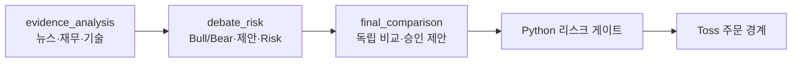
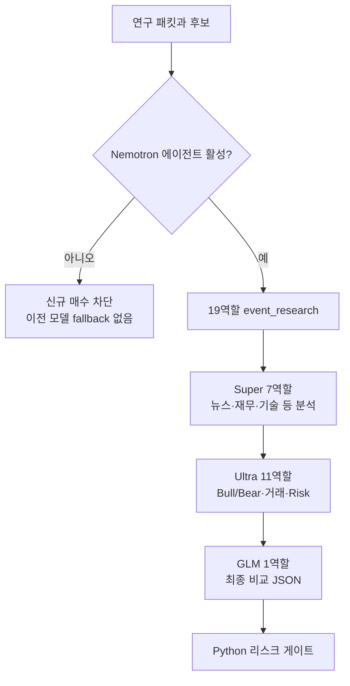
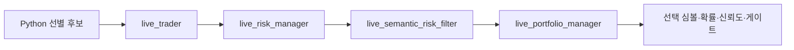

# 06. AI 에이전트 분석 파이프라인 설계

## 두 폴더의 역할

이 프로젝트에는 이름이 비슷하지만 목적이 다른 두 폴더가 있다.

| 폴더 | 역할 | 런타임 직접 사용 |
|---|---|---|
| `ai_prompt/` | 논문 PDF와 연구 메모, 구현 아이디어의 원본 | 아니오 |
| `agent/` | 역할별 프롬프트, 공통 정책, provider 지시, registry | 예 |

`ai_prompt/`의 연구 아이디어를 그대로 주문 규칙으로 쓰지 않고, 검증 가능한 런타임 프롬프트와 Python 안전장치로 옮긴 결과가 `agent/`와 `strategy/agentic/`이다.

## AI의 권한 경계

LLM은 다음을 할 수 있다.

- 후보 종목 중 하나를 선택하거나 아무것도 선택하지 않는다.
- 이벤트의 상승 확률과 신뢰도를 제안한다.
- 사실, 의견, 기술, 재무, 뉴스, 위험 관점을 구조화한다.
- 신규 매수를 허용, 축소, 보류할 수 있다.
- 포지션 크기에 0~1 범위의 축소 배수를 제안한다.
- 근거, 반증 조건, 위험 플래그를 남긴다.

LLM은 다음을 할 수 없다.

- 후보 목록 밖 심볼을 주문 대상으로 추가한다.
- 토스 API 또는 브로커 자격 증명에 접근한다.
- 주문 수량을 하드 한도보다 키운다.
- 시장 폐장, 데이터 누락, 호가 위험 같은 Python 가드를 우회한다.
- 이벤트 수준의 부정 의견만으로 모든 보유 종목을 일괄 청산한다.
- 주문 접수나 체결을 사실로 확정한다.

## 파이프라인 선택

### 역할별 모델 라우팅

| 모델 그룹 | 담당 역할 | 모델 환경 변수 | 역할 경계 |
|---|---|---|---|
| `evidence_analysis` | 통계·사실·주관·펀더멘털·뉴스·심리·기술 분석 | `NVIDIA_SUPER_MODEL` | 증거 보고서만 생성, 최종 판단 금지 |
| `debate_risk` | 사실/주관 추론, Bull/Bear, 거래 제안, Risk·semantic filter | `NVIDIA_NEMOTRON_MODEL` | 입력 근거만 재해석, 최종 승인 금지 |
| `final_comparison` | portfolio manager, live portfolio manager | `NVIDIA_FINAL_MODEL` (`z-ai/glm-5.2`) | 앞선 보고서 비교만 수행, 새 사실·위험 완화 금지 |

각 역할 MD는 `model_group`과 `model_env`를 선언한다. 오케스트레이터는 `stage`를 추정해 모델을 고르지 않고 이 선언을 검증해 라우팅한다. 선언되지 않은 그룹, 그룹과 맞지 않는 환경변수, 허용되지 않은 stage 조합은 모델 호출 전에 차단한다.

세 모델 호출은 NVIDIA의 OpenAI 호환 streaming completion으로 통일한다. Ultra·Super는 thinking과 reasoning budget을 활성화해 `reasoning_content`와 최종 `content`를 분리 수집하며, GLM 최종 비교는 thinking 없이 고정 seed로 앞선 JSON 보고서만 비교한다. 모델의 reasoning 문자열은 판단 근거를 대체하지 않으며 감사 데이터로만 취급한다.

`run_once`의 자동 LLM 판단은 3모델 에이전트 경로만 사용한다.

3모델 에이전트 경로는 기능 플래그로 활성화한다. 비활성화, 키 누락, 필수 보고서 실패, GLM 최종 JSON 계약 오류가 발생하면 이전 단일 NVIDIA 모델이나 Ultra 판단으로 대체하지 않고 해당 이벤트의 신규 매수를 막는다.

기본 `event_research`는 세 모델 그룹을 모두 호출하는 전체 경로다. 레지스트리에는 저지연 실험용 `live_event_research`도 남아 있지만 Super 분석과 전체 Bull/Bear 토론을 생략하므로 현재 자동매매 기본값이 아니다.

## 에이전트 레지스트리

`agent/agent_registry.json`은 버전, 기본 공급자, 공통 프롬프트, 파이프라인과 역할 정의를 가진다. 각 역할 MD는 기대 schema, 모델 그룹, 의존 역할과 권한 경계를 선언한다. 오케스트레이터는 현재 파이프라인에 함께 들어 있는 `depends_on` 역할만 선행 조건으로 검사하며, 보고서가 없거나 `status: ok`가 아니면 후속 모델 호출을 `required_dependency_unavailable`로 차단한다. 사후·오프라인 경로가 이전 실행 결과를 입력으로 받는 경우처럼 다른 파이프라인에 속한 의존성은 현재 호출 안에서 다시 기다리지 않는다.

### `live_event_research`(실험용 축약 경로)

실전 루프의 호출 비용과 지연을 줄인 4단계 경로다.

| 역할 | 주요 책임 |
|---|---|
| `live_trader` | 제한된 후보와 연구 패킷을 보고 하나의 거래 후보/보류 제안 |
| `live_risk_manager` | 신규 매수의 포트폴리오·시장·자료 위험 검토 |
| `live_semantic_risk_filter` | 인과 근거 부족, 공통원인, 유동성·출처 위험을 pass/reduce/hold로 변환 |
| `live_portfolio_manager` | 앞선 보고서를 종합해 최종 후보와 노출 의견 제안 |

LIVE 경로에서는 주요 역할 보고서가 모두 유효해야 하고, trader와 portfolio manager의 심볼 합의가 요구된다. 누락, 불일치, schema 오류는 매수 승인이 아니라 차단 사유가 된다.

### `event_research`

상세 연구 파이프라인은 다음 역할군을 순서와 의존관계에 따라 실행한다.

| 단계 | 역할 | 산출물 |
|---|---|---|
| 1. 기초 자료 | statistics, fact, subjectivity, fundamental, news, sentiment, technical vision | 수치·사실·의견·재무·뉴스·차트 관찰 |
| 2. 추론 | fact_reasoner, subjectivity_reasoner | 사실과 주관 자료의 분리된 해석 |
| 3. 토론 | bull_researcher, bear_researcher, debate_moderator | 강세·약세 논거와 충돌 정리 |
| 4. 거래 제안 | trader | 후보·방향·근거·무효화 조건 |
| 5. 위험 관점 | aggressive, neutral, conservative risk | 여러 위험 성향의 평가 |
| 6. 위험 통합 | risk_manager, semantic_risk_filter | 가장 제한적인 위험 판정 |
| 7. 최종 제안 | portfolio_manager | 확률·노출·신뢰도와 후보 |

### 사후·오프라인 파이프라인

- `post_decision`: 결과가 알려진 뒤 reflection과 memory curator가 원래 결정을 덮지 않고 새 성찰 메모를 추가한다.
- `offline_experiments`: simulation designer, distillation teacher, latency optimizer가 시뮬레이션·teacher label·지연 개선 후보를 만든다. 이 출력은 검증 없이 LIVE 주문 권한으로 승격되지 않는다.
- `cash_symbol_discovery`(신규, 기본 꺼짐 — `CASH_SYMBOL_DISCOVERY_ENABLED`): `data/symbols.csv` 레지스트리 밖의 종목도 제안받기 위한 1-role 발굴 파이프라인. 위 `event_research`/`live_event_research`와 달리 `analyze_event()`가 아니라 `NvidiaNemotronAgentOrchestrator.discover_cash_symbols()`라는 별도 진입점으로 호출되며, **제미나이(`GeminiAPI2Client`, 실시간 Google Search grounding)가 1순위, 여기 등록된 NVIDIA `cash_symbol_discovery` role은 제미나이 실패 시의 폴백**이다. 두 provider 중 어느 쪽이 낸 `symbol_guess`든 이후 `strategy/toss_symbol_verifier.verify_symbol_guesses()`로 실제 토스 API 재검증을 통과해야만(fail-closed) `data/symbols.csv`에 `resolved=ai_discovered_verified`로 추가되고, 그 뒤에는 `event_research`/`live_event_research`를 포함한 기존 모든 후보 흐름·하드 게이트를 동일하게 통과해야 한다. 상세 설계는 `14_1분봉단타실행엔진및확률모델설계.md` 13.5절.

## 입력 컨텍스트

에이전트 실행 단위는 이벤트 하나다. 주요 입력은 다음과 같다.

- run ID, 결정 시각, data cutoff
- 이벤트 ID, 테마, 질문
- Python이 제한한 후보 심볼과 종목 메타
- 종목별 연구 패킷과 입력 해시
- Naver 뉴스·검색 근거
- 선택적 lead-lag 연구 후보와 전처리 설명
- 현금 맞춤 이벤트에서만 현재 KRW·USD, 환율, 시장별 최대 검토금액과 Python 검증 후보를 담은 `portfolio_affordability`
- 이전 역할의 구조화 보고서
- 태그·텍스트로 검색한 과거 메모리
- 사용 가능한 기능 목록: 차트 이미지 여부, OHLCV, 포트폴리오 정보, 주문 접근 없음 등

큰 입력은 context 크기에 맞게 축약할 수 있다. 축약 여부 자체가 감사 자료에 드러나야 하며, 에이전트가 받지 못한 자료를 본 것처럼 답하지 않도록 capability와 data quality 필드를 제공한다.

`portfolio_affordability`는 수익 근거가 아니라 실행 가능성 제약이다. Trader와 최종 Portfolio Manager는 `candidate_symbols` 밖의 심볼을 반환할 수 없고, 현금이 많다는 이유로 기대수익이나 confidence를 높이지 않는다. 정확한 주문 금액·수량은 모델 출력이 아니라 Python이 최신 잔액과 가격으로 다시 만든다. 잔액이 붙은 내부 질문은 NVIDIA 연구 컨텍스트와 감사 원장에는 남지만 공개 Naver 검색 질의는 잔액 없는 기본 질문을 사용한다.

## 역할 실행 순서와 의존성

오케스트레이터는 registry 순서를 그대로 무조건 호출하지 않는다. 요청 파이프라인의 역할 목록, 활성 상태, 최대 에이전트 수, 의존 보고서 준비 여부를 확인한다. 앞선 역할 결과는 요약된 형태로 다음 역할 컨텍스트에 포함된다.

일일 호출 예산이 소진되거나 API 키가 없으면 해당 turn은 `unavailable`로 감사 로그에 남는다. LIVE 필수 역할이 unavailable이면 보수적으로 `buy_allowed=false`, `size_multiplier=0`인 결과가 된다.

## 구조화 응답 계약

역할별 schema가 다르지만 공통적으로 다음 요소를 요구한다.

| 요소 | 의미 |
|---|---|
| `status` | ok, insufficient_data, unavailable 등 |
| `symbol` | 후보군 안의 선택 심볼 또는 null |
| `direction`/`verdict` | buy/hold 또는 pass/reduce/hold |
| `confidence` | 제한된 범위의 확신 |
| `evidence_ids` | 연구 패킷 안 근거 연결 |
| `invalidation` | 어떤 조건이면 판단이 무효인지 |
| `risk_flags` | 유동성·출처·집중·공통원인 등 |
| `data_cutoff_utc` | 판단이 이용한 자료의 시간 경계 |

JSON 파싱 또는 schema 검증이 실패하면 자유 텍스트를 주문 승인으로 해석하지 않는다. 결과는 감사에 남기되 LIVE 게이트는 fail-closed로 처리한다.

## 위험 판정 결합

`risk_manager`와 `semantic_risk_filter` 결과는 더 제한적인 쪽으로 결합한다.

| verdict | 허용 | 크기 배수 |
|---|---|---|
| pass | 기본 판단이 유효하면 허용 | 요청값을 최대 1.0으로 제한 |
| reduce | 허용 가능 | 최대 0.75로 제한 |
| hold/알 수 없음 | 불허 | 0.0 |

여러 평가의 flags와 reasons는 합쳐 보존한다. LLM이 큰 배수를 요청해도 Python 하드 상한을 늘릴 수 없고, 오직 유지하거나 줄일 수 있다.

## 결과를 전략으로 전달하는 필드

오케스트레이터의 통합 결과는 대략 다음 의미를 가진다.

- `yes_probability`: 이벤트 상승 가능성. 0.01~0.99 범위로 제한된다.
- `confidence`: 유효한 결정에 대한 신뢰도.
- `news_score`: GLM이 Super의 뉴스·심리 분석과 Ultra 판단을 비교해 확정한 이벤트 뉴스 영향(-1~1).
- `buy_allowed`: 신규 매수를 계속 검토할 수 있는지.
- `size_multiplier`: Python이 산출한 위험 주문 금액에 곱할 축소 배수.
- `block_reason`: 보류/차단 이유의 결합 문자열.
- `selected_symbols`: 입력 후보군과 교집합인 선택 심볼. 보통 한 개.
- `reasoning_signals`: 사실·주관 보고서와 정량 신호를 결합하기 위한 자료.

이 결과만으로 주문이 만들어지지 않는다. 이후 생존 게이트, 정량 행동, 기술 진입, 예산, 시장/종목, 최신가격, 호가 검증이 남아 있다.

## 판단 캐시

현재 운영 캐시는 두 계층이다.

1. 기본 계층인 `daily_event_llm_cache`는 `연구 날짜|pipeline|event_id`를 key로 쓴다. 한국 날짜의 첫 시도에서 모델 분석 성공, 자료 부족, 공급자 실패, Python 사전 선별 후보 없음 중 어떤 결과가 나와도 저장한다. 이 결과는 해당 날짜에 같은 이벤트의 모델 질문을 다시 보내지 않게 하는 실행 제어 기록이다.
2. `EVENT_LLM_ONCE_PER_DAY=false`로 일일 정책을 끈 경우에는 기존 `live_agent_decision_cache`가 사용된다. 이 계층은 이벤트 ID, 실제 질문, pipeline 이름, 정렬된 후보 집합을 key로 하고, 정상 완료한 판단만 TTL 동안 재사용한다.

테스트 환경의 `EVENT_LLM_REFRESH_ON_PROCESS_START=true`는 영속 캐시와 별도로 프로세스 메모리에 완료 key 집합을 둔다. 새 `python main.py` 프로세스에서는 이 집합이 비어 있으므로 기존 당일 레코드를 이벤트별 한 번 무시하고 새 분석 결과로 같은 key를 덮어쓴다. 시도가 저장되면 메모리 집합에도 완료 표시를 하므로 프로세스를 유지한 채 도는 이후 전략 루프는 갱신된 당일 캐시를 읽는다. 운영에서 재시작해도 같은 날 재호출하면 안 되는 경우 이 설정을 `false`로 둔다.

당일 캐시 hit에서는 모델 입력을 만들기 위한 Naver 뉴스 조회와 lead-lag 연구를 다시 하지 않는다. 그러나 현재가·OHLCV·재무·기술 신호·보유수량·예산·생존 게이트는 그 전략 루프의 최신 입력으로 다시 계산한다. 따라서 “모델 질문 하루 한 번”은 “봇 전체 계산 하루 한 번”을 의미하지 않는다.

당일에는 질문 후보 집합이 달라져도 이미 저장된 이벤트 공통 판단을 재사용한다. 이벤트의 실제 주문 대상은 매 루프 현재 실행 종목 및 사전 선별 후보와 다시 교집합을 취하므로, 저장 결과에 있던 과거 후보가 임의로 주문 대상으로 살아나지 않는다. 다음 연구 날짜가 되면 새 질문을 시도하고 과거 날짜의 운영 캐시는 정리된다.

캐시는 브로커 현재가·호가 캐시와 다르다. 과거 LLM 의견을 재사용하더라도 실제 주문 직전 가격과 호가는 다시 검증한다.

## 메모리와 감사

각 에이전트 turn은 공급자, 모델, prompt hash, 입력 hash, 응답 hash, 지연, status와 결과를 `audit.jsonl`에 남긴다. 통합 결정은 테마와 대표 심볼 태그를 가진 `decision` 메모리로 `memory.jsonl`에 추가될 수 있다.

메모리 검색은 최신성과 단순 텍스트/태그 일치를 이용한다. 검색된 과거 판단은 참고 근거이며 현재 시장 데이터보다 우선하지 않는다. 사후 결과는 원래 기록을 수정하지 않고 새 reflection 레코드와 link로 연결한다.

## 비용과 지연 제어

- 전체 이벤트 종목을 LLM에 보내기 전에 Python 점수로 후보를 제한한다.
- 현금 맞춤 이벤트는 활성 KR/US 전체의 가격만 묶음 scan하고, 구매 가능성과 시장별 상한을 통과한 최대 40개만 정밀자료 수집 대상으로 삼는다.
- 기술적 신규 매수 후보가 없으면 live 에이전트 호출을 생략할 수 있다.
- 공급자별 일일 호출 한도와 최소 호출 간격을 적용한다.
- 일일 이벤트 시도 캐시로 같은 질문의 10분 주기 반복 요청을 막는다.
- 이벤트 간 인위적인 `sleep`은 두지 않고, 한 이벤트 출력이 끝나면 다음 이벤트를 즉시 준비한다.
- 최대 에이전트 수로 한 실행의 호출 폭을 제한한다.
- latency는 turn 감사에 남겨 p50/p95 등 오프라인 분석이 가능하다.

## 운영 점검 항목

- 실제 사용 pipeline 이름이 registry에 존재하는가
- 필수 역할 프롬프트와 schema가 모두 로드되는가
- 모델 키가 토스 자격 증명과 분리되어 있는가
- 후보 밖 심볼이 `selected_symbols`에 남지 않는가
- data cutoff와 연구 패킷 관측 시각이 일관적인가
- missing/unavailable 결과가 매수 승인으로 변환되지 않는가
- semantic `reduce`가 크기를 키우지 않는가
- LLM 차단이 기존 포지션의 강제 청산까지 막지 않는가
- 감사 로그가 커질 때 민감정보·보존기간을 관리하는가
