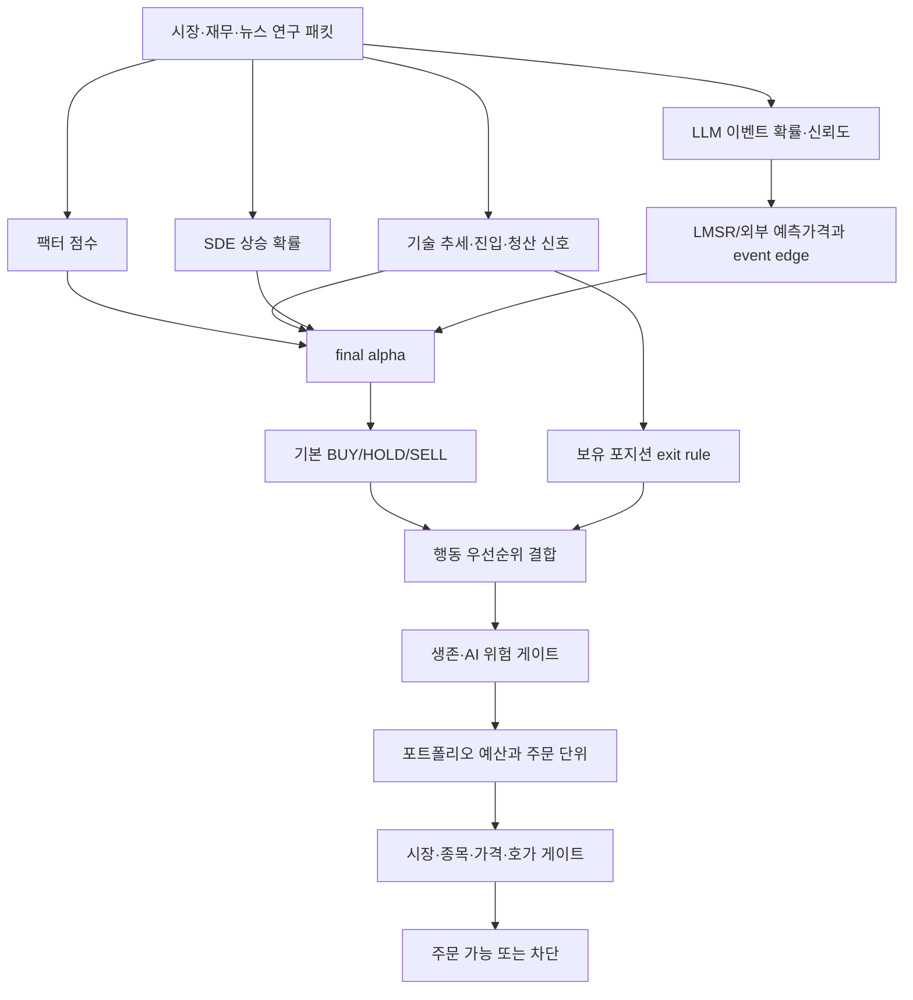
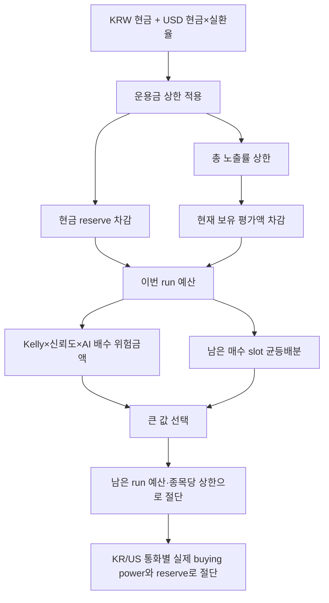

# 07. 신호 판단 및 리스크 관리 설계

## 목적

이 문서는 종목 자료와 AI 의견이 어떻게 BUY/HOLD/SELL로 바뀌고, 주문 금액이 어떤 한도에 의해 줄어들며, 어떤 조건에서 신규 매수가 차단되는지를 설명한다. 이 프로젝트의 핵심은 하나의 점수가 주문을 결정하지 않고 여러 독립 게이트를 직렬로 통과시키는 데 있다.

## 판단 계층

## 이벤트 확률과 LMSR

각 이벤트는 yes/no 관점을 가진 내부 LMSR 시장을 유지한다. LLM이 `yes_probability`를 제안하면 기존 LMSR 확률을 한 번에 덮지 않고 `LMSR_UPDATE_ALPHA`만큼 점진적으로 이동시킨다.

외부 Sapience 가격이 있으면 내부 LMSR 가격 70%, 외부 가격 30%의 참고 혼합값을 사용한다. 외부 값이 없으면 내부 LMSR 가격만 사용한다. 이벤트 엣지는 LLM 확률에서 이 기준 가격을 뺀 값이다. 이를 통해 “모델이 시장/기존 믿음보다 얼마나 더 낙관적인가”를 표현한다.

LMSR은 이벤트별 상태를 `state.json`에 저장한다. 이 값은 실제 거래소 가격이 아니라 연구용 확률 상태이며, 토스 주문 체결 가격과 혼동해서는 안 된다.

## 정량 구성요소

### 팩터 점수

재무·시장 특징을 가치, 품질, 성장, 모멘텀, 유동성, 위험 관점으로 정규화해 종목 간 비교 점수를 만든다. 재무 공급자의 값이 누락되면 해당 항목은 근거 부족으로 남아야 하며, 임의의 좋은 점수로 보정하지 않는다.

### SDE/GBM 상승 확률

현재가, 추정 drift, 역사적 변동성, 뉴스·공시 위험 배수를 이용해 설정된 horizon 뒤 목표 수익률을 넘을 확률을 근사한다. 이 확률은 `sde_prob_up`으로 사용하며 0.5를 중심으로 -1~1 점수로 변환해 final alpha에 일부 반영한다.

### 기술 점수

빠른/느린 Supertrend, 돌파 채널, Bollinger, 박스권, 반전 패턴, 신호 지속기간과 잦은 뒤집힘을 합쳐 `trend_score`를 만든다. 별도로 `buy_signal`, `sell_signal`, `exit_signal`, `partial_exit_signal`과 세부 trigger를 제공한다.

### 신호 융합

사실 에이전트, 주관 에이전트, 정량 신호는 각각 -1~1 범위로 제한한 뒤 가중 결합할 수 있다. 이 융합값은 설명과 attribution을 보강하지만 기존 하드 리스크 규칙을 대체하지 않는다.

## final alpha

현재 구현의 개념적 구성은 다음과 같다.

| 구성 | 가중치/방향 |
|---|---|
| 팩터 점수 | +25% |
| 이벤트 엣지 | +25% |
| SDE 확률 점수 | +20% |
| 기술 추세 점수 | +20% |
| 뉴스 이벤트 점수 | +10% |
| 부정적 위험 점수 | 추가 감점 |

최종값은 -1~1 범위로 제한된다. 이 공식은 여러 근거를 한 숫자로 요약하지만, 데이터 품질과 주문 안전성은 별도 게이트이므로 높은 alpha 하나만으로 주문할 수 없다.

## 기본 행동 결정

### BUY 후보

다음 조건을 모두 만족해야 기본 BUY가 된다.

- 이벤트 엣지가 최소값 이상
- Kelly yes 값이 양수
- final alpha가 최소값 이상
- SDE 상승 확률이 최소값 이상
- 추세 점수가 최소값 이상
- 유동성 점수가 허용 범위 이상

기술 진입 규칙 사용이 켜져 있으면 여기에 `buy_signal=true`가 추가로 필요하다.

### SELL 후보

이벤트 엣지, Kelly no, final alpha, 추세, SDE 중 하나라도 매도 임계값을 넘으면 기본 SELL 신호가 될 수 있다. 그러나 이벤트 확률은 같은 테마 여러 종목이 공유하므로, 이 기본 SELL만으로 테마 보유종목을 전부 청산하지 않는다. 실제 보유 포지션은 종목별 exit rule이 청산 권한을 가진다.

### HOLD

매수 조건을 모두 만족하지 않고 매도 임계도 넘지 않으면 HOLD다. 또한 AI가 후보를 선택하지 않거나 신규 매수를 승인하지 않으면 기본 BUY가 HOLD로 낮아질 수 있다.

## 청산 규칙

보유 수량과 평균단가가 있어야 실제 매도 명세를 만들 수 있다.

| 조건 | 행동 |
|---|---|
| 손익률이 손절 한도 이하 | 전량 SELL |
| 손익률이 익절 한도 이상 | 전량 SELL |
| 수익 구간 + 기술 매도 신호 | 기술적 trailing 성격의 전량 SELL |
| 이벤트 엣지 강한 음수 | 전량 SELL |
| Kelly no 과다 | 전량 SELL |
| final alpha/추세/SDE 하락 임계 | 전량 SELL |
| 돌파 중단선 하향 이탈 | 전량 SELL |
| 박스 하방 이탈 | 전량 SELL |
| 기술 sell signal | 전량 SELL |
| 수익 중 빠른 반대 신호 2회 | 설정 비율 PARTIAL_SELL |

보유가 없는데 매도 신호가 생기면 `SELL_SIGNAL_NO_POSITION`으로 기록만 하고 공매도 주문을 만들지 않는다.

설정에 trailing stop 비율이 있지만 현재 구현은 포지션별 최고가를 지속 저장해 정확한 고점 대비 하락을 계산하는 완전한 trailing stop이 아니다. 현재는 수익 활성 구간과 기술 매도 신호를 결합한다.

## 행동 우선순위

1. 실제 보유 포지션의 손절·익절·기술 청산이 있으면 SELL/PARTIAL_SELL을 우선한다.
2. 보유가 없는 매도 신호는 기록만 한다.
3. 이벤트 수준 기본 SELL은 종목별 exit 근거가 없으면 HOLD로 바꾼다.
4. 신규 BUY는 기술 진입 조건, 생존 게이트, AI 선택과 위험 게이트를 추가로 통과해야 한다.

이 순서 때문에 낮은 LLM 신뢰도는 위험을 늘리는 신규 매수를 막지만, 이미 존재하는 위험 포지션의 결정적 손절까지 막지는 않는다.

## 생존 게이트

`survival_gate`는 다음을 순서대로 검사한다.

| 검사 | 차단 이유 |
|---|---|
| 일손익률이 최대 일손실 이하 | `daily loss limit reached` |
| 누적 낙폭이 최대 낙폭 이하 | `total drawdown limit reached` |
| API 오류 횟수가 한도 이상 | `too many api errors` |
| LLM 신뢰도가 최소 미만 | `llm confidence too low` |

생존 게이트는 신규 매수의 확장을 막는 장치다. 손실률은 LIVE에서 실제 계좌 평가 데이터를 통해 갱신되며, DRY RUN에서는 상태 파일 값에 의존한다.

## AI 위험 게이트

AI의 `pass`, `reduce`, `hold`를 결정적 값으로 변환한다.

- pass: 0~1 범위 배수, 기본 판단이 유효할 때만 허용
- reduce: 최대 0.75의 배수만 허용
- hold/누락/알 수 없음: 배수 0, 신규 매수 차단

`risk_manager`와 semantic filter가 다르면 더 제한적인 verdict와 더 작은 배수를 선택한다. 이유와 flag는 모두 합쳐 감사 가능성을 유지한다.

## 포지션 크기와 총 예산

### 하드 한도

- 최대 관리 운용금
- 전체 자동매수 금액 상한
- 총 노출 비율 상한
- 종목당 자동매수 상한
- 현금 보유 비율
- 한 주기 신규 매수 수
- 최대 보유 종목 수
- 최소 원화/달러 주문 금액
- 시장별 실제 주문 가능 금액

기존 보유 평가액은 종목당/총 노출 여유에서 차감한다. 미국 포지션은 통화가 USD로 명시된 경우 실환율로 원화 환산한다.

## KR/US 주문 단위

- KR 매수: 원화 배정액을 현재가로 나눈 뒤 내림하여 정수 주식 수량으로 만든다. 1주도 살 수 없으면 차단한다.
- US 매수: 원화 배정액을 환율로 달러 전환하여 금액 주문으로 만든다.
- KR 매도: 보유 수량×매도 비율을 내림한 정수 수량이다.
- US 매도: 보유 수량 기반 수량 주문이며 소수점 허용 여부는 실제 계좌/토스 계약을 별도로 확인해야 한다.
- KR/US 외 시장: 주문 명세 생성 단계에서 차단한다.

## 주문 직전 리스크 게이트

| 게이트 | 검사 내용 |
|---|---|
| 미해결 주문 | 이전 POST의 결과가 불명확하거나 주문이 비종결인지 |
| 신규 매수 수 | 한 주기 최대 횟수를 넘는지 |
| 포지션 수 | 최대 보유 종목 수를 넘는지 |
| 종목 미체결 | 같은 종목의 OPEN 주문이 이미 있는지 |
| 시장 상태 | KR/US 장이 열려 있는지 |
| 종목 거래가능 | 토스 종목 정보상 주문 가능한지 |
| 최신 가격 | 분석 가격 대비 변동률이 허용 이내인지 |
| 매도 가능 수량 | 실제 sellable quantity가 주문 수량 이상인지 |
| 호가 시각 | 호가가 너무 오래되지 않았는지 |
| 스프레드 | 최대 bps 이내인지 |
| 예상 충격 | 주문량을 호가에 대입한 impact가 한도 이내인지 |

하나라도 확인할 수 없으면 strict LIVE에서는 허용으로 추정하지 않고 차단한다.

## 대표 차단 시나리오

- AI가 매수를 추천했지만 기술 buy signal이 없음 → HOLD
- 기술 buy signal이 있으나 AI가 후보를 선택하지 않음 → HOLD
- 모든 분석은 좋으나 당일 손실 한도 초과 → 신규 매수 차단
- 총 자동매수 상한이 이미 기존 포지션으로 가득 참 → 주문 금액 0
- 주문 직전 가격이 분석 가격보다 급등 → BUY 차단
- 장은 열렸지만 호가 timestamp가 오래됨 → 시장가 주문 차단
- 보유 종목 손절 발생 + LLM unavailable → 매도 규칙은 계속 평가
- 이벤트 수준 SELL + 해당 종목 청산 trigger 없음 → HOLD

## 리스크 로그에서 확인할 값

운영자는 각 종목 로그에서 action만 보지 말고 다음을 함께 봐야 한다.

- `action_reason`과 exit trigger
- 분석 가격과 주문 직전 가격
- event edge, final alpha, SDE, trend, Kelly
- LLM confidence, selected symbol, buy_allowed, size multiplier
- 총 예산, 종목 여유, 통화별 buying power
- orderability 결과와 orderbook check
- 실행 결과의 submitted, terminal, filled, pending, rejected 상태

## 설정 변경 원칙

리스크 임계값은 한 번에 여러 개를 완화하지 않는 것이 좋다. DRY RUN의 실제 로그를 기간별로 비교하고, 변경 이유·기대효과·롤백 값을 기록한 뒤 하나의 변수군만 조정한다. LLM prompt 변경과 자금 한도 변경을 동시에 적용하면 성과와 장애 원인을 분리하기 어렵다.

