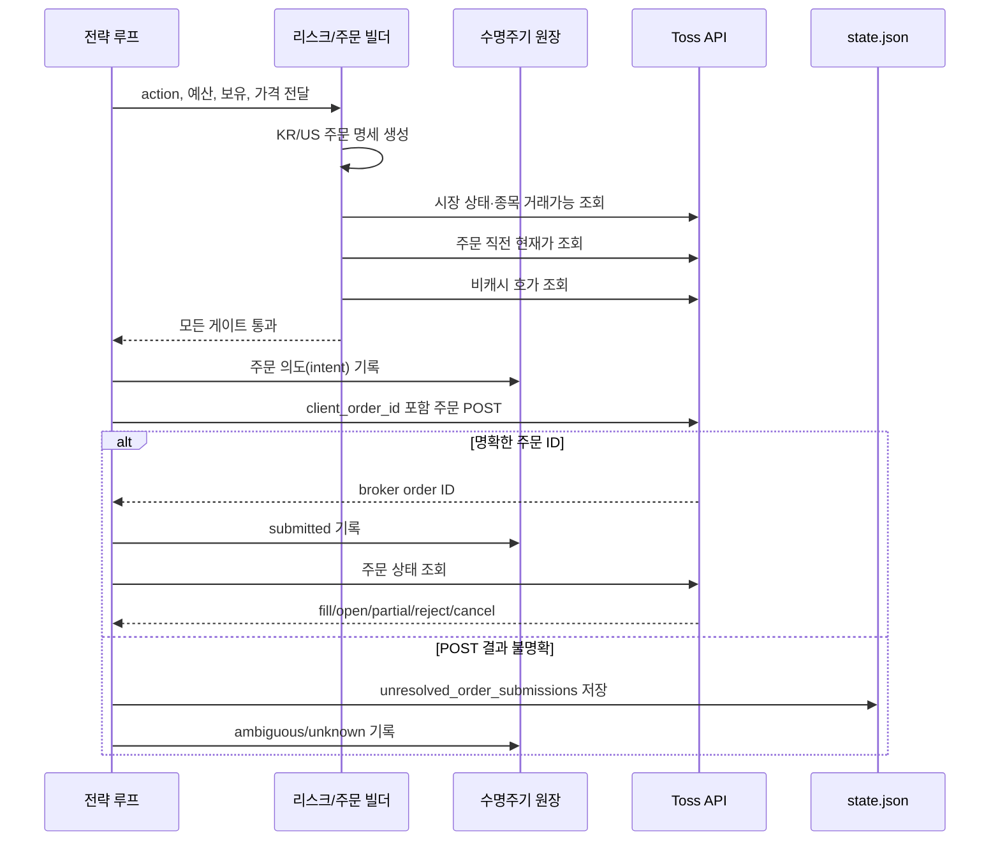
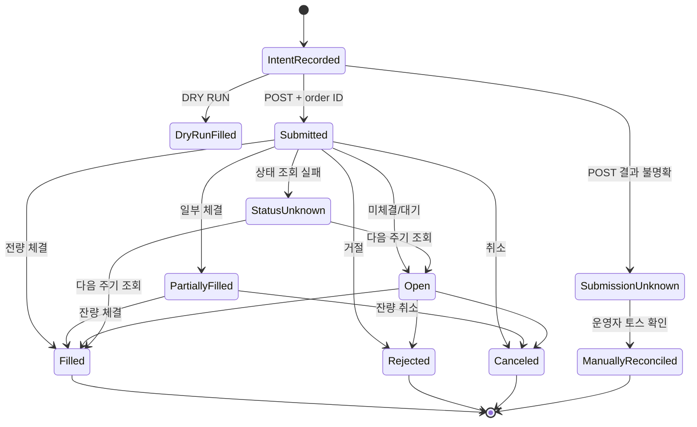
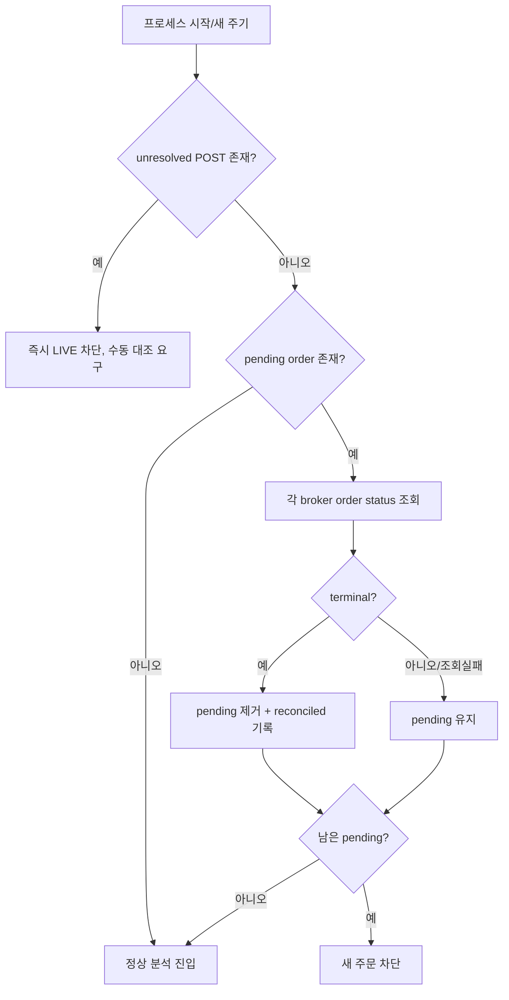

# 08. 주문 실행 및 포지션 수명주기 설계

## 목적

이 문서는 하나의 BUY/SELL 판단이 실제 토스 주문 요청으로 바뀌고, 접수·체결·거절·부분체결·불명확 상태를 어떻게 기록하고 복구하는지 설명한다. 핵심 원칙은 “POST 응답이 없다고 주문이 실패한 것은 아니다”이다.

## 주문 전 전체 흐름

## 주문 명세

공통 필드는 다음 의미를 가진다.

| 필드 | 의미 |
|---|---|
| `market` | KR 또는 US |
| `symbol` | 토스 종목 코드 |
| `side` | BUY 또는 SELL |
| `order_type` | 자동 전략은 주로 MARKET |
| `quantity` | KR 매수/매도 및 US 매도 수량 |
| `order_amount` | US 매수 달러 금액 |
| `notional_krw` | 위험·한도 추적용 원화 환산 명목금액 |
| `client_order_id` | 애플리케이션 생성 idempotency/추적 식별자 |

KR 매수는 정수 수량, US 매수는 달러 금액 주문이라는 차이가 있다. 시장별 최소 주문 금액과 1주 구매 가능 여부를 먼저 검사한다.

## 주문 의도 기록

실제 POST 전에 고유 `lifecycle_id`를 생성하고 다음 자료를 수명주기 원장에 기록한다.

- runtime run과 이벤트 ID
- 심볼, 시장, 행동과 행동 이유
- 연구 패킷 hash와 LLM 결과 요약
- 주문 명세
- 시장·종목 거래 가능 확인 결과
- 호가 안전성 결과와 주문 직전 가격
- 생존 게이트 결과
- 현금과 기존 포지션 요약

이 기록은 “왜 주문을 보내려고 했는가”를 POST 결과와 독립적으로 남긴다. LIVE에서 이 원장을 기록할 수 없으면 무인 주문을 보내지 않는 것이 원칙이다.

## 클라이언트 주문 ID

`client_order_id`는 `lifecycle_id`를 바탕으로 길이를 제한한 `bot-...` 형태로 만든다. 다음 용도로 쓰인다.

- 브로커 주문과 내부 의도 연결
- 네트워크 오류 후 토스 주문내역 대조
- 같은 의도의 무조건 재전송 방지
- 거래 로그, 상태 파일, 주문 원장의 공통 키

클라이언트 ID가 있다고 브로커가 완전한 idempotency를 보장한다고 가정해서는 안 된다. 그래서 POST 모호 상태에서는 새 주문을 전역 차단하고 사람이 토스 내역과 대조한다.

## 주문 상태 모델

### 접수와 체결의 차이

토스가 주문 ID를 반환한 것은 주문을 접수했다는 뜻이지 전량 체결됐다는 뜻이 아니다. `require_order_status_after_live_order`가 켜져 있으면 POST 직후 주문 상태를 조회한다. `filled`, `rejected`, `canceled` 같은 종결 상태만 최종 상태로 취급하고 open·partial·조회 실패는 pending으로 보존한다.

## DRY RUN 체결

DRY RUN에서는 네트워크로 주문을 보내지 않고 `sim_positions`를 갱신한다.

- BUY: 기존 수량·평단과 새 주문 금액을 합쳐 새 평균단가를 계산한다.
- SELL: 수량을 줄이고 평균단가 대비 실현손익을 누적한다.
- 수량이 0 이하가 되면 해당 모의 포지션을 제거한다.

DRY RUN의 `executed`는 모의 체결을 뜻하며 토스 실제 주문/체결 증거가 아니다. 운영 로그와 화면에서 mode를 반드시 함께 확인해야 한다.

## LIVE 주문 직전 검증

### 계좌와 포지션

신규 매수 전 실제 주문 가능 금액과 현재 노출을 사용한다. 매도 전에는 보유 수량뿐 아니라 `sellableQuantity`가 실제 주문 수량 이상인지 확인한다. 파서가 수량을 찾지 못하면 0으로 추정하여 주문하지 않고 실패로 처리한다.

### 시장·종목

시장 달력 응답으로 시장이 열렸는지 확인하고, 종목 정보로 거래 가능 상태를 확인한다. 지원하지 않는 시장은 주문 빌더 이전·이후 여러 계층에서 반복 차단한다.

### 최신 가격

연구 패킷 가격은 분석 근거이고 주문 직전 가격은 실행 근거다. 두 가격의 변동률이 `MAX_LIVE_PRICE_MOVE_PCT`를 넘으면 오래된 분석으로 판단해 차단한다. 이후 주문 명세를 최신 가격으로 다시 만든다.

### 호가

시장가 주문 직전 단건 호가를 캐시 없이 조회한다. timestamp의 시간대가 명확하고 충분히 최신이어야 하며, bid/ask가 정상이고 crossed/locked 상태가 아니어야 한다. 주문 수량 또는 금액을 호가 레벨에 소진시켜 예상 평균 체결가를 추정하고 spread와 impact bps를 한도와 비교한다.

## POST 이후 세 가지 분기

### 1. 종결 상태

주문 ID와 상태 조회가 성공하고 `filled`, `rejected`, `canceled`가 확인되면 수명주기 원장에 종결 이벤트를 기록한다. 체결 여부는 브로커 상태를 기준으로 하며, 단순 HTTP 200만으로 채우지 않는다.

### 2. 비종결 상태

open, pending, partial 또는 상태 조회 실패라면 `pending_live_orders`에 다음 정보를 저장한다.

- client/broker order ID
- lifecycle ID, symbol, event ID
- 최초 제출 시각과 마지막 관측 상태
- 남은 수량 또는 파싱된 상태 요약
- 주문 명세와 대기 이유

pending이 하나라도 있으면 새 LIVE 주문을 전역 차단한다. 다음 루프 첫 단계에서 각 broker order ID를 읽기 전용으로 조회한다. 종결되면 pending에서 제거하고 원장에 reconciled 이벤트를 추가한다.

### 3. 제출 결과 불명확

POST가 타임아웃되거나 응답이 잘못됐거나 주문 ID가 없거나 POST 이후 감사 기록 자체가 실패하면, 주문이 토스에 도달했을 가능성을 배제할 수 없다. 이때 `unresolved_order_submissions`에 client ID, lifecycle ID, 이유, 주문 명세 등을 먼저 영속화한다.

이 상태에서는 자동 조회만으로 안전하게 같은 주문을 찾을 브로커 계약이 충분하지 않으므로 새 LIVE 주문을 전역 차단한다. 운영자가 토스 주문 내역에서 심볼·시각·side·금액과 client ID를 확인한 뒤에만 acknowledgement 명령을 사용한다.

## 재조정 절차

pending 재조정 함수는 상태 조회와 내부 기록만 수행하고 새 주문이나 취소를 자동 생성하지 않는다. 부분 체결을 전량 체결로 추정하거나, open 주문 목록에 보이지 않는다는 이유만으로 종결 처리하지 않는다.

## 포지션 재조정

LIVE 포지션의 진실 원천은 토스 보유종목 응답이다. 매 주기 실제 보유를 다시 파싱하여 수량, 매도 가능 수량, 평균단가, 평가액, 통화를 정규화한다. 로컬 `positions`는 브로커를 대신하는 확정 장부가 아니다.

현금과 보유 평가액을 합쳐 포트폴리오 자산을 계산하고 최고 자산을 갱신한다. 현재 자산/최고 자산으로 총 낙폭을 계산하며, 토스가 제공한 일 손익률을 생존 게이트에 반영한다.

## 수동 주문과 자동 주문의 차이

`cli.py order`와 대시보드 `/api/order`는 TossClient를 직접 호출할 수 있다. 이 경로는 자동 전략의 연구 패킷, 생존 게이트, 호가 검사, `OrderLifecycleLedger` 전체를 자동으로 통과하지 않는다. 따라서 운영상 다음을 구분해야 한다.

- 자동 전략 주문: 본 문서의 수명주기·감사·가드 적용
- 수동 CLI/대시보드 주문: 운영자 책임, 토스 API 응답과 Excel HTTP 로그 중심

LIVE에서는 수동 주문 직후 자동 전략을 계속 돌리기 전에 보유·미체결을 재조회해야 한다.

## 장애 복구 체크리스트

1. `state.json`의 pending/unresolved 두 맵을 확인한다.
2. `data/order_lifecycle.jsonl`에서 lifecycle ID의 마지막 이벤트를 찾는다.
3. `trades.jsonl`에서 같은 runtime run, event, symbol 판단을 찾는다.
4. 토스 주문 내역에서 해당 시간대·심볼·side·수량/금액을 대조한다.
5. 주문 ID가 있으면 상태를 조회하고 체결·취소·거절·부분체결을 확인한다.
6. unresolved는 실제 대조가 끝난 뒤에만 acknowledgement한다.
7. 보유종목과 주문가능금액을 다시 읽는다.
8. preflight 후 전략을 재개한다.

## 절대 피해야 할 처리

- POST 타임아웃 직후 같은 주문을 새 client ID로 재전송
- 주문 ID가 있다는 이유로 체결로 기록
- open 주문 목록에 없다는 이유만으로 filled로 추정
- 부분 체결의 잔량을 무시하고 새 주문 허용
- 로컬 모의 포지션을 LIVE 보유로 사용
- 토스 확인 없이 unresolved 가드를 일괄 삭제
- 수동 주문 뒤 자동 전략 상태를 재조정하지 않고 재개

