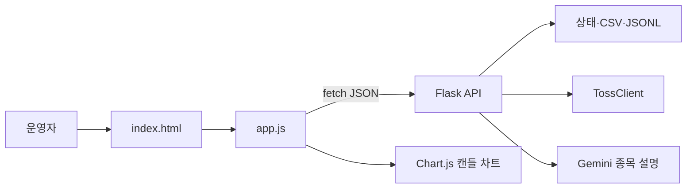
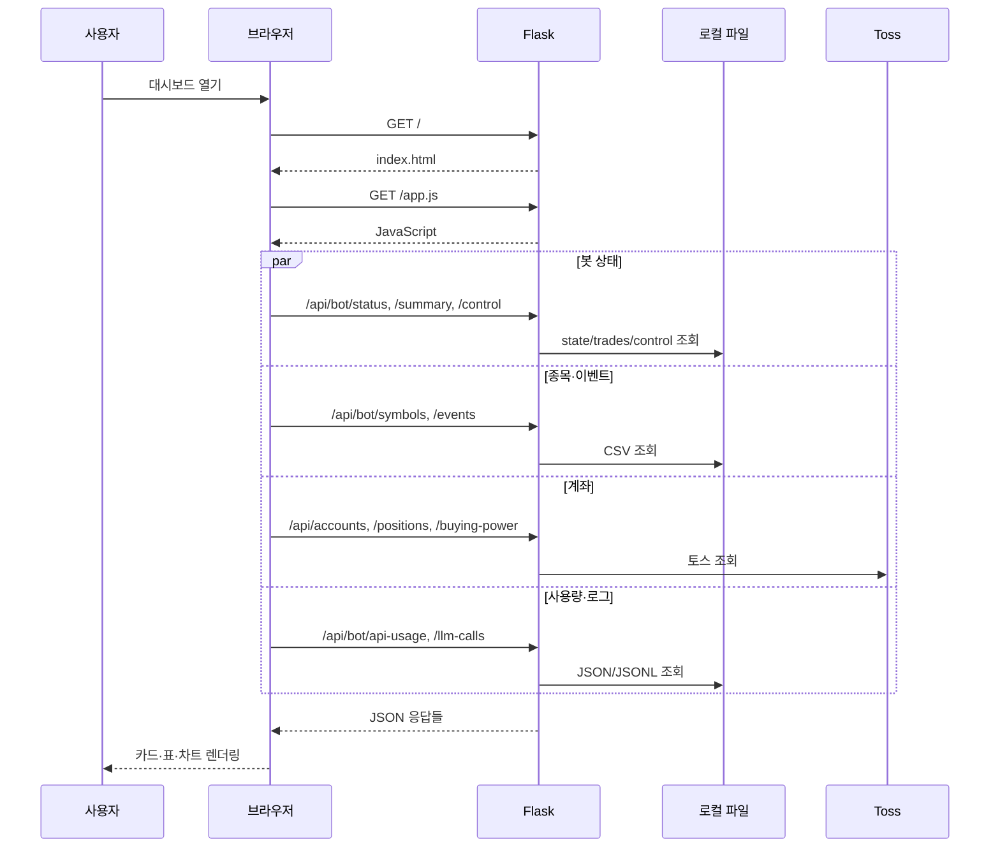
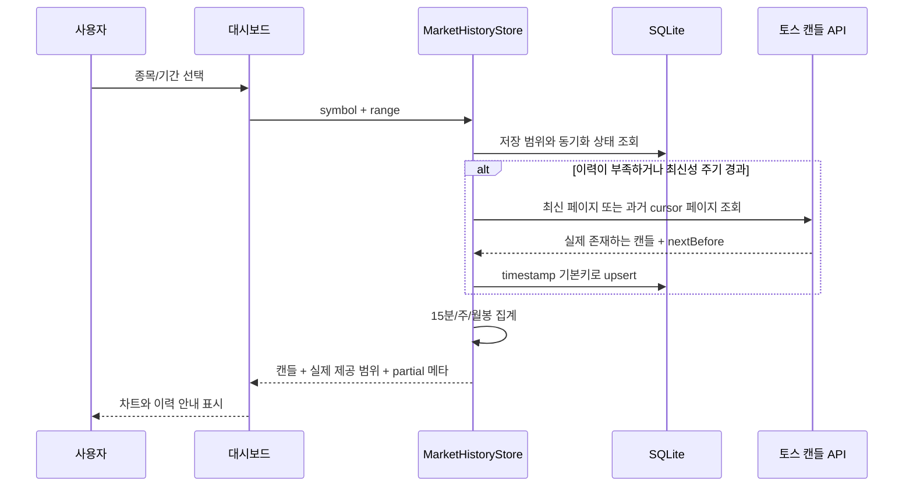

# 09. 대시보드 및 사용자 흐름 설계

## 목적

대시보드는 자동매매 엔진을 대체하는 서버가 아니라, 상태·종목·시장 데이터·LLM 사용량을 조회하고 소프트 시작/정지를 제어하며 필요할 때 토스 API를 수동 호출하는 로컬 운영 화면이다. 화면은 `dashboard/index.html`과 `dashboard/app.js`, 서버는 Flask `dashboard_server.py`로 구성된다.

## 화면과 서버 구조

브라우저는 서버가 제공한 정적 HTML/JavaScript를 실행하고 `fetch()`로 JSON API를 호출한다. 서버 push, WebSocket, SSE는 없다. 주요 요약은 일정 주기로 polling한다.

## 인증·브라우저 상태

- 로그인 화면이 없다.
- 세션 쿠키가 없다.
- 토스 access token을 브라우저에 저장하지 않는다.
- localStorage/sessionStorage를 핵심 운영 상태 저장소로 사용하지 않는다.
- 모든 중요한 화면 상태는 Flask API에서 다시 읽는다.
- POST 요청에 CSRF token이 없다.

따라서 기본 `127.0.0.1` 바인딩이 보안 경계다. 같은 PC의 악성 페이지나 로컬 프로세스까지 방어하는 완전한 인증 체계는 아니다.

## 초기 화면 로딩 흐름

화면 일부 호출이 실패해도 다른 카드가 표시될 수 있다. 공통 `getJson`은 받은 JSON을 원시 출력 영역에도 보여주어 디버깅을 돕는다.

## 주요 사용자 여정

### 자동투자 상태 확인

1. `/api/bot/status`에서 DRY/LIVE, 루프 주기, 전체 상태와 마지막 거래 로그를 읽는다.
2. `/api/bot/summary`에서 오늘 매수·매도 수, 최근 제출 내역, action별 빈도, 일손익·낙폭·평가자산·API 오류를 읽는다.
3. 화면은 LIVE를 활성 상태 색상, DRY RUN을 경고 색상으로 구분한다.
4. 최근 판단은 `/api/bot/trades?n=50`의 JSONL 마지막 부분에서 가져온다.

대시보드의 “체결 내역”은 브로커 체결 전용 원장이 아니라 거래 로그에서 `submitted` 또는 `executed`로 표시된 레코드를 요약한다. 정확한 체결 확인은 주문 수명주기와 토스 상태를 함께 봐야 한다.

### 시작/정지

1. 사용자가 버튼을 누른다.
2. 브라우저가 `POST /api/bot/control`에 `{run: true|false}`를 보낸다.
3. Flask가 `data/bot_control.json`에 run과 갱신 시각을 쓴다.
4. 메인 루프가 다음 제어 확인 시 이를 읽는다.
5. `run=false`이면 다음 분석 주기를 시작하지 않고 짧게 대기한다.

이 동작은 현재 실행 중인 HTTP 요청, LLM 호출, 주문 POST를 강제 중단하지 않으며 토스 미체결 주문을 취소하지 않는다.

### 계좌·잔고 확인

1. `/api/accounts`로 토스 계좌 목록을 가져온다.
2. 계좌 선택값을 `/api/buying-power?account=...&currency=KRW|USD`에 넘긴다.
3. `/api/positions?profit=1`로 보유와 추정 손익 필드를 가져온다.
4. 브라우저가 KRW/USD 형식과 퍼센트로 표시한다.

자동 전략이 쓰는 계좌는 설정/자동 선택 규칙을 따르므로, 화면에서 선택한 계좌가 자동 전략 설정과 항상 같다고 가정하면 안 된다.

### 종목 목록과 이벤트

- 실행 종목 화면은 `symbols.csv`에서 필터된 KR/US 활성 심볼을 보여준다.
- 원본 관심종목 화면은 `watchlist_raw.csv`를 보여준다.
- 이벤트 화면은 현재 질문, 테마, LMSR b, 매핑 심볼을 보여준다.
- 종목명 변환을 위해 브라우저가 symbols API 결과를 캐시 변수로 유지할 수 있으나 페이지 새로고침 시 서버에서 다시 읽는다.
- `전체`, `국내`, `미국`, 국가별 탭은 현재 검색어와 함께 적용된다. 탭 버튼 자체를 누를 때는 일반 click으로 처리하고, 탭 줄의 빈 영역에서만 포인터 드래그 스크롤을 시작한다. 버튼 위에서 pointer capture를 잡아 click 대상이 부모로 바뀌지 않게 분리한다.

### 차트 조회

사용자가 종목과 `1일`, `1주`, `1개월`, `3개월`, `1년`, `3년`, `5년`, `10년` 범위를 선택하면 브라우저는 `/api/chart?symbol=...&range=...`를 호출한다. 서버가 화면 범위에 맞는 저장 원본과 표시 해상도를 고르므로 브라우저가 임의 count를 계산하지 않는다.

1일은 저장된 1분봉 중 최신 거래 세션만 보여준다. 1주는 15분봉, 1개월~1년은 일봉, 3~5년은 주봉, 10년은 월봉으로 집계한다. 종목이 생긴 지 1년뿐이라면 10년 요청도 실제 1년만 보여주고 차트 아래에 실제 제공 시작일과 부분 이력 사유를 표시한다. 데이터가 없다고 앞기간을 임의 가격으로 채우지 않는다.

차트 원본은 전략도 이용하는 누적 SQLite지만, 화면을 연 시점의 최신 갱신과 전략 연구 패킷의 snapshot 시각은 다를 수 있다. 사후 감사에는 연구 패킷 hash와 거래 로그를 사용해야 한다. `/api/candles`는 기존 직접 조회 호환용으로 남고 대시보드 주 차트에는 사용하지 않는다.

### 종목 AI 설명

1. 종목을 선택하면 `/api/stock/analyze?symbol=...`로 기존 캐시를 조회한다.
2. 캐시가 없고 generate가 없으면 자동 비용 발생 없이 빈 결과를 반환한다.
3. 사용자가 생성/새로고침을 선택하면 Gemini Grounding 호출을 실행한다.
4. 회사 소개, 거시 환경, 비전, 위험등급과 이유를 구조화 JSON으로 받아 `data_cache/ai_analysis/{symbol}.json`에 저장한다.

이 설명은 대시보드용 정성 리서치이며 자동 전략의 주문 승인과 동일한 경로가 아니다.

### 수동 주문·정정·취소

브라우저는 입력 폼을 JSON으로 만들어 `/api/order`, `/api/modify`, `/api/cancel`에 POST한다. 주문에는 화면 시각을 이용한 `dash-...` client order ID가 들어갈 수 있다.

이 경로는 매우 민감하다.

- 사용자 재인증이 없다.
- 자동 전략의 전체 위험 게이트와 수명주기 원장을 자동으로 거치지 않는다.
- 요청과 응답은 Excel API 로그에 기록될 수 있다.
- 잘못된 계좌·심볼·단위를 방지하는 최종 책임이 운영자에게 있다.

수동 주문 기능이 필요하지 않은 운영 환경에서는 별도 기능 플래그로 라우트를 비활성화하거나 읽기 전용 대시보드로 분리하는 것이 바람직하다.

## API별 화면 데이터 소스

| API | 주 데이터 원천 | 화면 목적 |
|---|---|---|
| `/api/bot/status` | `state.json`, 마지막 `trades.jsonl` | 모드·오류·최근 판단 |
| `/api/bot/summary` | 상태 + 거래 로그 최근 2,000줄 | 오늘 활동·손익·판단 분포 |
| `/api/bot/trades` | `trades.jsonl` 마지막 N줄 | 판단 상세 |
| `/api/bot/events` | 이벤트/질문 CSV | 분석 질문 |
| `/api/bot/symbols` | 실행 필터된 symbols CSV | 종목 탐색 |
| `/api/bot/watchlist-raw` | raw watchlist CSV | 미해결 후보 확인 |
| `/api/bot/llm-calls` | `llm_calls.jsonl` | 모델 질문/응답 점검 |
| `/api/bot/api-usage` | `api_usage_state.json` | 일일 예산 |
| `/api/bot/data-requirements` | 실제 데이터 요구사항 CSV | LIVE 데이터 계약 확인 |
| `/api/chart` | `data/market_history.sqlite3` + 부족분 토스 캔들 | 기간별 차트, 실제 보유 이력과 부분 이력 안내 |
| `/api/accounts` 등 | 토스 실시간 API | 계좌·시세·주문 |

## 자동 새로고침

자동투자 요약은 30초마다 갱신된다. 나머지 표와 차트는 사용자 동작 또는 초기 로드에 따라 조회한다. polling 간격보다 짧은 주문 상태 변화는 화면에서 즉시 보이지 않을 수 있으며, 자동 전략의 상태 파일 갱신 시점과도 차이가 날 수 있다.

이 polling 때문에 모델 분석 중에도 `/api/bot/summary` 요청은 계속 발생한다. 요청 처리를 중지하지는 않되, `127.0.0.1 ... GET ...` 형태의 Werkzeug 접근 줄은 `runtime_logging.py`가 `log/dashboard_access.log` 회전 파일로 보낸다. 따라서 거래 콘솔의 이벤트 질문과 계산 결과 사이에는 polling 로그가 나타나지 않는다.

## 서버 측 API 로깅

모든 `/api/` 응답 후 hook이 요청과 응답을 `log/api_logs.xlsx`에 기록한다. 날짜별 worksheet로 분리되며 긴 응답은 잘린다. 예외가 나더라도 API 응답 자체는 반환하려고 한다.

`log/dashboard_access.log`는 응답 본문 없이 요청 경로·HTTP 상태 같은 웹 서버 접근 줄을 기록한다. Excel API 로그와 목적이 다르며, 콘솔 정리 때문에 접근 흔적을 삭제하지 않도록 둔 파일이다.

운영 화면의 보안과 개인정보 관점에서 다음이 필요하다.

- 토큰 응답, 계좌 식별자, 주문 본문 마스킹
- Excel 보존 기간과 접근 권한
- 대용량 응답 기록 제한
- 사용자를 도입할 경우 사용자 ID와 request ID 추가

## 오류 표시

브라우저의 공통 요청 함수는 JSON 파싱 성공 여부를 중심으로 처리하고 원시 응답을 화면에 표시한다. HTTP 4xx/5xx여도 JSON이면 화면 함수가 값을 받을 수 있으므로 각 렌더러는 `error` 키를 확인해야 한다. 네트워크 또는 JSON 파싱 오류는 client-side fetch error로 표시된다.

## 현재 UI 운영 제한

- 다중 사용자/역할별 권한이 없다.
- 긴 JSONL을 읽는 API는 파일 크기에 따라 응답 시간이 늘 수 있다.
- 대시보드 요약의 최근 2,000줄 통계는 전체 기간 통계가 아니다.
- 전략 루프와 화면의 상태는 트랜잭션 snapshot으로 묶여 있지 않다.
- 서버 push가 없어 주문 상태가 polling 전까지 지연될 수 있다.
- Flask 개발 서버이므로 인터넷 공개용 배포 서버가 아니다.
- 직접 `python dashboard_server.py`로 실행해도 모든 라우트를 먼저 등록한 뒤 서버를 시작하고 동일한 접근 로그 분리 설정을 사용한다. 전략 루프와 함께 보려면 `main.py` 통합 실행을 사용한다.

## 읽기 전용 운영 화면으로 확장할 때

1. 조회 API와 주문 API를 별도 blueprint/프로세스로 분리한다.
2. 기본 사용자는 read-only로 두고 주문은 재인증을 요구한다.
3. 토스 토큰 발급 API는 UI에서 제거하거나 관리자 전용 POST로 바꾼다.
4. CSRF, secure/HttpOnly/SameSite 세션 쿠키, TLS를 도입한다.
5. 주문 변경에는 서버 발급 idempotency key와 확인 화면을 둔다.
6. 브로커 체결 상태 전용 화면은 order lifecycle 원장과 토스 조회를 결합한다.
7. 대용량 로그는 DB 페이지네이션 또는 색인을 사용한다.

세션을 새로 도입한다면 쿠키에는 토스 토큰을 넣지 않고 불투명한 서버 세션 ID만 넣어야 한다. 토스와 LLM 비밀은 계속 서버 측 비밀 저장소에 둔다.
