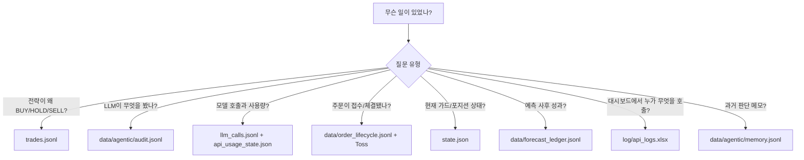
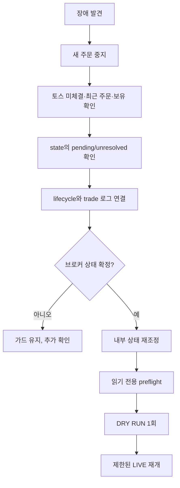

# 10. 로그, 감사, 장애복구 및 운영 점검

## 목적

이 문서는 장애나 이상 주문이 발생했을 때 어떤 로그를 어떤 순서로 확인하고, 하나의 판단을 어떻게 재구성하며, 재시작 전에 무엇을 점검해야 하는지를 설명한다. 로그마다 목적이 다르므로 하나의 파일만 보고 주문 성공·실패를 단정하지 않는 것이 중요하다.

## 관측 자료 지도

## 로그별 진실 범위

| 저장소 | 신뢰할 수 있는 내용 | 단독으로 확정하면 안 되는 내용 |
|---|---|---|
| `trades.jsonl` | 전략 입력, 점수, 행동, 주문 시도 설명 | 브로커 최종 체결 |
| `order_lifecycle.jsonl` | 자동 주문 의도와 관측된 상태 변화 | 토스에 기록되지 않은 외부/수동 주문 |
| `state.json` | 현재 로컬 가드와 최신 포트폴리오 snapshot | 전체 역사, 브로커 절대 원장 |
| `agentic/audit.jsonl` | 에이전트 입력/응답 hash, 모델, 지연, status | 시장 사실의 진위 자체 |
| `memory.jsonl` | 과거 결정·성찰의 보존 | 현재 시장 상태 |
| `forecast_ledger.jsonl` | 예측 시점과 이후 평가 연결 | 주문 수익 또는 실제 체결 |
| `llm_calls.jsonl` | 일반 공급자 호출 이력 | 에이전트 원장의 모든 세부 turn |
| `api_logs.xlsx` | Flask를 통과한 HTTP 요청/응답 | main.py 내부 직접 호출 전체 |
| 토스 주문/보유 조회 | 브로커가 현재 보고하는 주문·포지션 | 내부 전략의 이유 |

## 한 판단의 추적 키

| 키 | 연결 범위 |
|---|---|
| `runtime_run_id` | main.py 한 주기의 거래 판단 |
| `run_id` | 에이전트 실행과 예측 기록 |
| `event_id` | 질문, LMSR, 여러 종목 판단 |
| `symbol` | 시장 자료, 판단, 주문, 포지션 |
| `input_snapshot_hash` | 연구 입력과 예측/감사 무결성 |
| `lifecycle_id` | 한 자동 주문 의도의 모든 상태 이벤트 |
| `client_order_id` | 내부 주문과 브로커 대조 |
| `broker_order_id` | 토스 주문 상태 조회 |

가능하면 조사 시 먼저 시간대와 심볼로 거래 로그를 찾고, 거기서 ID를 얻어 다른 원장으로 이동한다.

## 정상 주기에서 기대되는 흔적

1. 콘솔에 모드, 현금, 운용 가능액, 노출, 포지션 수가 출력된다.
2. 이벤트 ID, 테마, 후보 수, 질문이 출력된다.
3. 가격/OHLCV 누락 종목은 `DATA_SKIPPED` 레코드가 생긴다.
4. LLM을 호출했다면 호출 예산과 agent turn 감사가 추가된다.
5. 종목마다 점수·action·reason·execution을 가진 거래 레코드가 추가된다.
6. 예측 대상이면 forecast prediction이 추가된다.
7. 주문 의도가 있으면 lifecycle intent가 POST보다 먼저 생긴다.
8. 주기 완료 시 `state.json`에 LMSR·캐시·포지션·오류 상태가 저장된다.

## 장애 유형별 조사

### 데이터 부족으로 종목이 사라짐

1. `trades.jsonl`에서 `DATA_SKIPPED`와 `data_error`를 확인한다.
2. 현재가 묶음 응답의 심볼 매핑 실패인지 확인한다.
3. 캔들 파싱 후 bar 수와 timestamp 정렬을 확인한다.
4. `data_cache/toss_candles`의 캐시 나이와 손상 여부를 확인한다.
5. LIVE이면 fallback 차단 설정이 의도대로 동작한 것인지 확인한다.
6. 토스 종목 검증 CSV에서 `stock_info_found`, `price_found`, failure reason을 확인한다.

### LLM이 계속 보류

1. `api_usage_state.json`에서 공급자 일일 한도 소진 여부를 확인한다.
2. `agentic/audit.jsonl`에서 필수 role의 `unavailable`, schema 오류, latency/timeout을 찾는다.
3. live trader와 portfolio manager의 선택 심볼이 일치하는지 본다.
4. semantic/risk manager verdict와 size multiplier를 확인한다.
5. 후보가 Python 기술 진입 필터 전에 모두 제거된 것은 아닌지 확인한다.
6. 입력 패킷의 `data_quality_flags`와 data cutoff를 확인한다.

### 신규 매수가 전부 차단됨

1. `state.json`의 일손익, 낙폭, API 오류 횟수, pending/unresolved 주문을 확인한다.
2. 총 노출, 종목당 상한, 현금 reserve, 실제 주문 가능 금액을 확인한다.
3. 최대 신규 매수 수와 최대 포지션 수를 확인한다.
4. 거래 로그의 `action_reason`, `orderability`, `orderbook_check`를 확인한다.
5. 분석 가격과 주문 직전 가격 차이를 확인한다.
6. 장 상태와 종목 거래가능 응답의 파싱 결과를 확인한다.

### 주문 POST 타임아웃/응답 오류

1. 같은 주문을 재전송하지 않는다.
2. `state.json`의 `unresolved_order_submissions`에서 client/lifecycle ID와 주문 명세를 확인한다.
3. lifecycle 원장에서 intent와 마지막 이벤트를 찾는다.
4. 토스 주문 내역에서 시간, 심볼, side, 수량/금액을 대조한다.
5. 체결·미체결·거절 여부를 토스에서 확인하고 포지션까지 재조회한다.
6. 대조가 끝난 경우에만 `--acknowledge-unresolved`를 실행한다.

### 주문 ID는 있으나 상태가 안 끝남

1. `pending_live_orders`에서 broker order ID를 확인한다.
2. 토스 order status를 읽어 open/partial/filled/canceled/rejected를 확인한다.
3. 부분 체결이면 체결 수량과 남은 수량을 확인한다.
4. 자동 전략이 새 주문을 막는 것은 정상 안전 동작이다.
5. 다음 주기 재조정 또는 운영자 취소 후 종결 상태가 확인되어야 pending이 제거된다.

### 대시보드와 실제 계좌가 다름

1. 대시보드 summary는 거래 로그 최근 2,000줄을 요약한다는 점을 확인한다.
2. `positions_state`가 토스 실시간 보유와 같은 개념인지 구분한다.
3. `/api/positions`를 새로 조회하고 토스 앱과 대조한다.
4. 수동 주문이 자동 수명주기 원장 밖에서 발생했는지 확인한다.
5. 브라우저 polling 지연과 상태 파일 마지막 갱신 시각을 확인한다.

## 복구 우선순위

가장 먼저 해야 할 일은 로그 삭제나 상태 초기화가 아니라 새 주문을 멈추고 브로커 사실을 확정하는 것이다. 로컬 상태를 맞추는 작업은 그 다음이다.

## 일일 운영 점검표

### 장 시작 전

- 시스템 시간과 네트워크 확인
- `.env`의 DRY/LIVE, 계좌, 자금 한도 확인
- 토큰 발급/계좌 목록/preflight 성공 확인
- pending/unresolved 주문 0건 확인
- 보유 수량·평단·매도 가능 수량 확인
- KRW/USD 주문 가능 금액과 환율 확인
- 활성 종목 검증 상태와 이벤트 후보 수 확인
- LLM·Naver 일일 예산과 키 상태 확인
- 디스크 여유 공간과 로그 파일 쓰기 권한 확인

### 운영 중

- API 오류 횟수와 429/401 비율 확인
- `DATA_SKIPPED` 급증 여부 확인
- LLM unavailable/timeout 증가 확인
- 장 상태, 호가 stale, spread/impact 차단 빈도 확인
- 주문 제출과 lifecycle 상태 조회가 쌍을 이루는지 확인
- pending이 오래 유지되지 않는지 확인
- 일손익·총 낙폭 한도 접근 여부 확인

### 장 종료 후

- 토스 주문·체결·보유를 내부 로그와 대조
- pending/unresolved가 남았으면 원인과 처리자 기록
- 예측 평가 가능 horizon 도달 자료 처리
- 로그 백업과 rotation 수행
- API 사용량과 비용 확인
- 다음 날 적용할 설정 변경은 변경 사유와 롤백값 기록

## 로그 보존과 용량

`trades.jsonl`과 `llm_calls.jsonl`은 계속 증가하며 대시보드가 파일 전체를 읽는 코드 경로도 일부 존재한다. 월/일 단위 rotation과 압축, 최근 파일 pointer 또는 DB 색인을 도입하는 것이 좋다.

권장 보존 예시는 다음과 같다.

| 자료 | 온라인 보존 | 장기 보존 |
|---|---|---|
| 주문 lifecycle | 전체 | 장기 보존, 변경 금지 |
| 거래 판단 | 최근 1~3개월 | 압축 아카이브 |
| agent audit | 최근 분석 기간 | 압축·민감정보 정책 적용 |
| forecast | 전체 | 장기 연구 자료 |
| API Excel | 짧은 기간 | 마스킹 후 필요분만 |
| cache | TTL 중심 | 장기 보존 불필요 |
| state snapshot | 현재 + 일일 백업 | 장애 분석 기간만 |

실제 보존 기간은 개인 금융정보와 API 공급자 약관, 저장공간을 고려해 정해야 한다.

## 민감정보 점검

- `.env`: client secret, LLM 키 등 포함
- `.toss_token_cache.json`: Bearer access token 포함
- `api_logs.xlsx`: token/계좌/주문 응답이 포함될 가능성
- `llm_calls.jsonl`, agent audit: 프롬프트와 연구 입력 포함
- `trades.jsonl`, state: 포지션·자금·주문 정보 포함

현재 Git ignore만으로 로컬 유출·백업 유출을 막을 수는 없다. 운영 PC 계정 권한, 디스크 암호화, 백업 암호화, 로그 마스킹이 필요하다.

## 테스트와 변경 검증

변경 전후 최소 검증 순서는 다음과 같다.

1. `python -m pytest -q` 전체 테스트
2. `git diff --check` 문법 외 공백/충돌 확인
3. `python main.py --preflight` 읽기 전용 브로커 계약 확인
4. `python main.py --once` DRY RUN 한 주기
5. 거래 로그에서 데이터 출처·action reason·execution 확인
6. 대시보드 조회 API와 Excel 로그 민감정보 확인
7. LIVE는 자금 상한을 최소화하여 제한적으로 전환

테스트는 현재 파서와 계산의 일부 계약을 검증하지만 실제 토스 API 버전, 장중 호가, 계좌별 소수점 주문 지원까지 보장하지는 않는다.

## 알려진 운영 부채

- SQL DB와 중앙 인덱스가 없어 대용량 로그 조회가 느리다.
- 일부 JSON/JSONL 쓰기는 다중 프로세스 안전하지 않다.
- 로그 rotation과 보존 자동화가 없다.
- Flask 대시보드 인증과 권한이 없다.
- API Excel 로그에 민감정보 마스킹이 없다.
- 수동 주문 경로는 자동 주문 lifecycle 원장을 완전히 공유하지 않는다.
- 완전한 상태형 trailing high-water mark가 없다.
- 대시보드 직접 실행 경로의 라우트 선언 순서를 정리할 필요가 있다.

이 항목들은 현재 안전장치가 없다는 뜻이라기보다, 단일 사용자 로컬 운용에서 서비스형 운영으로 확장할 때 우선 해결해야 할 순서를 나타낸다.

## 사고 보고서에 남길 항목

장애나 예상 밖 주문이 있었다면 다음을 한 묶음으로 보존한다.

- 발생/발견 시각과 시간대
- DRY/LIVE와 실행 명령
- runtime run ID, event ID, symbol
- lifecycle/client/broker order ID
- 분석 가격, 주문 직전 가격, 호가 시각
- action과 action reason, 모든 gate 결과
- 토스 주문/체결/보유 snapshot
- 관련 거래·lifecycle·agent audit 레코드
- 운영자가 수행한 수동 조회·취소·acknowledgement
- 근본 원인, 임시 조치, 영구 조치, 재발 방지 테스트

원본 로그는 수정하지 않고 보고서가 원본 ID를 참조하도록 한다. 잘못된 예측이나 판단도 삭제하지 않고 사후 outcome/reflection을 append하여 연구 기록의 신뢰성을 유지한다.

