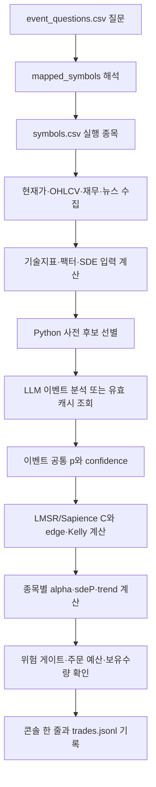
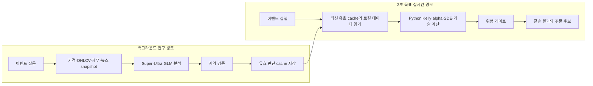

# 11. 콘솔 출력값 해석 및 3초 응답 성능 설계

## 문서 목적

이 문서는 `main.py` 실행 중 다음과 같이 출력되는 이벤트와 종목별 판단값을 운영자가 해석하기 위한 설명서다.

아래 숫자와 심볼은 형식 설명용 예시다.

```text
[event] global_quantum | theme=Quantum Computing | symbols=4 | q=향후 3개월 동안 양자컴퓨팅 관련 종목 중 가능성이 높은 종목은?
            HOLD | IONQ     | p=0.50 C=0.50 edge=+0.000 kelly=+0.000 frac=0.000 alpha=+0.145 sdeP=0.52 trend=+0.48 tech_buy=True order=0 gate=False
```

또한 “질문 하나의 결과를 약 3초 안에 보고 싶다”는 목표를 현재 구조에서 왜 달성하기 어려운지, 어떤 구조로 바꿔야 실제로 가능한지를 설명한다.

이 콘솔 한 줄은 모델의 원문 답변이 아니다. 이벤트 공통 LLM 판단, 내부 LMSR 가격, 종목별 재무·팩터·가격 경로·기술 신호, Python 위험 게이트와 주문 가능 금액을 결합한 최종 요약이다.

## `DRY_RUN=True`와 자금 요약 헤더

한 주기가 시작될 때 다음과 같은 헤더가 먼저 출력된다.

```text
DRY_RUN=True cash=600,000 (KRW=300,000, USD=222.22) effective=300,000 deployable=30,000 exposure=0/30,000 positions=0
```

### `DRY_RUN=True` — 실제 주문을 보내지 않는 모의 운용 모드

`DRY_RUN=True`는 전략·LLM·지표·예산 계산은 실행하되 토스증권에 실제 매수·매도 주문을 제출하지 않는 안전 모드다.

이 모드에서 달라지는 핵심 동작은 다음과 같다.

| 영역 | DRY RUN 동작 |
|---|---|
| 주문 | 실제 토스 주문을 보내지 않고 모의 체결 결과를 사용 |
| 보유종목 | 토스 계좌가 아니라 `state.json`의 `sim_positions` 사용 |
| 매수 가능 금액 | 실제 계좌 조회 대신 KRW 300,000원과 같은 가치의 USD 모의 금액 사용 |
| 현재가 | 실제 조회를 시도할 수 있지만 실패하면 모의 가격 fallback 허용 |
| OHLCV | 연구용 모의 OHLCV 사용 가능 |
| 종목·호가 검증 | 실제 주문 직전 일부 브로커 검증을 건너뜀 |
| 기록 | `state.json`, `trades.jsonl`, agent audit, API 사용량 등은 계속 기록 |
| LLM·외부 데이터 | NVIDIA LLM, 재무, 뉴스 API는 설정이 켜져 있으면 실제 호출될 수 있음 |

따라서 `DRY_RUN=True`는 “아무 API도 호출하지 않는 모드”가 아니다. **실제 증권 주문을 막는 모드**다. 모델 API 키가 활성화되어 있으면 NVIDIA 호출량과 대기시간은 DRY RUN에서도 발생한다.

`DRY_RUN=False`로 바꾸면 실제 토스 계좌의 원화·달러 주문 가능 금액, 보유종목, 미체결 주문, 환율과 수수료를 조회하고 모든 주문 안전장치를 통과한 주문을 실제로 제출할 수 있다. 단순 시험 목적으로 `False`로 변경하면 안 된다.

### `cash=600,000` — 원화 환산 총 모의 주문 가능 현금

```text
cash = KRW 주문 가능 금액 + USD 주문 가능 금액 × USD/KRW 환율
```

DRY RUN에서는 다음 두 시장을 모두 시험할 수 있도록 모의 주문 가능 금액을 따로 만든다.

```text
KRW 주문 가능 금액 = 300,000원
USD 주문 가능 금액 = 300,000원 ÷ 1,350원/달러 = 222.22달러
USD의 원화 환산값 = 222.22 × 1,350 ≈ 300,000원
cash = 300,000 + 300,000 = 600,000원
```

이 `600,000원`은 실제 토스 계좌 잔고가 아니다. 국내 주문 시험용 300,000원과 미국 주문 시험용 원화 환산 300,000원을 합친 모의 계산값이다.

### `(KRW=300,000, USD=222.22)` — 통화별 주문 가능 금액

- `KRW=300,000`: 국내 종목 주문 경로가 사용할 수 있다고 가정한 모의 원화 금액
- `USD=222.22`: 미국 종목 주문 경로가 사용할 수 있다고 가정한 모의 달러 금액

괄호 안의 두 값은 서로 다른 통화 단위다. USD 숫자에 원화 기호를 붙이면 안 된다. LIVE에서는 토스의 통화별 실제 주문 가능 금액 응답을 파싱한 값이 표시된다.

### `effective=300,000` — 전략이 관리하도록 허용한 자금

전체 현금이 많더라도 자동매매 전략이 전부 관리하지 못하도록 상한을 둔다.

```text
effective = min(cash, MAX_MANAGED_BANKROLL_KRW)
```

현재 예에서는 다음과 같다.

```text
cash = 600,000원
MAX_MANAGED_BANKROLL_KRW = 300,000원
effective = min(600,000, 300,000) = 300,000원
```

즉 모의 통화별 현금의 원화 환산 합계는 600,000원이지만, 자동매매 계산에 참여할 수 있는 관리 대상 자금은 최대 300,000원이다.

### `deployable=30,000` — 현재 주기에 실제로 신규 배치할 수 있는 한도

`effective` 전체가 이번 주기 매수 예산은 아니다. 현금 reserve와 전체 자동매수 노출 한도, 현재 보유 노출을 추가로 적용한다.

```text
cash_after_reserve = effective × (1 - CASH_RESERVE_FRACTION)
total_cap = min(AUTO_BUY_TOTAL_CAP_KRW, effective × MAX_TOTAL_EXPOSURE_FRACTION)
portfolio_room = max(0, total_cap - current_exposure)
deployable = min(cash_after_reserve, portfolio_room)
```

현재 설정값을 적용하면 다음과 같다.

```text
effective = 300,000원
CASH_RESERVE_FRACTION = 0.15
cash_after_reserve = 255,000원

AUTO_BUY_TOTAL_CAP_KRW = 30,000원
MAX_TOTAL_EXPOSURE_FRACTION = 0.80
비율 기준 상한 = 300,000 × 0.80 = 240,000원
total_cap = min(30,000, 240,000) = 30,000원

current_exposure = 0원
portfolio_room = 30,000 - 0 = 30,000원
deployable = min(255,000, 30,000) = 30,000원
```

따라서 `deployable=30,000`은 현금이 30,000원뿐이라는 뜻이 아니라, 현재 안전 설정상 자동매매가 새로 배치할 수 있는 총 한도가 30,000원이라는 뜻이다.

### `exposure=0/30,000` — 현재 보유 노출과 자동매수 상한

```text
exposure = 현재 포지션 평가금액의 원화 환산 합계 / AUTO_BUY_TOTAL_CAP_KRW
```

- 앞의 `0`: 현재 모의 포지션에 묶인 평가금액
- 뒤의 `30,000`: 설정된 전체 자동매수 명시적 상한

예를 들어 `exposure=15,000/30,000`이면 이미 15,000원 상당을 보유하고 있으며 명시적 상한 기준 남은 공간은 최대 15,000원이다. 실제 남은 매수 가능 금액은 현금 reserve와 비율 한도도 함께 적용하므로 단순 뺄셈보다 작을 수 있다.

### `positions=0` — 현재 인식한 보유 종목 수

`positions`는 현금 액수나 주문 수가 아니라 현재 포지션 map에 들어 있는 서로 다른 종목 수다.

- DRY RUN: `state.json`의 `sim_positions` 종목 수
- LIVE: 토스 보유종목 응답을 정상 파싱한 종목 수

`positions=0`이면 현재 인식된 보유종목이 없다는 뜻이다. 따라서 매도 신호가 발생해도 `SELL_SIGNAL_NO_POSITION`으로 끝날 수 있다.

DRY RUN에서 모의 매수가 발생하면 `sim_positions`가 갱신되고 다음 주기에는 `positions`와 `exposure`가 증가할 수 있다. 모의 포지션을 실제 토스 보유종목으로 오해하면 안 된다.

## 자금 헤더 전체 해석 예

```text
DRY_RUN=True cash=600,000 (KRW=300,000, USD=222.22) effective=300,000 deployable=30,000 exposure=0/30,000 positions=0
```

이를 한 문장으로 해석하면 다음과 같다.

> 실제 주문을 보내지 않는 모의 모드이며, 국내·미국 시험용 모의 현금을 합치면 원화 환산 600,000원이지만 전략 관리 상한으로 300,000원만 인정한다. 현금 reserve와 전체 자동매수 상한을 적용하면 이번 주기 신규 배치 가능 금액은 최대 30,000원이고, 현재 모의 보유 노출과 보유종목은 없다.

## 현금 맞춤 일일 질문과 출력

질문 목록의 첫 이벤트 `cash_affordable_candidates`는 현재 KRW·USD 주문가능액으로 실제 주문 명세를 만들 수 있는 활성 KR/US 종목을 먼저 찾는다. 현재 기본 소액 설정에서는 전체 신규 배치 상한 30,000원, 종목당 상한 15,000원, 한 주기 신규 매수 최대 2개다.

다음 숫자와 심볼은 출력 형식 설명용 예시이며 실제 scan 결과가 아니다.

```text
[cash-universe] affordable={'KR': 120, 'US': 260} selected={'KR': 20, 'US': 20} budget_krw={'KR': 15000.0, 'US': 15000.0}
[cash-universe] KR=심볼1,심볼2,...
[cash-universe] US=심볼1,심볼2,...
[event] cash_affordable_candidates | theme=Cash Affordable | symbols=40 | q=현재 ...
[cash-model] selected=선택심볼 | ranked=순위심볼1,순위심볼2,...
```

| 출력 | 의미 |
|---|---|
| `affordable` | 전체 활성 목록 중 현재 가격·시장별 최대 주문금액으로 주문 명세를 만들 수 있었던 미보유 종목 수 |
| `selected` | 장기 OHLCV·재무·기술 정밀분석으로 넘긴 KR/US 수. 기본 각 20개, 합계 40개 이하 |
| `budget_krw` | 현재 시점에 해당 시장 한 종목에 사용할 수 있는 최대 검토금액. 주문 확정액이 아님 |
| `KR=`, `US=` | 이번 정밀분석 대상의 정확한 심볼 목록 |
| `cash-model selected` | 최종 비교 모델이 입력 후보 안에서 고른 단일 심볼. 없으면 `-` |
| `cash-model ranked` | 최종 비교 모델이 반환한 상위 후보 심볼. 이 목록 자체는 주문 목록이 아님 |

국내 후보는 `budget_krw`로 최소 1주를 살 수 있어야 한다. 미국 후보는 코드의 금액주문 경로에서 원화 최소 주문과 달러 최소 주문을 만족해야 한다. 이 판정은 최신 가격 scan 시점의 사전 판정이며 실제 주문 직전 잔액·가격·시장·호가를 다시 확인한다.

현금 맞춤 모델에는 `tech_buy=True`인 미보유 후보만 전달된다. 그래도 `tech_buy=True`만으로 사지 않는다.

```text
가격 기준 구매 가능
→ tech_buy=True
→ 모델이 이 심볼을 selected로 선택하고 buy_allowed 승인
→ edge·Kelly·alpha·sdeP·trend·liquidity 기준 통과
→ confidence·손실·낙폭·API 오류 생존 게이트 통과
→ 전체/종목당/시장별 현금·신규매수 수·포지션 수 통과
→ 최신가격·종목 주문 가능·장 상태·호가 검증
→ DRY RUN 모의체결 또는 LIVE 주문
```

`DRY_RUN=true`에서는 잔액과 대부분의 scan 가격, OHLCV가 테스트 값이므로 출력된 심볼을 실제 투자 가능 추천으로 해석하면 안 된다. `DRY_RUN=false`에서만 실제 토스 KRW·USD·환율을 읽으며, 그래도 결과는 자동매매 규칙의 후보일 뿐 수익 보장이 아니다. 전체 구매 가능 목록과 사전 명세는 `trades.jsonl`의 `CASH_AFFORDABLE_UNIVERSE` 레코드에 남는다.

## 질문과 종목 목록의 출처

질문은 `data/event_questions.csv`에서 읽는다. 예를 들어 `global_quantum` 행은 다음 의미를 가진다.

| 항목 | 값과 의미 |
|---|---|
| `event_id` | `global_quantum`. 로그·LMSR·캐시를 연결하는 이벤트 식별자 |
| `theme` | `Quantum Computing` |
| `question` | 모델에 전달할 기본 연구 질문 |
| `mapped_symbols` | `THEME:Quantum Computing` |
| `b` | LMSR 유동성 파라미터 |
| `enabled` | 이벤트 실행 여부 |

`THEME:Quantum Computing`은 실제 종목코드가 아니다. `strategy/events.py`가 이 토큰을 해석하고 `data/symbols.csv`에서 다음 조건을 만족하는 종목을 가져온다.

1. `theme=Quantum Computing`
2. `enabled=true`
3. 심볼이 비어 있지 않음
4. 현재 주문 경로가 지원하는 KR 또는 US 시장

현재 이 조건으로 연결되는 종목은 `IONQ`, `QBTS`, `RGTI`, `QTUM`이다. CSV의 종목을 바꾸면 다음 이벤트 로드부터 목록도 바뀐다.

`ROTATE_EVENT_QUESTIONS=true`이면 `data/question_templates.csv`에서 같은 테마의 문장 하나를 선택할 수 있다. 선택은 연구 날짜·이벤트 ID·테마를 seed로 사용하므로 같은 한국 날짜에는 프로세스를 다시 시작해도 같은 문장이 유지된다. 날짜가 바뀌면 다른 문장이 선택될 수 있지만 이벤트 ID와 테마 기반 종목 연결은 그대로 유지된다.

## 질문 주기와 프로세스 재시작의 정확한 의미

현재 프로젝트 `.env` 설정은 다음과 같다.

| 환경변수 | 현재 `.env` | 담당하는 시간 |
|---|---:|---|
| `EVENT_LLM_ONCE_PER_DAY` | `true` | 이벤트별 실제 LLM 질문을 연구 날짜당 한 번만 시도 |
| `EVENT_LLM_DAILY_TIMEZONE` | `Asia/Seoul` | 날짜가 바뀌는 경계. 한국 자정 기준 |
| `EVENT_LLM_REFRESH_ON_PROCESS_START` | `true` | 새 Python 프로세스에서 이벤트별 첫 당일 결과를 강제로 갱신 |
| `LOOP_SECONDS` | `600` | 전체 이벤트 목록 처리가 끝난 뒤 다음 전략 주기 전 간격 |

처음 실행되는 당일 이벤트는 시장·재무·뉴스 자료를 준비한 후 Super·Ultra·GLM 파이프라인에 실제 질문을 보낸다. 이 호출은 외부 모델이 응답할 때까지 걸리므로 몇 분이 소요될 수 있다. 모델 응답과 해당 이벤트의 종목 계산·출력이 끝나면 질문 사이의 5초·10초 `sleep` 없이 다음 이벤트를 즉시 준비한다.

“하루 한 번”은 매일 자정 정각에 실행하는 예약 작업이라는 뜻이 아니다. 봇이 실행 중이면 한국 날짜가 바뀐 뒤 처음 도달한 정상 전략 주기에서 각 이벤트를 차례로 시도한다. 봇이 꺼져 있었다면 그날 처음 켠 시점에 시도하며, 봇을 하루 종일 켜지 않았다면 그날 실행 기록도 생기지 않는다.

```text
첫 질문 데이터 준비 + 19역할 모델 분석 + 종목 계산·출력
→ 별도 대기 없음
→ 다음 질문 데이터 준비 + 19역할 모델 분석 + 종목 계산·출력
```

### 캐시가 있는데 Python을 껐다 켠 경우

`state.json`은 프로세스가 꺼져도 남지만 현재 테스트 설정의 `EVENT_LLM_REFRESH_ON_PROCESS_START=true`는 새 프로세스에서 그 당일 캐시를 이벤트별 한 번 무시한다. 따라서 `python main.py`를 종료하고 다시 실행하면 기존 당일 레코드가 있어도 질문을 다시 수행하고, 같은 `연구 날짜|pipeline|event_id` key를 새 시각·새 run ID·새 결과로 덮어쓴다. 이전 역할별 실행 기록은 append 원장인 `data/agentic/audit.jsonl`에 계속 남는다.

강제 갱신이 저장된 뒤에는 메모리에 “이 프로세스에서 갱신 완료”가 표시된다. 그러므로 Python을 끄지 않고 이어지는 다음 10분 루프에서는 새 당일 캐시를 사용하고 19역할 질문을 반복하지 않는다. 테스트가 끝난 후 재시작 사이에도 당일 캐시를 그대로 쓰려면 `EVENT_LLM_REFRESH_ON_PROCESS_START=false`로 변경한다.

프로세스 재시작은 `api_usage_state.json`의 공급자별 일일 사용량을 초기화하지 않는다. 이미 호출 한도에 도달했다면 기존 캐시를 무시한 뒤에도 실제 모델 요청은 예산 가드에서 차단될 수 있고, 그 `unavailable` 결과가 새 당일 시도로 저장된다. 재시작 테스트가 비용·호출 한도를 자동 우회하지 않도록 한 의도적인 안전장치다.

정상 판단뿐 아니라 최종 비교 실패, 자료 부족, 호출 실패, Python 후보 없음도 최신 당일 시도로 저장한다. 다만 실제 모델 호출 전 예외로 상태 저장 자체가 완료되지 않았다면 갱신 완료로 표시하지 않으므로 다음 루프에서 다시 시도할 수 있다.

다만 당일 캐시를 쓴다고 전체 계산이 멈추는 것은 아니다. 현재가, 장기 OHLCV, 재무 입력, 기술 지표, `alpha`, `sdeP`, `trend`, Kelly, 보유수량, 예산, 위험 게이트와 실제 주문 직전 검증은 각 정상 전략 주기에서 다시 평가한다. 외부 시장·재무 API 응답시간 때문에 이 로컬·데이터 경로도 항상 3초를 보장하지는 않는다.

콘솔의 이벤트 연구 출처는 다음처럼 구분된다.

| `source` | 의미 |
|---|---|
| `process_start_refresh` | 새 Python 프로세스에서 기존 당일 캐시를 무시하고 모델 질문을 다시 실행함 |
| `fresh_daily_model_call` | 오늘 이 이벤트의 실제 모델 질문을 실행함 |
| `daily_cache` | 오늘 이미 저장한 성공 또는 실패 결과를 재사용함 |
| `ttl_cache` | 일일 정책을 끈 상태에서 기존 성공 TTL 캐시를 사용함 |
| `python_pre_screen_no_call` | 모델에 전달할 신규 매수 후보가 없어 호출하지 않음 |

## 계산 사이에 보이던 `127.0.0.1` 줄

다음 줄은 모델이나 매매 계산이 아니라 브라우저 대시보드가 Flask 서버에 보낸 HTTP 요청의 Werkzeug 접근 로그다.

```text
127.0.0.1 - - [시각] "GET /api/bot/summary HTTP/1.1" 200 -
```

대시보드의 JavaScript가 summary·계좌·API 사용량을 일정 주기로 새로 읽기 때문에, 한 이벤트 모델 분석이 오래 걸리는 동안에도 이 요청은 계속 들어온다. `200`은 정상 응답, `404`는 해당 정적 파일이나 경로를 찾지 못했다는 뜻이며 전략 계산이 멈췄다는 뜻이 아니다.

현재는 이 기록을 없애지 않고 `log/dashboard_access.log`로 이동한다. 파일은 기본 5 MB 단위로 최대 3개 백업까지 회전한다. 콘솔에는 `[dashboard] 주소 | access_log=경로`, `[event]` 질문, `[event-research]` 출처, 종목별 계산 결과와 실제 오류만 남기므로 장시간 계산 출력 사이에 polling 로그가 끼지 않는다. 로그 위치만 바뀌며 대시보드 polling이나 API 동작은 그대로다.

## 한 이벤트가 출력되기까지의 흐름



이벤트 헤더의 `symbols=4`는 질문에 연결된 전체 실행 종목 수다. 실제 LLM에는 이 전체 목록 중 데이터가 준비되고 기술 진입 조건을 만족한 신규 매수 후보만 전달될 수 있다. 최종 콘솔 계산은 다시 이벤트의 데이터 준비 완료 종목 전체에 대해 수행된다.

따라서 같은 이벤트의 여러 종목에 동일한 `p`가 표시될 수 있다. `p`는 현재 종목 하나의 독립 상승 확률이 아니라 질문 전체에 대한 이벤트 공통 판단이다. `alpha`, `sdeP`, `trend`, `tech_buy`는 종목별 값이다.

## 출력 필드 한눈에 보기

| 출력 | 범위 | 의미 |
|---|---|---|
| `p` | 이벤트 공통 | 최종 LLM 비교 결과의 `yes_probability` |
| `C` | 이벤트 공통 | LMSR YES 가격과 선택적 Sapience 가격을 합친 비교 기준 가격 |
| `edge` | 이벤트 공통 | `p - C` |
| `kelly` | 이벤트 공통 | YES 방향 예측시장형 Kelly 값 |
| `frac` | 이벤트 공통 크기 후보 | Kelly를 단일 포지션 한도 안으로 자른 포지션 비율 |
| `alpha` | 종목별 | 팩터·이벤트 edge·SDE·추세·뉴스·위험을 합친 최종 정량 점수 |
| `sdeP` | 종목별 | GBM/SDE 기반 목표수익 이상 상승 확률 |
| `trend` | 종목별 | 기술 규칙이 만든 추세 점수 |
| `tech_buy` | 종목별 | 기술적 신규 매수 조건 충족 여부 |
| `order` | 종목별 | 이번 판단에서 의도한 신규 매수 금액. 비매수이면 0 |
| `gate` | 이벤트/계좌 상태 | 손실·낙폭·API 오류·LLM confidence 생존 게이트 통과 여부 |
| 왼쪽 action | 종목별 | `BUY`, `HOLD`, `SELL_SIGNAL_NO_POSITION` 등 최종 행동 분류 |

## 각 값의 정확한 해석

### `p=0.50` — 이벤트 전체 LLM 확률

`p`는 최종 비교 모델이 질문에 대해 반환한 `yes_probability`다. 예를 들어 `p=0.70`이면 모델 파이프라인은 현재 증거 기준으로 이벤트 질문의 긍정 방향을 0.70으로 평가했다는 뜻이다.

하지만 `p=0.50`은 반드시 정상적인 모델 판단을 뜻하지 않는다. 다음 경우 시스템은 신규 매수를 막기 위해 중립값을 사용한다.

- Python 사전선별을 통과한 신규 매수 후보가 없음
- 모델 기능이 꺼짐
- 필요한 API 키가 없음
- 호출 한도 소진
- 선행 역할이 `insufficient_data`, `error`, `blocked` 상태가 됨
- GLM 최종 비교 JSON이 계약 검증에 실패함

이때 보통 실제 `confidence=0.0`, `buy_allowed=false`, `size_multiplier=0.0`이 함께 저장된다. 콘솔만 보지 말고 `trades.jsonl`의 `agent_block_reason`, `gate_reason`, `agentic_analysis.status`를 확인해야 정상 중립 판단과 장애·자료부족 기본값을 구분할 수 있다.

### `C=0.50` — Confidence가 아닌 이벤트 비교 가격

콘솔의 `C`는 LLM confidence가 아니다. 내부 LMSR의 현재 YES 가격을 기본값으로 사용하고, Sapience 이벤트 가격을 실제로 가져왔다면 다음처럼 혼합한다.

```text
Sapience 없음: C = LMSR YES 가격
Sapience 있음: C = 0.7 × LMSR YES 가격 + 0.3 × Sapience 가격
```

LMSR이 아직 어느 방향으로도 갱신되지 않았다면 YES와 NO 수량이 같으므로 시작 가격은 0.50이다. LLM confidence는 현재 콘솔 한 줄에는 별도 숫자로 출력되지 않으며 `trades.jsonl`의 `confidence`에 저장된다.

### `edge` — 모델 확률과 비교 가격의 차이

```text
edge = p - C
```

- 양수: 모델이 현재 이벤트 가격보다 긍정적으로 평가
- 0 부근: 모델과 시장 기준이 비슷하거나 둘 다 안전 기본값 0.50
- 음수: 모델이 현재 이벤트 가격보다 부정적으로 평가

`edge`는 이벤트 공통값이므로 같은 이벤트 종목에 동일하게 출력된다. 이것만으로 매수하지 않고 종목별 `alpha`, `sdeP`, `trend`, 유동성 조건을 함께 본다.

### `kelly` — 예측시장형 Kelly 값

YES를 가격 `C`에 사서 사건 발생 시 1로 정산된다고 볼 때 다음 식을 사용한다.

```text
kelly_yes = (p - C) / (1 - C)
kelly_no  = (C - p) / C
```

`kelly` 출력은 `kelly_yes`다. 양수일수록 YES 방향의 이론상 배팅 여지가 크고 음수이면 YES 신규 배팅 근거가 없다. 실제 주문 비율은 이 값을 그대로 사용하지 않고 0 이상, `MAX_POSITION_FRACTION` 이하로 제한한다.

### `frac` — 포지션 비율 후보

```text
frac = clip(kelly_yes × KELLY_MULTIPLIER, 0, MAX_POSITION_FRACTION)
```

현재 기본 단일 포지션 한도가 0.06이면 `frac=0.060`은 이 단계에서 최대 6% 후보라는 뜻이다. 실제 주문금액은 이후 LLM confidence, 모델 size multiplier, 총 운용한도, 종목당 한도, 현금 reserve, 남은 신규 매수 슬롯을 다시 적용하므로 `frac`와 실제 주문금액은 같지 않다.

### `alpha` — 종목별 최종 정량 점수

`alpha`는 다음 결합식을 `-1`에서 `1` 사이로 제한한 값이다.

```text
alpha =
    0.25 × factor_score
  + 0.25 × event_edge
  + 0.20 × sde_prob_score
  + 0.20 × trend_score
  + 0.10 × news_event_score
  - 0.10 × max(0, -risk_score)
```

`factor_score`에는 가치, 모멘텀, 품질, 위험, 유동성, 성장·실적수정, 뉴스 관련 값이 들어간다. `alpha`가 양수라고 바로 매수하는 것은 아니다. 매수에는 event edge, Kelly, 최소 alpha, SDE 확률, 추세, 유동성 조건이 모두 필요하다.

### `sdeP` — 종목별 SDE/GBM 상승 확률

가격이 기하 브라운 운동을 따른다는 근사 아래 drift `mu`, 변동성 `sigma`, 설정된 투자 기간과 목표수익을 이용해 목표수익 이상일 확률을 계산한다.

- `0.50` 부근: 위·아래 방향 우위가 약함
- `0.50`보다 큼: 설정 기간에서 상승 목표를 넘을 확률이 상대적으로 높음
- `0.50`보다 작음: 상승 목표 달성 가능성이 상대적으로 낮음

이는 통계적 근사이지 실제 성공확률 보증이 아니다. 입력 변동성과 팩터·이벤트·추세·뉴스 값이 바뀌면 함께 바뀐다.

### `trend` — 종목별 기술 추세 점수

OHLCV에서 계산한 Supertrend, 이동평균, MACD, 돌파·박스권, 거래량, 패턴 상태 등을 종합한 기술 추세 점수다.

- 큰 양수: 상승 추세 우세
- 0 부근: 방향 불명확 또는 박스권
- 큰 음수: 하락 추세 우세

`trend`가 양수여도 다른 매수 조건이 부족하면 `HOLD`가 될 수 있다.

### `tech_buy=True|False` — 기술적 신규 매수 조건

여러 기술 규칙이 신규 진입을 허용하는지 나타낸다. `USE_TECHNICAL_ENTRY_RULES=true`일 때 `False`이면 LLM과 정량 점수가 긍정적이어도 신규 매수는 `HOLD`로 바뀐다.

`tech_buy=True`는 매수 완료나 주문 승인이 아니다. 기술 계층 하나를 통과했다는 의미다.

### `gate=True|False` — 생존 위험 게이트

게이트는 다음 순서로 확인한다.

1. 당일 손실 한도
2. 누적 낙폭 한도
3. API 오류 횟수
4. LLM confidence 최소값

`gate=False`이면 위 조건 중 하나가 실패했다는 뜻이다. 정확한 이유는 `trades.jsonl`의 `gate_reason`에 기록된다. 낮은 confidence 게이트는 신규 매수만 차단하며, 보유 포지션의 결정론적 손절·청산까지 막는 용도로 사용하지 않는다.

### `order=0` — 주문 없음

콘솔의 `order`는 신규 매수에 사용하려던 원화 환산 금액이다. 다음 경우 0이 정상이다.

- 행동이 `BUY`가 아님
- Kelly 또는 position fraction이 0
- confidence 또는 모델 size multiplier가 0
- 위험 게이트가 신규 매수를 차단
- 모델이 이 종목을 최종 후보로 선택하지 않음
- 총 운용한도·종목당 한도·현금 reserve 때문에 남은 금액이 없음

`order`가 0보다 크더라도 실제 주문 제출을 보장하지 않는다. 주문 가능 종목, 장 상태, 최신가격 급변, 호가 spread·impact, 계좌 주문 가능 금액 검사를 추가로 통과해야 한다.

## 행동값 해석

| 행동 | 의미 | 실제 주문 |
|---|---|---|
| `BUY` | 정량·기술·LLM·위험 조건상 신규 매수 후보 | 이후 주문 전 검증을 통과해야 제출 |
| `HOLD` | 신규 행동 없음 | 없음 |
| `SELL` | 보유 포지션에 종목별 손절·익절·기술 청산 조건 발생 | 보유수량과 주문 전 검증 후 제출 가능 |
| `SELL_SIGNAL_NO_POSITION` | 정량 분류는 매도지만 현재 보유수량 없음 | 없음 |
| `BUY_BLOCKED` | 매수 신호는 있었지만 예산·종목·시장·호가 등에서 차단 | 없음 |
| `SELL_BLOCKED` | 청산 후보였지만 주문 가능성 검증에서 차단 | 없음 |
| `ORDER_RECONCILIATION_REQUIRED` | 이전 주문 상태가 미확정이어서 새 주문 금지 | 운영자 또는 다음 주기 조정 필요 |

`SELL_SIGNAL_NO_POSITION`은 공매도 주문이 아니다. 이 프로젝트의 해당 경로는 보유하지 않은 종목을 매도하지 않으며 “부정 신호는 있었지만 할 주문이 없음”을 명시적으로 남긴다.

## 한 줄을 함께 읽는 예

```text
SELL_SIGNAL_NO_POSITION | 058610 | p=0.50 C=0.50 edge=+0.000 kelly=+0.000 frac=0.000 alpha=-0.003 sdeP=0.49 trend=-0.23 tech_buy=False order=0 gate=False
```

해석 순서는 다음과 같다.

1. `p=0.50`, `C=0.50`이라 이벤트 우위가 없다.
2. `edge=0`, `kelly=0`, `frac=0`이라 신규 매수 크기가 없다.
3. 종목별 `alpha`, `sdeP`, `trend`도 강한 상승 근거가 아니다.
4. 기술 진입도 `False`다.
5. `gate=False`이므로 신규 매수는 추가로 차단돼 있다.
6. 정량 규칙의 매도 분류가 발생했지만 보유수량이 없어 `SELL_SIGNAL_NO_POSITION`으로 끝난다.
7. `order=0`이므로 토스 주문은 생성되지 않는다.

## 현재 한 이벤트가 오래 걸리는 이유

기본 `NVIDIA_NEMOTRON_PIPELINE=event_research`는 한 이벤트에 최대 19개 역할을 둔다.

| 단계 | 모델 | 역할 수 | 실행 특성 |
|---|---|---:|---|
| 증거 분석 | Nemotron Super | 7 | 통계·사실·주관·재무·뉴스·심리·기술 |
| 추론·토론·위험 | Nemotron Ultra | 11 | 앞 보고서에 의존하는 순차 단계 |
| 최종 비교 | GLM | 1 | 모든 필수 보고서가 정상일 때 최종 JSON 생성 |

현재 구현은 `for agent_id in pipeline` 순서로 한 역할씩 기다린다. 독립적으로 보이는 앞단 역할도 현재는 병렬 호출하지 않는다. 출력·추론 예산도 역할별 최대 16,384 토큰이고 공급자 응답시간과 네트워크 지연이 추가된다.

모델 전에 다음 작업도 있다.

- 이벤트 전체 현재가 조회
- 종목별 OHLCV 준비
- 종목별 국내외 재무 공급자 조회·병합
- 기술 지표와 팩터 계산
- Naver 뉴스 근거 조회
- 설정 시 lead-lag 통계 계산

자료가 부족한 역할도 모델 호출 후 `insufficient_data`를 반환할 수 있다. 그 뒤 의존 역할은 빠르게 `blocked`되지만, 이미 실행한 앞단 호출 시간은 되돌릴 수 없다. 최종 비교가 정상 완료되지 않으면 결과는 `p=0.50`, `confidence=0.0`으로 안전 차단된다. 이 실패 결과도 `daily_event_llm_cache`에는 당일 시도로 저장되므로 같은 한국 날짜의 다음 전체 주기에는 느린 분석을 다시 실행하지 않는다. 정상 성공 결과만 보관하는 기존 TTL 캐시와는 목적이 다르다.

`LOOP_SECONDS=600`은 시작 시각 기준 10분 주기가 아니다. 한 전체 주기가 끝난 다음 600초를 추가로 기다린다.

```text
전체 데이터·모델·종목 계산 시간 + 600초 sleep = 실제 다음 시작 간격
```

## 3초 안에 가능한 것과 불가능한 것

### 현재 동기식 19모델 구조에서 불가능한 목표

사용자가 질문을 여는 순간 Super·Ultra·GLM 19개 외부 호출을 시작하고 그 최종 결과까지 3초 안에 받는 것은 보장할 수 없다. 모델 크기, 공급자 queue, 스트리밍 응답, 네트워크, 토큰 길이 중 하나만으로도 3초를 넘을 수 있다.

`live_event_research` 4역할로 줄이거나 토큰을 줄이면 평균 지연은 낮아질 수 있지만 3초 SLA를 보장하지 못한다. 독립 역할을 병렬화해도 가장 느린 한 호출과 후속 의존 단계가 남는다.

### 3초 목표를 달성할 수 있는 범위

입력 자료와 최종 LLM 판단을 미리 준비해 놓고 요청 시점에는 다음 로컬 작업만 수행한다면 이벤트 계산·표시는 3초 안을 목표로 할 수 있다.

- SQLite에서 OHLCV 읽기
- 저장된 재무·뉴스 snapshot 읽기
- 저장된 최신 유효 LLM 이벤트 판단 읽기
- 팩터·SDE·추세·Kelly·alpha 계산
- 보유수량과 예산 상태 결합
- 콘솔·JSONL 출력

실제 토스 주문 제출·체결 확인까지 3초를 보장하는 목표와는 구분해야 한다. 주문 직전 현재가·종목 가능 여부·호가·계좌·브로커 응답은 외부 네트워크이므로 별도 지연이 생길 수 있다.

## 권장 3초 응답 구조

현재 구현된 1차 개선은 “동기식 첫 분석 + 당일 시도 캐시”다. 이 방식은 같은 날 반복되는 19역할 호출을 없애지만, 날짜별 첫 분석은 여전히 메인 실행 경로에서 기다린다. 첫 분석까지 포함해 3초 목표가 필요하면 분석 경로와 실행 경로를 별도 worker로 분리해야 한다.



### 백그라운드 연구 경로

- 질문별 LLM 분석을 사용자 요청과 분리된 worker에서 수행한다.
- 일봉 기반 분석이면 장 시작 전, 장 마감 후 또는 1시간 단위처럼 정책에 맞게 미리 갱신한다.
- 최종 JSON 계약을 통과한 결과만 활성 cache로 승격한다.
- 새 분석이 실패하면 직전 유효 결과를 즉시 삭제하지 않고, 만료 정책에 따라 `stale`로 표시한다.
- 실패 결과도 짧은 시간 negative cache로 저장해 같은 장애를 매 루프 반복 호출하지 않는다.

### 3초 목표 실시간 경로

- 외부 LLM을 직접 기다리지 않는다.
- 종목 현재가는 루프 전에 묶음 prefetch하거나 매우 짧은 별도 최신성 정책을 쓴다.
- OHLCV는 `data/market_history.sqlite3`에서 읽는다.
- 재무와 뉴스는 관측 시각이 기록된 snapshot을 읽는다.
- 최신 유효 LLM 결과가 없으면 즉시 `HOLD`, `gate=False`, `reason=valid_llm_cache_unavailable`을 반환하고 백그라운드 분석을 요청한다.
- Python 계산 결과와 사용한 cache 시각·run ID를 함께 기록한다.

### 권장 시간 예산

| 구간 | 목표 |
|---|---:|
| cache·SQLite·상태 읽기 | 0.5초 이내 |
| 팩터·기술·SDE·Kelly 계산 | 0.5초 이내 |
| 예산·포지션·위험 게이트 | 0.3초 이내 |
| 로그 저장·화면 응답 | 0.2초 이내 |
| 운영체제·데이터 크기 변동 여유 | 1.5초 |
| 합계 | 3.0초 |

이 예산은 외부 LLM과 브로커 호출이 실시간 계산 경로에서 빠졌을 때만 의미가 있다.

## 단계별 개선 우선순위

### 1단계 — 반복 실패 방지

- 구현 완료: 성공·실패·자료부족·후보 없음 결과를 한국 날짜가 바뀔 때까지 `daily_event_llm_cache`에 저장한다.
- 구현 완료: 같은 날에는 이벤트 질문을 다시 보내지 않고 당일 결과로 Python 신호를 재계산한다.
- 구현 완료: 콘솔에 `source=fresh_daily_model_call|daily_cache|ttl_cache|python_pre_screen_no_call`을 표시한다.

이 단계는 평균 반복시간과 API 낭비를 줄이지만 첫 호출 3초를 만들지는 못한다.

### 2단계 — 데이터 prefetch

- 현재가, 장기 시세, 재무, 뉴스 갱신을 이벤트 계산 전에 수행한다.
- 질문별로 필요한 종목 snapshot hash를 만든다.
- 데이터가 바뀌지 않았으면 기존 유효 LLM 판단을 그대로 사용한다.

### 3단계 — LLM worker 분리

- `main.py`의 주문 판단 루프와 별도 연구 프로세스를 둔다.
- 연구 worker는 긴 19역할 파이프라인을 실행해 결과를 저장한다.
- 주문 판단 루프는 worker를 기다리지 않고 최신 유효 결과만 읽는다.

이 단계부터 사용자에게 보이는 계산을 3초 목표로 설계할 수 있다.

### 4단계 — 모델 파이프라인 자체 최적화

- 의존성이 없는 Super 분석 역할을 제한된 동시성으로 병렬화한다.
- 역할별 최대 출력 토큰을 실제 JSON 크기에 맞게 축소한다.
- 입력 패킷에서 중복 OHLCV·보고서 원문을 줄이고 hash·요약을 전달한다.
- 자료가 애초에 없는 주관·뉴스 역할은 모델을 호출하기 전에 `insufficient_data`로 결정한다.
- 최종 판단에 영향을 주지 않는 역할은 오프라인 분석으로 이동한다.

이는 백그라운드 연구 완료시간과 비용을 줄이는 작업이며, 외부 모델 호출 자체를 3초 SLA에 포함시키는 해법은 아니다.

## 운영 시 반드시 구분할 시간

| 측정값 | 시작 | 종료 |
|---|---|---|
| 연구 지연 | 데이터 snapshot 완성 | GLM 최종 판단 저장 |
| 신호 계산 지연 | 유효 cache 읽기 시작 | action·order 후보 확정 |
| 주문 제출 지연 | 주문 전 최신가격 확인 | 토스 주문 ID 수신 |
| 체결 지연 | 토스 주문 접수 | 체결 또는 종결 상태 확인 |

“3초”를 신호 계산 지연 목표로 정의하는 것이 현실적이다. 연구, 주문 접수, 실제 체결은 각각 별도 지표로 운영해야 한다.

## 관련 코드와 기록

| 역할 | 위치 |
|---|---|
| 질문과 매핑 종목 | `data/event_questions.csv`, `data/symbols.csv`, `strategy/events.py` |
| 현금·가격 기반 구매 가능 후보 | `strategy/affordable_universe.py`, `main.py` |
| 이벤트 전체 실행과 콘솔 출력 | `main.py` |
| LLM 역할 순서와 의존성 | `agent/agent_registry.json`, `strategy/agentic/orchestrator.py` |
| LMSR 가격 | `strategy/lmsr.py` |
| Kelly와 포지션 비율 | `strategy/kelly.py` |
| alpha·행동·생존 게이트 | `strategy/risk.py` |
| SDE/GBM 확률 | `strategy/sde.py` |
| 기술 진입 조건 | `strategy/technical_entries.py` |
| 장기 OHLCV | `strategy/market_history.py`, `data/market_history.sqlite3` |
| 전체 종목별 결정 기록 | `trades.jsonl` |
| 역할별 모델 지연·상태 | `data/agentic/audit.jsonl` |
| 대시보드 접근 로그 분리 | `runtime_logging.py`, `log/dashboard_access.log` |
| 당일 성공·실패 시도 cache | `state.json`의 `daily_event_llm_cache` |
| 일일 정책 해제 시 성공 TTL cache | `state.json`의 `live_agent_decision_cache` |

콘솔은 빠른 요약이고 `trades.jsonl`이 해석의 기준 원장이다. `p=0.50`, `gate=False`, `order=0`의 정확한 원인은 같은 레코드의 `confidence`, `agent_block_reason`, `gate_reason`, `agentic_analysis`, `execution`을 함께 확인해야 한다.
