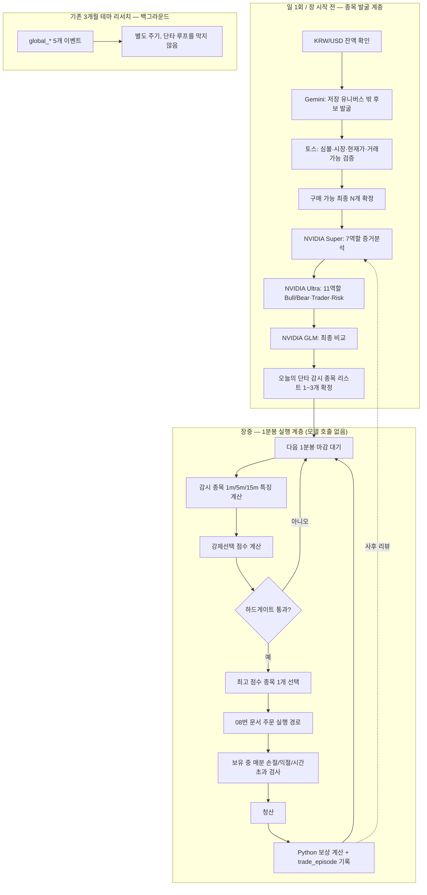

# 14. 1분봉 단타 실행 엔진 및 확률모델 설계

## 문서 관계

이 문서는 `12_1분봉예시.md`(단타 구조에 대한 검토 답변)와 `13_확률미적분학.txt`(브라운 운동·이토 미적분·GBM·OU 과정 설명)를 하나의 실행 설계로 통합한 것이다. `12`가 제시한 "강제선택 모드 + 목록 밖 종목 발견 + NVIDIA 3모델 + 독립 1분봉 엔진 + Python 숫자 보상" 방향을 그대로 채택하고, `13`의 확률미적분학 개념(GBM, 이토 보조정리, OU 과정)을 실제 `strategy/sde.py`의 `gbm_prob_up`, `build_sde_inputs`와 07번 문서의 `final_alpha` 산식에 접목하는 수준까지 구체화한다.

이 문서는 기존 01~11번 설계를 대체하지 않는다. 07(신호판단및리스크관리), 08(주문실행및포지션수명주기), 06(AI에이전트분석파이프라인) 위에 "1분봉 실행 계층"을 얹는 확장 설계다.

## 1. 문제 정의 — 지금 시스템은 왜 단타가 아닌가

`main.py`의 자동매매 루프가 종목별로 요청하는 OHLCV는 일봉(`interval="1d"`) 기준이다. `tech_buy`(`technical.get("buy_signal")`), `trend_score`, `final_alpha`, `sde_prob_up`은 전부 일봉 통계에서 나온다. 대시보드가 1분봉 차트를 그려줄 수는 있지만, 그것과 전략이 1분봉 단위로 진입·청산을 판단하는 것은 다른 문제다.

또한 이벤트 질문(`data/event_questions.csv`)의 실제 실행 순서는 다음과 같고, 세 개의 3개월 테마 질문(우주·방산, 로봇, 배터리, 양자, 글로벌 국가)까지 매 루프 순서대로 처리한 뒤에야 다음 루프가 시작된다.

| 순서 | event_id | 성격 |
|---|---|---|
| 1 | `cash_affordable_candidates` | 지금 현금으로 살 수 있는 종목 |
| 2 | `kr_domestic_top_candidates` | 국내 상위 후보 |
| 3 | `global_ai_semiconductor` | 3개월 테마 |
| 4 | `global_defense_space` | 3개월 테마 |
| 5 | `global_robotics` | 3개월 테마 |
| 6 | `global_battery` | 3개월 테마 |
| 7 | `global_quantum` | 3개월 테마 |
| 8 | `global_country_markets` | 3개월 테마 |

`LOOP_SECONDS`(기본 600초, `config.py:43`)가 이 8개 이벤트 전체를 순서대로 처리한 뒤에야 한 바퀴가 끝난다. 단타에 필요한 "다음 1분봉 마감마다 재평가"는 이 구조로는 만들 수 없다. 즉 단타를 하려면 **실행 흐름을 두 개로 분리**해야 하며, 이것이 이 문서의 핵심 결정이다.

## 2. 전체 아키텍처 — 리서치 계층과 실행 계층 분리



핵심 원칙은 세 가지다.

1. **모델 호출은 장 시작 전에 끝낸다.** 19역할(Super 7 + Ultra 11 + GLM 1)을 1분마다 반복하면 느리고 비용이 커진다. 모델은 "오늘 무엇을 감시할지"를 정하고, 장중 1분 판단은 Python 계산만 한다.
2. **단타 루프는 테마 리서치를 기다리지 않는다.** `global_ai_semiconductor`, `global_defense_space` 같은 3개월 질문은 주문 후보가 이미 정해진 뒤에 실행하거나 완전히 별도 주기로 돌린다.
3. **하드 안전조건은 절대 우회하지 않는다.** 아래 4장에서 다룬다.

## 3. 루프 분리 — 하나의 `LOOP_SECONDS`를 네 개로 쪼갠다

| 루프 | 주기 | 담당 |
|---|---|---|
| 종목 발견(`cash_symbol_discovery`) | 하루 1회 | Gemini + 토스 검증 |
| 테마 리서치(`global_*`) | 하루 1회 또는 기존 600초 | 기존 `event_research` 그대로 |
| 1분봉 단타 실행 | 다음 분봉 마감 시각까지 대기(시계 정렬) | Python 계산만, 모델 호출 없음 |
| 포지션 보유 중 감시 | 매분 또는 그보다 짧게 | 손절·익절·보유시간 초과 |

`LOOP_SECONDS=60`으로 단순히 낮추면 모델 호출 지연이 그대로 더해져 주기가 계속 밀린다. 1분봉 실행 루프는 벽시계 분 경계(`:00`)에 맞춰 별도 스레드/프로세스로 돌아야 한다. 제안 설정값(기존 `config.py`의 `env_int` 관례를 따름):

```
INTRADAY_ENGINE_ENABLED=true
INTRADAY_LOOP_ALIGN_TO_CLOCK=true        # 다음 분 경계까지 sleep
INTRADAY_MAX_WATCHLIST_SYMBOLS=3          # 장 시작 전 확정된 감시 종목 상한
INTRADAY_MAX_HOLDING_MINUTES=45           # 보유시간 하드 상한
INTRADAY_NO_NEW_ENTRY_BEFORE_CLOSE_MIN=10 # 장마감 N분 전 신규 진입 금지
```

## 4. 강제선택 모드 — 하드게이트와 소프트 스코어의 분리

지금 구조(`strategy/risk.py`의 `decide_action`, `main.py`의 `technical_entry_not_confirmed`/`agent_did_not_select_this_symbol`)는 아래 세 조건이 하나라도 실패하면 그 종목은 즉시 HOLD가 된다.

- `tech_buy=False` → `technical_entry_not_confirmed`
- `final_alpha < min_final_alpha`(또는 event_edge/kelly/sde_prob_up/trend_score 중 하나 미달) → 애초에 `base_action`이 BUY가 되지 못함
- 모델이 이 종목을 선택하지 않음 → `agent_did_not_select_this_symbol`

단타 전용 모드에서는 이 세 조건 + `gate=False`(생존 게이트)를 **차단 조건이 아니라 감점 요소**로 바꾸고, 구매 가능한 후보 중 종합 점수 1위를 강제로 선택한다. 단, 이는 "분석 조건"에만 적용되며 "실행 안전조건"에는 적용하지 않는다.

### 4.1 절대 우회 금지 — 하드게이트 (그대로 유지)

이 목록은 07/08번 문서의 생존 게이트·주문 직전 리스크 게이트와 동일한 성격이며, 단타에서는 추가 항목이 붙는다.

| 하드게이트 | 근거 |
|---|---|
| 실제 잔액 부족 | 08번 문서 LIVE 주문 직전 검증 |
| 토스에서 심볼을 찾지 못함 / 거래정지 / 주문 불가 | 08번 문서 시장·종목 검증 |
| 장 마감, 또는 마감 N분 전(신규 진입만 금지) | 신규 |
| 현재가·호가가 오래됨 | 07번 문서 주문 직전 리스크 게이트 |
| 스프레드·예상 슬리피지 과다 | 동일 |
| 미체결·상태 불명 주문 존재 | 08번 문서 재조정 절차 |
| 일일 최대 손실 도달, 총 낙폭 한도 | 07번 문서 생존 게이트 |
| 중복 주문, 손절 주문 실패 | 08번 문서 |
| 데이터/API 장애 | 전역 |
| **1분봉이 미확정(진행 중인 봉)** | 신규 — 마감된 봉만 신호에 사용 |
| **최대 보유시간 초과** | 신규 — 시간 기반 강제 청산은 게이트, 점수 대상 아님 |

정상 후보가 0개인 상황(하드게이트를 통과한 종목이 하나도 없음)에서도 매수하도록 만들면 안 된다. 현금 보유가 최선인 시장 상태가 실제로 존재하고, 적은 자본으로 단타를 할수록 거래비용과 시스템 장애의 영향이 상대적으로 커진다는 점은 FINRA의 데이트레이딩 위험 고지에서도 지적하는 부분이다. 즉 "구매 가능한 정상 후보가 1개 이상이면 최고 점수 종목을 강제 매수"이지, "항상 매수"가 아니다.

### 4.2 감점 방식으로 전환하는 항목

| 기존 하드 차단 | 단타 모드 전환 |
|---|---|
| `tech_buy=False` → 매수 안 함 | 기술점수 감점 |
| `final_alpha`/`event_edge`/`kelly`/`sde_prob_up`/`trend_score` 미달 | 종합점수 감점(구성 요소별 가중 감점) |
| 모델이 이 종목을 선택하지 않음 | 모델점수 감점(선택 안 됨=0, top_candidate 순위에 있으면 부분 점수) |
| `gate=False`(생존 게이트) | 의미·신뢰도 감점(단, 일일 손실 한도·API 오류 한도는 여전히 하드게이트로 유지 — 자금 안전 항목까지 점수로 바꾸지 않는다) |

`gate=False`를 전부 감점으로 바꾸는 것은 위험하다. `survival_gate`의 네 검사(일손실 한도, 총 낙폭, API 오류, LLM 신뢰도) 중 **일손실 한도·총 낙폭·API 오류 한도는 하드게이트로 남기고, `llm confidence too low`만 감점 대상**으로 좁히는 것을 권장한다. 자금 보호 규칙까지 순위 요소로 바꾸면 "강제선택"이 아니라 "위험 무시"가 된다.

### 4.3 최종 단타 점수

```
intraday_score =
    0.25 * momentum_1m          # 1분봉 모멘텀 (아래 5장)
  + 0.15 * volume_surge          # 거래량 증가율
  + 0.15 * vwap_position          # VWAP 대비 위치/괴리
  + 0.10 * short_trend            # 5분/15분 단기 추세
  + 0.15 * model_score            # 장전 확정된 모델 평가(top_candidate 순위 기반, 감쇠)
  + 0.05 * news_score              # 장전 확정 뉴스 점수
  - 0.10 * spread_penalty
  - 0.10 * volatility_risk_penalty
  - 0.05 * execution_cost_penalty
  - gate_alpha_tech_penalty        # 4.2절 감점 총합, 최대 -0.30
```

가중치는 시작값이며 08번 문서 "설정 변경 원칙"과 동일하게 한 번에 하나의 변수군만 바꾸고 DRY RUN 로그로 비교해야 한다. 하드게이트를 통과한 후보가 여럿이면 `intraday_score` 최댓값 종목 1개를 선택하고, 후보가 0개면 현금 보유(HOLD)로 종료한다.

## 5. 1분봉 특징 계층

일봉 파이프라인과 별도로 최소 다음 특징을 1분·5분·15분 세 해상도로 계산해야 한다.

| 특징 | 정의 |
|---|---|
| `momentum_1m` | 최근 N개 1분봉 종가의 로그수익률 합 또는 단기 이동평균 기울기 |
| `volume_surge` | 최근 1분 거래량 / 최근 20분 평균 거래량 |
| `vwap_position` | `(price - vwap) / vwap`, 당일 누적 VWAP 기준 |
| `short_trend` | 5분·15분 Supertrend 또는 EMA 정렬 |
| `spread_bps` | 매수/매도 호가 스프레드 |
| `impact_bps` | 주문 수량을 호가창에 소진했을 때 예상 평균 체결가 괴리 (08번 문서 "예상 충격" 게이트와 동일 정의) |

이 특징들은 확정된 1분봉(진행 중인 봉 제외)에서만 계산한다. 장중 진행 중인 봉으로 신호를 만들면 미래 정보를 앞당겨 쓰는 것과 같은 문제가 생긴다.

## 6. 확률미적분학 응용 — 단타용 SDE 재설계

`13_확률미적분학.txt`가 정리한 네 개념(브라운 운동, 이토 미적분, GBM, OU 과정)을 실제 `strategy/sde.py`에 연결한다.

### 6.1 현재 `sdeP`의 한계

`strategy/sde.py`의 `gbm_prob_up`은 `horizon_days`(기본 20일)와 `target_return`(기본 3%)을 쓰는 **일 단위·스윙 설계**다. 로그가격이 GBM을 따른다는 가정(`dS_t = μS_t dt + σS_t dW_t`, 로그수익률 `d(lnS_t) = (μ - σ²/2)dt + σ dW_t`)은 그대로 쓰되, 다음 세 가지를 단타에 맞게 바꿔야 한다.

1. `horizon_days` → `horizon_minutes`(예: 5~30분)
2. 단측 확률(목표수익률 초과 확률)만이 아니라 **익절선·손절선 중 무엇을 먼저 만나는지**를 계산하는 이중 배리어 확률
3. `sigma`를 일봉 역사적 변동성이 아니라 최근 N개 1분봉의 실현변동성으로 추정

### 6.2 목표시간 내 익절선 도달 확률 (단측 배리어)

기존 `gbm_prob_up`과 동일한 형태를 분 단위로 재사용할 수 있다. `T = horizon_minutes / minutes_per_year`(KR 시장 기준 1일 390분 × 252일 = 98,280분/년 가정)로 바꾸면 그대로 재사용 가능하다.

### 6.3 손절보다 익절이 먼저 올 확률 (이중 배리어 — 신규)

로그수익률 과정 `X_t = ln(S_t/S_0) = ν t + σ W_t`, `ν = μ - σ²/2`를 생각한다. 익절선을 `a = ln(1+tp_pct) > 0`, 손절선을 `-b = ln(1-sl_pct) < 0`이라 하자. `exp(-2ν X_t / σ²)`가 마팅게일이라는 성질(이토 보조정리로 확인 가능)을 이용하면, **시간 제한 없이(진입 후 언젠가는 둘 중 하나에 닿는다는 전제로)** 익절선을 손절선보다 먼저 만날 확률의 닫힌 형태 해가 나온다.

```
p_tp_first = [1 - exp(2ν b / σ²)] / [exp(-2ν a / σ²) - exp(2ν b / σ²)]
```

`ν = 0`(방향성 없음)인 극한에서는 `p_tp_first → b / (a + b)`로 수렴한다(거리 비율로 결정 — 표류가 없으면 확률은 배리어까지의 로그거리에만 비례한다는 직관과 일치).

이 식은 "무한 시간" 가정이므로 `INTRADAY_MAX_HOLDING_MINUTES`로 강제 청산되는 실제 상황보다 약간 낙관적이다. 시간 제한을 정확히 반영한 확률(`T` 이내에 도달)은 닫힌 형태가 무한급수(반사원리/이미지 방법)로만 나오므로, 실전에서는 **1분 단위 GBM 경로를 수천 개 벡터화 몬테카를로로 시뮬레이션**해서 `p_tp_before_sl_within_T`를 직접 추정하는 편이 구현·검증 난도 대비 합리적이다(numpy로 경로 1만 개, 30스텝이면 수 밀리초 수준).

### 6.4 기대 보유시간

왈드(Wald) 항등식으로 부터, `X_t - νt`가 마팅게일이라는 성질을 쓰면:

```
ν ≠ 0:  E[τ] = [a·p_tp_first - b·(1 - p_tp_first)] / ν
ν = 0:  E[τ] = [a²·p_tp_first + b²·(1 - p_tp_first)] / σ²
```

이 값은 `INTRADAY_MAX_HOLDING_MINUTES` 설정의 근거 자료로 쓴다. 기대 보유시간이 보유시간 상한에 근접하거나 초과하는 후보는 애초에 단타 후보에서 낮은 점수를 받아야 한다(회전율이 낮아지고 시간초과 강제청산 빈도가 올라가기 때문).

### 6.5 1분봉 변동성 추정

```
σ_1min = std(log(P_t / P_{t-1}))   # 최근 N개(예: 30~60개) 확정 1분봉
σ_annual = σ_1min * sqrt(minutes_per_year)   # minutes_per_year ≈ 98,280 (KR 기준)
```

역사적 변동성 대신 Parkinson(고가·저가 range 기반) 추정을 병행하면 노이즈가 줄어든다. `build_sde_inputs`의 `disclosure_multiplier`/`news_multiplier`/`risk_multiplier` 배수 구조는 그대로 유지하되 base variance만 1분봉 기반으로 교체한다.

### 6.6 비용차감 기대값

```
E[net_return] = p_tp_before_sl * tp_pct
              - (1 - p_tp_before_sl) * sl_pct
              - roundtrip_commission_pct
              - expected_slippage_pct(impact_bps)
```

이 값이 0 이하인 후보는 `intraday_score`와 무관하게 강제선택 대상에서 제외한다(4.1절 하드게이트에 추가할 수 있는 선택 항목). 적은 자본·짧은 보유시간일수록 거래비용 비중이 커지므로, 이 계산을 생략하면 "이론상 확률은 높지만 비용 때문에 매 거래 손실"인 구조가 될 수 있다.

### 6.7 OU 과정 응용 — VWAP 평균회귀 신호 (모멘텀과 별도 트랙)

GBM 기반 확률은 추세추종/돌파형 진입에 맞는다. VWAP 되돌림(눌림목) 진입처럼 평균회귀 전략에는 오른슈타인-울렌벡 과정이 더 맞는 모델이다.

```
z_t = (P_t - VWAP_t) / σ_short
dz_t = θ(0 - z_t) dt + σ dW_t
half_life = ln(2) / θ
```

`θ`(회귀 속도)를 최근 N분 구간에서 회귀분석(AR(1) 계수)으로 추정하면, `half_life`가 짧고 `|z_t|`가 클수록 "곧 VWAP로 되돌아올 가능성이 큰 되돌림 구간"으로 해석해 반대방향 진입 점수에 반영할 수 있다. 이 트랙의 기대 보유시간은 6.4절 공식 대신 `half_life`를 직접 사용한다.

정리하면 진입 성격에 따라 두 확률 모델을 분리 사용한다.

| 진입 성격 | 모델 | 기대 보유시간 |
|---|---|---|
| 모멘텀/돌파 | GBM 이중 배리어(6.3) | 6.4절 공식 또는 몬테카를로 |
| VWAP 눌림목/되돌림 | OU 과정(6.7) | half-life |

## 7. 보상 설계 — 이것은 강화학습이 아니다

NVIDIA 모델에게 거래 결과를 설명하게 하는 것과 실제 강화학습은 다르다. 정식 강화학습이 되려면 상태(진입 시점 가격·거래량·VWAP·변동성·뉴스·포지션), 행동(매수/대기/매도/주문비율), 보상(거래 결과), 정책 갱신(보상을 이용해 다음 행동 규칙이나 모델 파라미터를 실제로 바꾸는 절차)이 모두 있어야 한다. 지금 구조와 이 문서가 제안하는 구조에는 앞의 세 가지(상태·행동·보상)는 있지만, 네 번째(정책 갱신)가 없다. 모델이 "이번 거래는 잘했다/잘못했다"라고 설명하는 것은 **LLM 리뷰어/Critic**이지 정책 갱신이 아니다. 이 구분을 문서와 로그에 명시해 "강화학습을 한다"는 과장된 표현을 쓰지 않는다.

### 7.1 현실적인 구조

```
Python이 숫자 보상 계산
  → NVIDIA Super가 거래 원인·실수를 정성 리뷰
  → 결과를 trade_episode 로그와 agent memory(06번 문서의 memory.jsonl)에 저장
  → 다음 종목 질문에 최근 유사 거래 리뷰를 근거로 첨부
  → 전략별 최근 보상이 나쁘면 model_score/전략 비중을 축소
```

### 7.2 보상함수

```
reward = net_return_after_cost              # 6.6절
       - λ1 * max_adverse_excursion_pct      # 진입 후 최대 역행폭
       - λ2 * portfolio_drawdown_contribution
       - λ3 * stop_loss_delay_penalty        # 손절 신호 후 실제 청산까지 걸린 시간
       - λ4 * rule_violation_penalty         # 하드게이트 우회/보유시간 초과 등
```

체결가·수수료·슬리피지는 브로커 데이터로 Python이 계산하고, 모델이 이 숫자를 임의로 정하지 않는다. 07번 문서의 원칙("데이터 품질과 주문 안전성은 별도 게이트")과 동일하게, 보상 계산도 모델의 자기평가가 아니라 실제 체결 기록에서만 나온다.

### 7.3 NVIDIA 3모델의 사후 역할 재배치

| 모델 | 시점 | 역할 |
|---|---|---|
| Super | 체결 후(사후) | 거래 원인·실수 정성 리뷰, 패턴 분류 |
| Ultra | 다음 거래 전(사전) | 다음 진입/청산 계획, 위험 관점 |
| GLM | 장전 1회 | 여러 판단의 최종 비교(기존 06번 문서 역할 그대로) |

이는 06번 문서의 `post_decision`(reflection/memory curator) 파이프라인을 그대로 확장한 것이며 새 파이프라인을 만들 필요는 없다.

### 7.4 실제 강화학습으로 가는 로드맵

향후 정책 갱신까지 하려면 PPO/DQN류의 별도 정책 모델과 학습·검증 데이터가 필요하다(FinRL도 거래비용·유동성·위험회피를 포함한 시뮬레이션·백테스트를 전제로 구성된다). 순서는 다음과 같아야 하며, 실계좌에서 바로 학습시키는 단계를 건너뛰면 안 된다.

```
과거 1분봉 재생 테스트 (historical replay backtest)
  → DRY RUN 실시간 모의매매
  → Paper 거래로 보상 누적, 정책 후보 비교
  → 전략 고정 후 매우 작은 금액 LIVE
  → 이상 징후 시 자동 중지(kill switch)
```

이 로드맵은 08번 문서의 DRY RUN/LIVE 구분, 07번 문서의 생존 게이트와 완전히 호환된다. 별도 정책 모델을 도입하더라도 07/08번 문서의 하드게이트·주문 수명주기는 그대로 최종 승인권을 가진다(06번 문서 "AI의 권한 경계"와 동일 원칙 — 정책 모델도 하드 한도를 늘릴 수 없다).

## 8. 주문 실행 연계 — 08번 문서와의 접점

1분봉 단타는 08번 문서의 주문 수명주기를 그대로 쓰되 다음을 강화해야 한다.

- 보유시간이 짧으므로 `pending_live_orders`/`unresolved_order_submissions`가 하나라도 있으면 다음 1분봉을 기다리지 않고 **즉시** 전역 차단(08번 문서 원칙과 동일, 다만 대기 없이 즉시 재조회 시도).
- 시장가 주문 직전 호가·스프레드·impact 검사(07번 문서 "주문 직전 리스크 게이트")를 분봉 주기와 동일한 빈도로 반복 — 단타는 이 검사가 특히 중요하다. 시장가 주문은 화면에서 본 가격과 다른 가격에 체결될 수 있고, 빠르게 움직이는 시장일수록 그 차이가 커질 수 있다.
- `INTRADAY_MAX_HOLDING_MINUTES` 초과는 exit_rules에 새 조건으로 추가한다(07번 문서 청산 규칙 표에 "보유시간 초과 → 전량 SELL" 행 추가).

## 9. 실제 주문 후보 질문 우선순위 재설계

### 9.1 현재 순서의 문제

`cash_affordable_candidates`가 `event_questions.csv`의 첫 행이라 "가장 먼저"처럼 보이지만, 이것은 **기존 저장 유니버스(465개) 안에서만** 후보를 찾는다. 목록 밖 종목 발굴(Gemini)과 실제 매매 가능 종목 확정은 아직 이 우선순위에 없다. 게다가 이 8개 이벤트가 하나의 `run_once` 안에서 순차 실행되므로, 뒤쪽 테마 질문이 늦게 끝나면 실제 주문 후보 확정 자체가 늦어진다.

### 9.2 5단계 재구성안

| 순위 | 이벤트 성격 | 담당 |
|---|---|---|
| 1 | `cash_symbol_discovery` — 저장 목록 밖 후보 발굴 | Gemini |
| 2 | `broker_candidate_validation` — 토스에서 최종 후보 검증(심볼·시장·현재가·거래가능) | Python + 토스 API |
| 3 | `intraday_candidate_analysis` — Super → Ultra → GLM | NVIDIA 3모델 |
| 4 | 1분봉 감시 및 실제 주문 | Python 단타 엔진(2~8장) |
| 5 | 기존 우주·방산·로봇·국가·양자 등 장기 테마 질문 | 기존 `event_research`, 별도 주기 |

이 순서는 CSV 행 순서를 바꾸는 문제가 아니라 **실행 단계를 분리**하는 문제다. 1~4단계가 끝나야 "오늘의 감시 종목"이 나오고, 5단계는 그 결과를 기다리지 않고 병렬로(또는 하루 1회 별도 프로세스로) 돌려야 한다.

### 9.3 구현 방향

- `event_questions.csv`에 `priority_tier`(1~5) 컬럼을 추가하고, `main.py`의 `run_once`를 "tier 1~4 먼저 완료 → 감시 종목 확정 → 1분봉 엔진 시작" 후 "tier 5는 별도 스레드/프로세스"로 나눈다.
- tier 1~4는 하루 1회(장 시작 전) 완료를 목표로 하고, `daily_event_llm_cache`(06번 문서 "판단 캐시") 구조를 그대로 재사용해 같은 날 중복 질문을 막는다.
- tier 5(3개월 테마)는 지금처럼 `LOOP_SECONDS` 주기로 돌리되, 단타 엔진과 별도 프로세스/스레드로 분리해 서로의 지연이 섞이지 않게 한다.

## 10. `'NoneType' object is not iterable` — 정확한 원인과 수정

로그 `[event-research] kr_domestic_top_candidates | day=2026-08-14 | source=daily_cache | llm_candidates=6` 직후 발생하는 이 오류는 사용자가 보고한 세 가지 정상 차단 케이스(`gate=False`, `alpha 부족`, `모델이 다른 종목 선택`)와는 다른, **별도의 코드 결함**이다. 코드를 직접 확인한 결과다.

### 10.1 재현 경로

1. `strategy/agentic/orchestrator.py`의 `analyze_event`가 파이프라인 초반 단계(예: `statistics_analyst`)에서 `insufficient_data`를 반환하면, 뒤따르는 역할들이 `required_dependency_unavailable`로 전부 차단되어 `decision is None`이 된다.
2. `decision is None`이면 `analyze_event`는 `self._unavailable_result(reason, run_id=run_id)`를 반환한다(`strategy/agentic/orchestrator.py:782`). 이 함수는 `yes_probability`, `confidence`, `block_reason` 등은 채우지만 **`selected_symbols` 키를 아예 만들지 않는다.**
3. `main.py`의 `_compact_llm_result`(`main.py:506`)는 `_COMPACT_LLM_RESULT_KEYS`에 있는 모든 키를 `llm_result.get(key)`로 읽어 캐시용 dict를 만든다. `selected_symbols` 키가 원본에 없으면 `llm_result.get("selected_symbols")`는 `None`을 반환하고, 이 `None`이 `json.dumps`/`json.loads`를 거쳐 그대로 `compact["selected_symbols"] = None`으로 저장된다. 즉 "키가 없음"이 캐시에서는 "키는 있고 값이 `null`"로 바뀐다.
4. 이 compact 결과가 `daily_event_llm_cache`(`state.json`)에 저장되고, 같은 날 다음 루프에서 `get_daily_event_llm_result`가 이를 읽어 `llm_result`에 그대로 펼쳐 넣는다. 이때 `llm_result["selected_symbols"]`는 `None`이다.
5. `main.py:1727`에서:

   ```python
   agent_selected_symbols = {
       str(symbol) for symbol in llm_result.get("selected_symbols", [])
       if str(symbol) in llm_symbols
   }
   ```

   `.get("selected_symbols", [])`는 **키가 없을 때만** 기본값 `[]`를 반환한다. 지금은 키가 존재하고 값이 `None`이므로 기본값이 적용되지 않고 `for symbol in None`이 실행되어 `TypeError: 'NoneType' object is not iterable`이 발생한다.
6. 이 예외는 `run_once`의 최상위 예외 처리에서 잡혀 `[ERROR]`로 출력된 뒤(`main.py:2509` 부근) `LOOP_SECONDS`(600초) 대기로 들어간다. 600초 후 전체 주기가 처음부터 다시 시작되므로 "질문을 또 하는 것"처럼 보이지만, 실제로는 정상적으로 다음 이벤트로 넘어간 것이 아니라 **`run_once` 전체가 중단되고 재시작된 것**이다.

같은 함수(`main.py:459`)의 다른 코드는 이미 `llm_result.get("selected_symbols", []) or []`로 `None`을 방어하고 있다. `1727`행만 이 방어가 빠져 있는 것이 이번 버그의 정확한 위치다.

### 10.2 수정안

가장 안전한 순서는 세 지점을 함께 고치는 것이다. 한 곳만 고치면 같은 패턴(`top_candidate_symbols`, `avoid_symbols` 등)이 다른 이벤트에서 재발할 수 있다.

**(1) 즉시 조치 — `main.py:1727`을 나머지 코드와 같은 패턴으로 통일**

```python
# 변경 전
agent_selected_symbols = {str(symbol) for symbol in llm_result.get("selected_symbols", []) if str(symbol) in llm_symbols}

# 변경 후
agent_selected_symbols = {str(symbol) for symbol in (llm_result.get("selected_symbols") or []) if str(symbol) in llm_symbols}
```

**(2) 근본 조치 — `_compact_llm_result`에서 리스트형 키는 `None`을 만들지 않도록 정규화**(`main.py:506` 부근)

```python
_LIST_VALUED_RESULT_KEYS = {"selected_symbols", "top_candidate_symbols", "avoid_symbols"}

def _compact_llm_result(llm_result: dict) -> dict:
    compact = {}
    for key in _COMPACT_LLM_RESULT_KEYS:
        value = llm_result.get(key)
        if key in _LIST_VALUED_RESULT_KEYS and value is None:
            value = []
        compact[key] = json.loads(json.dumps(value, ensure_ascii=False))
    return compact
```

**(3) 원인 조치 — `_unavailable_result`가 처음부터 빈 리스트를 채우게 함**(`strategy/agentic/orchestrator.py:782`)

```python
def _unavailable_result(self, reason: str, *, run_id: str | None = None) -> Dict[str, Any]:
    return {
        "yes_probability": 0.5,
        "confidence": 0.0,
        "news_score": 0.0,
        "buy_allowed": False,
        "size_multiplier": 0.0,
        "block_reason": reason,
        "selected_symbols": [],          # 추가
        "top_candidate_symbols": [],       # 추가
        "avoid_symbols": [],               # 추가
        "agentic_analysis": {"run_id": run_id, "status": "unavailable", "reason": reason},
        "google_evidence": {"status": "unavailable", "reason": reason},
        "nvidia_judgement": {"status": "unavailable", "reason": reason},
        "api_usage": self.usage_snapshot(),
    }
```

**(4) 운영 조치 — 한 이벤트의 예외가 전체 `run_once`를 죽이지 않도록 이벤트별로 격리**

```python
for event in events:
    try:
        ...기존 이벤트 처리...
    except Exception as exc:
        print(f"[event-error] {event.event_id} | {exc!r}")
        append_jsonl(settings.log_path, {"event_id": event.event_id, "action": "EVENT_PROCESSING_ERROR", "error": repr(exc)})
        continue  # 다음 이벤트로, 전체 루프를 죽이지 않는다
```

이 네 가지 중 (1)은 지금 당장의 장애를 멈추고, (2)+(3)은 재발을 막으며, (4)는 앞으로 비슷한 결함이 또 생기더라도 봇 전체가 600초씩 죽는 대신 해당 이벤트만 실패로 기록되게 한다. 차단된 모델 결과는 오류가 아니라 **안전한 HOLD**로 처리되어야 한다는 것이 이 수정의 방향이다.

### 10.3 이번 사례가 4장의 논의와 만나는 지점

이번에 걸린 이벤트(`kr_domestic_top_candidates`)는 하드게이트가 아니라 **버그로 인해 강제 종료**됐다. 4장에서 제안한 "감점 방식 전환"이 적용됐더라도, `_unavailable_result` 자체가 예외를 던지므로 점수 계산까지 가지도 못하고 죽는다. 즉 이 수정은 강제선택 모드 설계의 전제조건이다 — 소프트 스코어링으로 바꾸기 전에 먼저 "모델 결과 누락이 예외가 아니라 0점으로 처리되도록" 고쳐야 한다.

## 11. 롤아웃 순서

1. 10장의 버그 수정(4가지) — 이것부터 배포. 단타와 무관하게 지금 시스템의 안정성 문제다.
2. 9장의 우선순위 재구성 — tier 1~4 분리, DRY RUN에서 "오늘의 감시 종목"이 장 시작 전에 안정적으로 확정되는지 확인.
3. 5~6장의 1분봉 특징·확률모델을 DRY RUN에 연결, 과거 1분봉 재생 테스트로 `p_tp_before_sl`·기대 보유시간 추정치를 실제 체결 결과와 비교.
4. 4장의 강제선택 점수식을 DRY RUN에서 1~2주 이상 운영하며 가중치 튜닝(08번 문서 "설정 변경 원칙"과 동일하게 한 번에 한 변수군만).
5. 7장의 보상/리뷰 루프를 Paper 단계에 연결.
6. 매우 작은 금액으로 LIVE 전환, `INTRADAY_MAX_HOLDING_MINUTES`·일손실 한도를 보수적으로 설정하고 이상 시 자동 중지.

## 13. 구현 현황 (2026-08-14 코드 반영)

이 절은 이 문서 작성 이후 실제로 `C:\Users\hyunj\toss` 코드베이스에 반영된 내용을 기록한다. 08번 문서 "설정 변경 원칙"에 따라 DRY_RUN에서 먼저 검증한 뒤에만 다음 단계로 넘어가야 한다.

### 13.1 완료 — 10장 NoneType 버그 수정 (1)(2)(3)

- `strategy/agentic/orchestrator.py`의 `_unavailable_result()`가 이제 `selected_symbols`/`top_candidate_symbols`/`avoid_symbols`를 빈 리스트로 채운다.
- `main.py`의 `_compact_llm_result()`가 리스트형 키의 `None`을 캐시 저장 시점에 `[]`로 정규화한다.
- `main.py:1727`(현재 라인은 앞선 수정으로 이동) 의 `agent_selected_symbols` 계산이 `llm_result.get("selected_symbols") or []`로 `None`을 방어한다.
- 오늘(2026-08-14) `state.json`에 이미 저장돼 있던 8개 이벤트의 오염된 캐시(`selected_symbols/top_candidate_symbols/avoid_symbols: null`)도 직접 정규화했다. 원본은 `state.json.bak_before_none_fix_20260814`로 백업했다.
- **미적용**: 10.2절 (4) "이벤트별 예외 격리"(전체 `for event in events:` 본문을 try/except로 감싸는 것)는 적용하지 않았다. 이 블록이 800줄 이상이라 기계적 재들여쓰기 자체가 실거래 코드에서 위험이 크다고 판단했다. (1)(2)(3)으로 근본 원인이 없어졌으므로 시급성은 낮아졌다. 원하면 `process_event(...)`로 함수 분리하는 별도 리팩터링으로 진행할 것을 권장한다.

### 13.2 완료 — 9장 우선순위 스케줄링

- `data/event_questions.csv`에 `priority_tier` 컬럼 추가: `cash_affordable_candidates`, `kr_domestic_top_candidates` = 1, 나머지 6개 3개월 테마 이벤트 = 5.
- `strategy/events.py`의 `EventSpec`이 `priority_tier`를 읽는다.
- `config.py`에 `PRIORITY_EVENT_MAX_TIER`(기본 1), `THEME_EVENT_EVERY_N_LOOPS`(기본 6) 추가.
- `main.py`의 이벤트 루프가 tier 5 이벤트를 `run_once_count % THEME_EVENT_EVERY_N_LOOPS != 0`인 루프에서는 건너뛴다(`[event-skip]` 로그로 기록). tier 1(실주문 후보)은 매 루프 처리된다.

### 13.3 신규 발견 — DRY_RUN은 100% 모의(mock) 데이터를 쓴다

코드 조사 중 버그와 별개로 더 큰 원인을 발견했다. `main.py`의 `pick_ohlcv()`는 `if settings.dry_run: return make_mock_ohlcv(...)`로 **DRY_RUN이면 무조건** 합성 OHLCV를 반환하고, 가격도 `price_source: "dry_run_fallback"`(모든 종목이 100.0 같은 고정값)으로 대체된다. 실제 감사 로그(`data/agentic/audit.jsonl`)를 보면, `statistics_analyst`가 이 가짜 데이터를 보고 `data_quality_flags: ["input_data_unreliable"]`로 스스로 `insufficient_data`를 반환하고, 이것이 `fact_reasoner`부터 `portfolio_manager`까지 전체 파이프라인을 연쇄 차단한다. 즉 2026-08-14 하루 동안 8개 이벤트 전부가 매수를 만들지 못한 것은 (a) NoneType 버그와 (b) DRY_RUN 모의데이터로 인한 정상적인 fail-closed 차단, 두 가지가 겹친 결과다. (b)는 버그가 아니라 안전장치가 설계대로 작동한 것이지만, 이 상태로는 DRY_RUN에서 "실제로 살 만한 종목을 찾는지"를 검증할 수 없다.

이 문서의 11장 롤아웃 순서(DRY RUN → Paper → 소액 LIVE)를 실제로 밟으려면, **실데이터를 쓰되 주문은 시뮬레이션만 하는 별도 Paper 모드**가 필요했다. 현재 코드에는 "가짜 데이터"와 "가짜 주문"이 `DRY_RUN` 하나로 묶여 있어 이 구분이 없었다.

### 13.4 완료 — PAPER_TRADING 모드 구현

사용자 확인 후 구현했다. `.env`에 `PAPER_TRADING=false`(기본값, 안 켜져 있으면 기존 동작과 100% 동일)를 추가했다.

- `config.py`: `Settings.paper_trading`(env `PAPER_TRADING`) 추가.
- `main.py`의 `pick_price()`, `fetch_prices_batched()`, `pick_ohlcv()`: `if settings.dry_run:` 분기를 `if settings.dry_run and not settings.paper_trading:`로 바꿔, `PAPER_TRADING=true`일 때는 LIVE와 동일한 실제 토스 시세·캔들 조회 경로를 탄다. 실패 시에도 `run_once` 전체를 죽이지 않고 해당 종목만 합성값으로 대체한다(`paper_trading_fetch_failed_fallback`).
- `main.py`의 브로커 프리플라이트 블록: `PAPER_TRADING=true`이면 실제 `toss.buying_power()`/`toss.exchange_rate()`로 KRW/USD 주문가능금액과 환율을 읽는다(사용자의 실제 3~10만원 잔액이 그대로 반영됨). 단 `positions_map`은 `get_positions_map()`을 그대로 호출해 계속 `sim_positions`(시뮬레이션 보유)를 쓴다 — 실제 계좌 보유종목과 봇의 페이퍼 매매를 섞지 않기 위함이다.
- **주문 제출 안전장치는 전혀 건드리지 않았다.** `toss_client.py`의 `create_order`/`modify_order`/`cancel_order`는 `self.dry_run`(=`settings.dry_run`, `PAPER_TRADING`과 무관)일 때 실제 HTTP POST 없이 합성 응답만 반환한다. `PAPER_TRADING`은 오직 읽기 전용 조회(`prices`/`candles`/`buying_power`/`exchange_rate`) 경로에만 영향을 준다.

**켜는 방법**: `.env`에서 `PAPER_TRADING=true`로 바꾸고 봇 프로세스를 재시작한다(파이썬은 실행 중 `.py`/`.env` 변경을 자동 반영하지 않는다). DRY_RUN은 `true`로 유지한 채로 켜야 한다.

### 13.5 완료 — AI 기반 레지스트리 외부 종목 발굴 (제미나이 실검색 + NVIDIA 폴백 + 토스 재검증)

`data/symbols.csv`에 아직 없는 종목도 AI가 제안할 수 있게 하되, **AI의 심볼 추측을 절대 그대로 신뢰하지 않고 Python이 토스 API로 재검증한 것만** 실행 후보 흐름에 들어가게 하는 발굴 파이프라인을 추가했다. 기본값은 꺼짐이며(`CASH_SYMBOL_DISCOVERY_ENABLED=false`), 켜지 않는 한 기존 실거래 흐름에 아무 영향도 주지 않는다.

**동작 순서** (하루 한 번, `daily_event_llm_cache`와 같은 정책 — `state["cash_symbol_discovery_cache"]`에 `research_day`로 캐시):

1. `strategy/agentic/symbol_discovery.py`의 `run_cash_symbol_discovery()`가 `main.py`의 `run_once()`에서 `load_events()` 호출 **직전**에 실행된다. 이렇게 해야 이번 루프에서 새로 검증·추가된 종목이 곧바로 `MARKET:KR`/`MARKET:US` 토큰 해석(`strategy/events.py resolve_symbol_tokens`)에 포함된다.
2. **1순위: 제미나이** — `strategy/llm_providers.py`의 기존 `GeminiAPI2Client`(이미 완성돼 있었고 `generate_json()`으로 실제 Google Search grounding 지원)를 `CASH_SYMBOL_DISCOVERY_PREFER_GEMINI=true`(기본값)일 때 먼저 호출한다. 프롬프트 페르소나/규칙은 `agent/agents/cash_symbol_discovery.md`의 본문(YAML frontmatter 제외)을 그대로 재사용해 두 provider가 동일한 제약(최대 4개, KR/US만, 숫자 조작 금지)을 받는다.
3. **2순위: NVIDIA 폴백** — 제미나이 키가 없거나 호출이 실패하면 `strategy/agentic/orchestrator.py`의 새 공개 메서드 `NvidiaNemotronAgentOrchestrator.discover_cash_symbols()`가 `agent/agent_registry.json`에 새로 등록된 1-role 파이프라인 `cash_symbol_discovery`(`_run_pipeline()` 재사용)를 돌린다. 실시간 검색은 없고 모델이 학습 시점에 알던 지식만으로 제안한다.
4. **재검증(핵심 안전장치)**: 두 provider 중 어느 쪽이 응답했든, 반환된 모든 `symbol_guess`는 `strategy/toss_symbol_verifier.py`에 새로 추가한 `verify_symbol_guesses()`로 **실제 토스 API**(`client.stocks()`/`client.prices()`, 읽기 전용)에 다시 조회한다. 이 조회는 `DRY_RUN`/`PAPER_TRADING` 값과 무관하게 항상 실제 API를 친다(주문 제출이 아니라 조회이기 때문). 토스가 종목정보와 유효한 마지막 가격을 둘 다 확인해주지 못하면 그 종목은 **폐기**되며(fail-closed), AI가 얼마나 확신했든 실행 후보가 될 수 없다.
5. 검증에 성공하고 `data/symbols.csv`에 아직 없는 종목만 `resolved=ai_discovered_verified`, `enabled=true`, `theme=AI Discovered`로 새 행이 **추가**된다(기존 행은 절대 수정하지 않음, append-only). 이후에는 기존의 모든 하드 게이트(잔고 부족, 거래정지, 스프레드/슬리피지, 생존 게이트, 중복 주문 방지 등)를 그대로 통과해야 실제 매수 후보가 된다 — 이 발굴 경로만을 위한 별도 우회는 만들지 않았다.

**새 파일/변경 요약**:

- `strategy/agentic/symbol_discovery.py` (신규) — 위 1~5 흐름 전체.
- `strategy/toss_symbol_verifier.py` — `verify_symbol_guesses()` 추가(기존 `verify_execution_symbols()`의 배치/재시도 헬퍼 재사용).
- `strategy/agentic/orchestrator.py` — `discover_cash_symbols()` 추가(기존 `_base_context()`/`_run_pipeline()` 재사용, `run_offline_experiments()`와 같은 패턴).
- `agent/agent_registry.json` — `pipelines.cash_symbol_discovery` 및 `agents` 목록에 `cash_symbol_discovery` 항목 등록.
- `agent/agents/cash_symbol_discovery.md` — NVIDIA 폴백 경로의 role 프롬프트(이미 작성돼 있던 파일을 실제로 연결).
- `config.py` — `cash_symbol_discovery_enabled`(기본 `false`), `cash_symbol_discovery_max_candidates`(기본 4), `cash_symbol_discovery_prefer_gemini`(기본 `true`), `cash_symbol_discovery_pipeline`, `cash_symbol_discovery_verify_batch_size`(기본 50).
- `main.py` — `run_once()`에서 `load_events()` 직전에 `run_cash_symbol_discovery()` 호출, 결과를 `[cash-symbol-discovery]` 로그 한 줄로 출력. 예외가 나도 `run_cash_symbol_discovery()` 내부에서 흡수해 이후 정상 후보 스캔을 막지 않는다.
- `.env` — `CASH_SYMBOL_DISCOVERY_ENABLED=false`, `CASH_SYMBOL_DISCOVERY_MAX_CANDIDATES=4`, `CASH_SYMBOL_DISCOVERY_PREFER_GEMINI=true`, `CASH_SYMBOL_DISCOVERY_VERIFY_BATCH_SIZE=50` 추가.

**켜는 방법**: `.env`에서 `CASH_SYMBOL_DISCOVERY_ENABLED=true`로 바꾸고 봇 프로세스를 재시작한다. 먼저 `DRY_RUN=true`(가능하면 `PAPER_TRADING=true`와 함께)로 며칠 관찰해 `[cash-symbol-discovery]` 로그의 `proposed`/`verified`/`appended` 수치와 `data/symbols.csv`에 실제로 붙는 행을 확인한 뒤에만 라이브에서 켤 것을 권장한다(08번 문서의 "DRY_RUN에서 먼저 검증 후 다음 단계" 원칙과 동일).

### 13.6 참고 — git 시크릿 유출 사고 처리 (2026-08-14)

`.env` 백업 파일(`.env.bak_before_paper_trading_20260814`)에 실제 GCP 서비스 계정 키가 포함된 채로 커밋됐고, GitHub push protection이 이를 차단했다. 시크릿 스캐닝의 "허용" 링크를 클릭해 우회하지 않고, 해당 파일을 커밋에서 제거(`git rm --cached` + `git commit --amend`)하고 `.gitignore`에 `.env.*`, `*.bak`, `*.bak_*`를 추가하는 방식으로 처리했다. 이 세션 환경은 GitHub에 직접 push할 네트워크 접근이 없어, 최종 `git push`는 사용자가 직접 실행해야 한다. 남은 할 일: 사용자가 (1) `git push` 실행, (2) 디스크에 남아있는 평문 `.env.bak_before_paper_trading_20260814` 파일 수동 삭제, (3) 유출됐던 GCP 서비스 계정 키 회전(rotate)을 권장. 이후 모든 `.env` 백업은 생성 즉시 `.gitignore` 커버리지를 먼저 확인한다.

## 14. 이 문서가 하지 않는 것 (명시적 비범위)

- PPO/DQN 등 실제 정책 갱신 모델의 구현 — 7.4절 로드맵의 마지막 단계이며 이 문서의 범위 밖이다.
- 하드 자금 보호 게이트(일손실 한도, 총 낙폭, 중복 주문 방지 등)를 점수화하는 것 — 절대 하지 않는다.
- 정상 후보가 0개인 상태에서의 강제 매수 — 하지 않는다.
